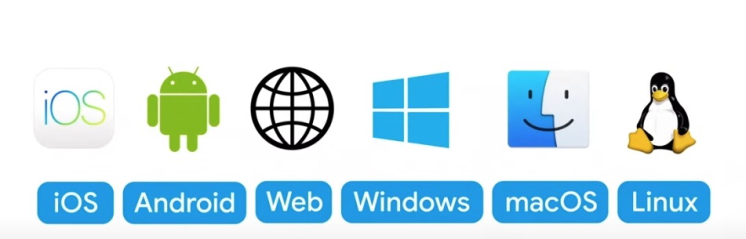
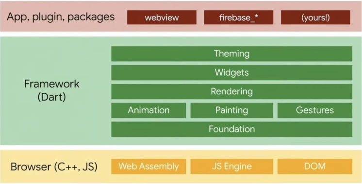

# Flutter 2 正式发布

**Flutter 2 正式发布！**

[https://mp.weixin.qq.com/s/tJe2ScLgKWFTybpBtDl2TA](https://mp.weixin.qq.com/s/tJe2ScLgKWFTybpBtDl2TA)

[https://developers.googleblog.com/2021/03/announcing-flutter-2.html](https://developers.googleblog.com/2021/03/announcing-flutter-2.html)

通过 Flutter 2，您可以使用相同的代码库为五种操作系统构建原生应用: iOS、Android、Windows、macOS 和 Linux；以及为 Chrome、Firefox、Safari 和 Edge 等浏览器打造 web 体验。 

[Flutter 2 Is Here: All You Need to Know After Flutter Engage](https://medium.com/swlh/flutter-2-is-here-all-you-need-to-know-after-flutter-engage-98ef7cb1469e), [Flutter web support hits the stable milestone](https://medium.com/flutter/flutter-web-support-hits-the-stable-milestone-d6b84e83b425).

# 新特性

全面支持Windows、MacOS、Linux、Web、iOS、Android六大平台

因底层使用skia本身就跨多平台的缘故，从移动端扩展到桌面端是非常顺畅。

> 相比于业内其他成熟的跨平台桌面开发框架，学习成本比Qt偏小（Dart语言），性能比electron好，但现成的组件没有electron成熟，非常适合工具类的应用从移动端平滑的迁移到桌面端。
>

# Flutter Web

> 更新: 2021-05-16 10:34:40  
> 原文: <https://www.yuque.com/u3641/dxlfpu/yngowz>