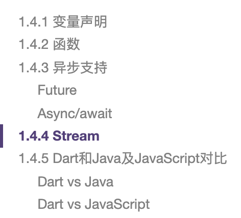
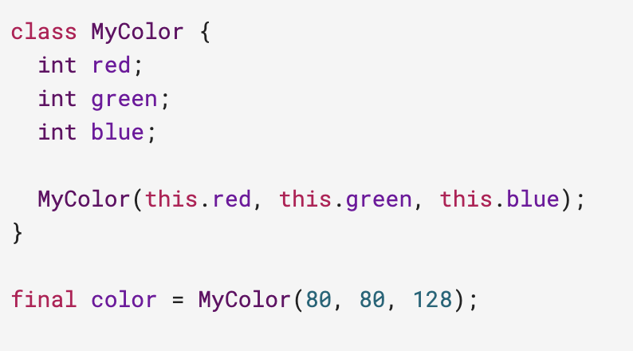
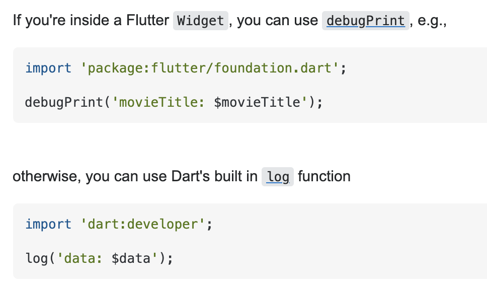

# dart

# 语言核心

# this

# log

# 所有都是对象
能够放在变量中的所有内容都是对象，每个对象都是一个类的实例。甚至于数字、函数和null值都是对象，并且所有对象都继承自Object类。

# 没有联合类型
使用 dynamic 或者 object 代替

# 内置类型
+ Number
+ String
+ Boolean
+ List
+ Set
+ Map
+ Symbol
+ Rune

# main 函数
Dart中每个应用程序都必须有一个顶级main()函数，该函数作为应用程序的入口点

# 拓展
## splash screen
https://github.com/DPLYR-dev/SplashScreenFlutterPackage

https://github.com/JairusTse/FlutterDemo/blob/master/lib/util/http.dart

## json to dart
https://javiercbk.github.io/json_to_dart/

## dart map
https://bezkoder.com/dart-map/

## 语法总览

https://juejin.cn/post/6844903773094019086#heading-20

> 更新: 2021-05-15 12:26:26  
> 原文: <https://www.yuque.com/u3641/dxlfpu/xyry5g>