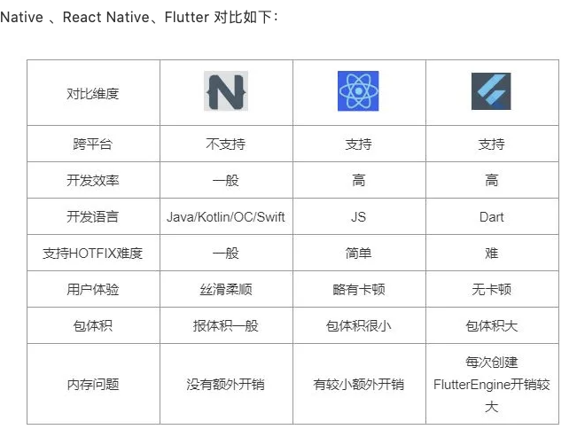

# 携程火车票Flutter最佳实践

Flutter官宣自绘UI引擎，采用原生方式做渲染，媲美原生体验。


[https://mp.weixin.qq.com/s/VP6WEQkEel3W4tdo3ThYDw](https://mp.weixin.qq.com/s/VP6WEQkEel3W4tdo3ThYDw)



# 优势
在复杂业务和长列表上面体验，确实 Flutter 优于 React Native。但是React Native 也有它的优势，比如灵活的版本迭代。

  


# MVVM
建议Flutter主体的构架采用MVVM模式


# Flutter 布局技巧
## 图片预加载
用到网络图片的地方，经常会先白一下

```java
///对每一页加载的数据进行做图片预加载
(hotelListViewModel.currentPageHotels ?? []).forEach((element) {
var logo = element?.logo ?? "";
  if (StringUtil.isNotEmpty(logo)) {
    precacheImage(NetworkImage(logo), context);
  }
});
```


> 更新: 2021-05-18 10:18:07  
> 原文: <https://www.yuque.com/u3641/dxlfpu/hwqt44>