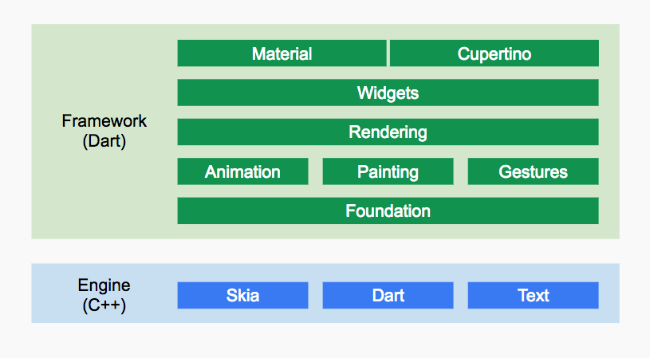
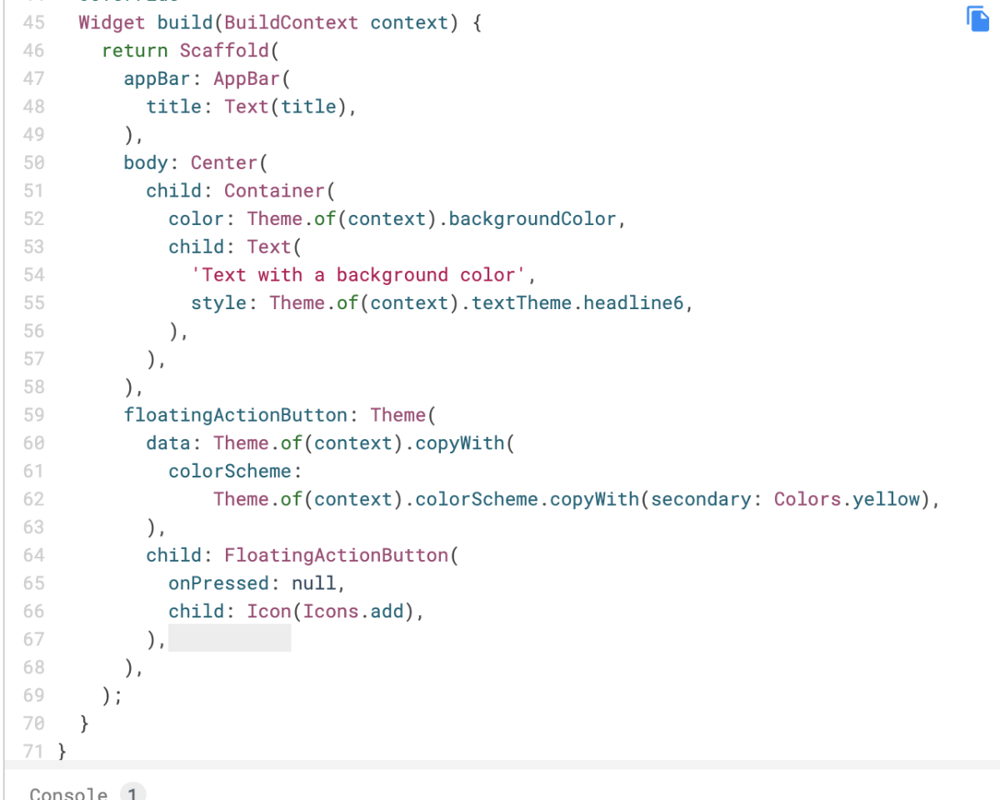

# 草稿

# 框架

# 包括那些

+ 路由
+ 组件
+ Dart
+ HTTP请求
+ 动画
+ 状态管理、持久化
+ 事件监听
+ 生命周期
+ 包管理
+ 权限

# devtools
flutterpub global activate devtools

# Cupertino 

使用Flutter构建 iOS 风格的应用

你已经完成了 codelab 并构建了一个具有 Cupertino 风格的Flutterapp！你还使用了 provider package 实现跨页面管理应用程序状态。

[codelabs.flutter-io.cn](https://codelabs.flutter-io.cn/codelabs/flutter-cupertino-cn/index.html#4)

# flutter 组件
1. Text，文本显示组件，里面包含了文本类相关的样式以及排版相关的配置信息；
2. Image，图片显示组件，里面包含了图片的来源设置，以及图片的配置；
3. Icon，Icon 库，里面是Flutter原生支持的一些小的 icon ；
4. FlatButton，包含点击动作的组件；
5. Row，布局组件，在水平方向上依次排列组件；
6. Column，布局组件，在垂直方向上依次排列组件；
7. Container，布局组件，容器组件，这点有点类似于前端中的 body ；
8. Expanded，可以按比例“扩伸” Row、Column 和 Flex 子组件所占用的空间 ，这点就是前端所介绍的 flex 布局设计；
9. Padding，可填充空白区域组件，这点和前端的 padding 功能基本一致；
10. ClipRRect，圆角组件，可以让子组件有圆形边角。

# material 组件
[flutter.dev](https://flutter.dev/docs/development/ui/widgets/material)

# 

# e.g.

## youtube demo

[https://www.youtube.com/channel/UCJm7i4g4z7ZGcJA_HKHLCVw](https://www.youtube.com/channel/UCJm7i4g4z7ZGcJA_HKHLCVw)

## use theme

## dy_flutter
[https://github.com/yukilzw/dy_flutter](https://github.com/yukilzw/dy_flutter)

## flutter_deer
flutter_deer

## 获取数据，显示数据

[https://hackernoon.com/fetching-data-and-displaying-it-on-widget-in-flutter-mu223yeq](https://hackernoon.com/fetching-data-and-displaying-it-on-widget-in-flutter-mu223yeq)

[https://www.geeksforgeeks.org/flutter-fetching-data-from-the-internet/](https://www.geeksforgeeks.org/flutter-fetching-data-from-the-internet/)

## FlutterJsonBeanFactory 插件

Json 2 Bean

[https://medium.com/@prafullkumar77/flutter-automate-json-to-dart-entity-class-776512fa6371](https://medium.com/@prafullkumar77/flutter-automate-json-to-dart-entity-class-776512fa6371)

## 核心库
+ import 'package:flutter/material.dart';
+ import 'package:flutter/scheduler.dart';
+ import 'package:flutter/services.dart';

## flutter web 美团的实践

Web-App 一体化实现

[https://mp.weixin.qq.com/s/PWeV2CDP47uHNo9P2QeM2A](https://mp.weixin.qq.com/s/PWeV2CDP47uHNo9P2QeM2A)

> 更新: 2021-08-17 15:29:24  
> 原文: <https://www.yuque.com/u3641/dxlfpu/ridhqv>