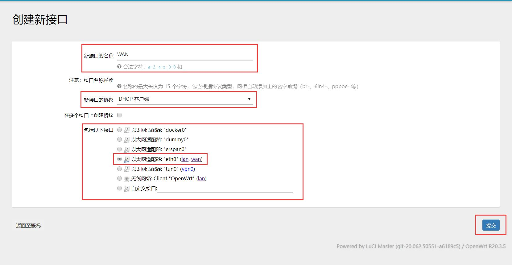
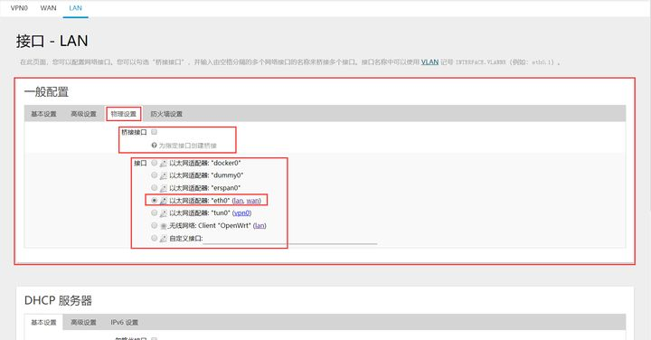
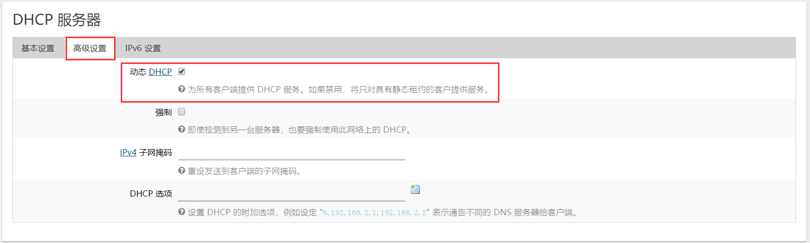
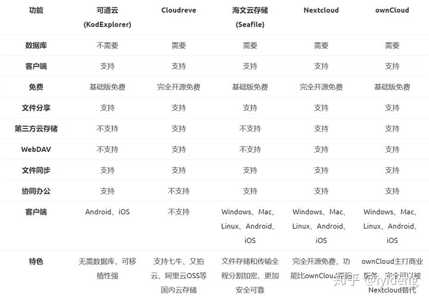
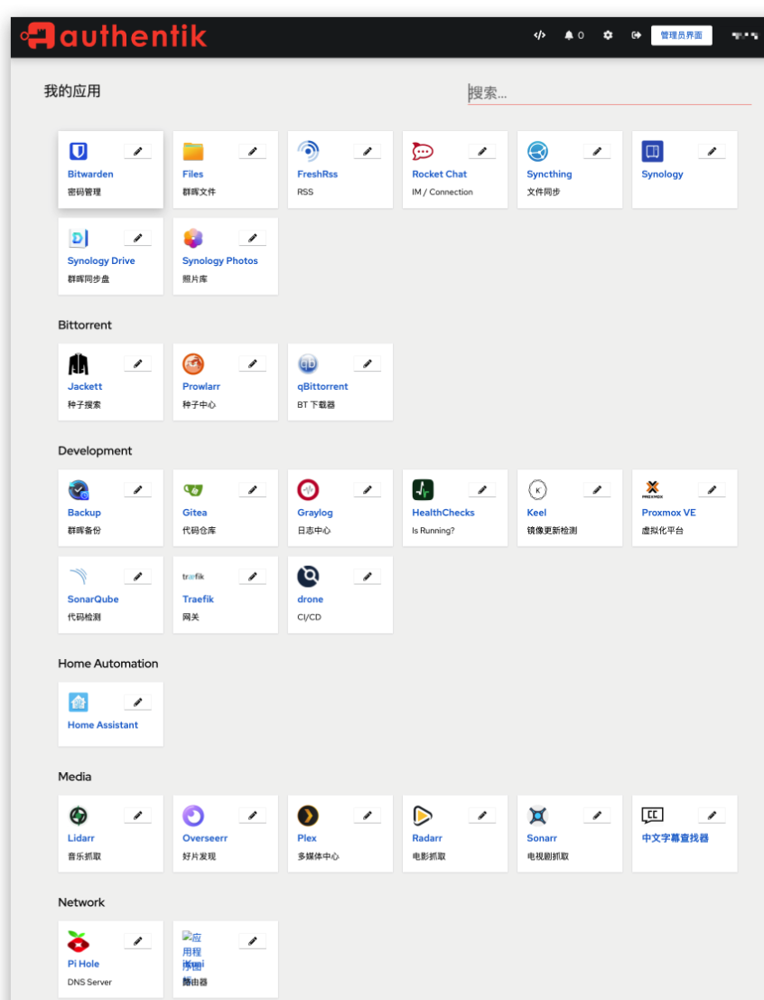

# 软路由与NAS

# 硬件方案

自己搭建

+ CPU
    - S805
    - J1500
    - Dxxxx
+ 树莓派
+ 玩客云
+ 斐讯 N1

成品

+ 蜗牛星际

# 软件方案

+ 架构
    - x86
    - arm
+ os
    - ubuntu
    - centos
    - armbian
    - Debian
    - Raspberry Pi OS
+ 路由
    - OpenWrt
+ NAS
    - 群晖
    - 威联通
    - 可道云 KodExplorer（原芒果云）
        * [https://github.com/kalcaddle/KodExplorer](https://github.com/kalcaddle/KodExplorer)
        * 体验地址 [http://demo.kodcloud.com/](http://demo.kodcloud.com/)
    - 开源NAS
        * freeNas
        * Openfiler
        * RaspNAS
        * seafile
        * nextCloud 13k star
        * ownCloud 7k star
        * fileRun
        * fileBrowser 文件管理器
            + [https://github.com/filebrowser/filebrowser](https://github.com/filebrowser/filebrowser)
+ 安装方式
    - docker
+ software
    - Syncthing
        * 微力同步

# 文件共享

+ smb
+ nfs
+ afs
+ WebDav

# 旁路由

2种方案，openwrt和lede

openwrt 设置，针对单网口

预先设置

+ 添加 WAN接口以及更改 LAN 接口配置

取消桥接

打开DHCP

后面设置

+ 手动设置网关
    - 设备自定义网关
+ 不设置网关-全局

打开主路由的设置界面, 进入DHCP设置, 将网关设置为N1的IP也就是192.168.0.254, 保存后再去电脑上查询IP设定时会发现网关已经是N1的IP了. 若未发生变化建议断开网络后重新连接以刷新网关设定

进入N1盒子的配置页面, 找到网络-接口-LAN-编辑, 将网关和DNS改为主路由IP地址192.168.0.1, 将DHCP服务禁用

+ 主路由网关指向N1，开启DHCP
+ N1网关指向主路由，关闭DHCP

总结：

旁路由的目的是尽量不改变当前网络拓扑，所以没必要将 DHCP 服务器设置在 N1 上。只要在主路由的 DHCP 设置中，将默认网关设置为 N1，然后 N1 的网关设置为主路由即可，其他网络设置无需改变。这样，上传流量会经过 N1 的过滤，国内下载流量不会经过 N1 。

[https://zhuanlan.zhihu.com/p/129414399](https://zhuanlan.zhihu.com/p/129414399)

[https://www.bilibili.com/read/cv6354709/](https://www.bilibili.com/read/cv6354709/)

# HTPC

使用群晖Docker 安装Jellyfin 家庭影院HTPC 比emby plex好用多了

[https://www.yuque.com/jabin-ka5gk/art3fv/4d7acb74-9cbd-401e-8ff8-a34423fdbcf4](https://www.yuque.com/jabin-ka5gk/art3fv/4d7acb74-9cbd-401e-8ff8-a34423fdbcf4)

> 目前比较火的个人媒体服务器差不多是 Plex 和 Emby，2 款都挺强大的，现在再说个最近才出来的一个媒体服务器 Jellyfin，功能上是和 Emby差不多的。按照官方的说法是，由于 Emby 3.6 开始闭源后，引起了一些核心开发人员的不满，所以最近在 Emby 的基础上单独开发了 Jellyfin 媒体服务器，致力于让所有用户都能访问最好的媒体系统。并且可以将 Emby 版本 3.5.2 及之前的数据无缝迁移过来。
>

# 私有云存储

# All in one

私有云盘ownCloud、Seafile、可道云、Nextcloud、Syncthing对比

[https://www.jianlove.com/private-cloud-138.html](https://www.jianlove.com/private-cloud-138.html)

[N1盒子] N1装私有云的选择？可道云、seafile、nextcloud？ [复制链接]

[https://www.right.com.cn/forum/thread-412043-1-1.html](https://www.right.com.cn/forum/thread-412043-1-1.html)

可道云、NextCloud和Seafile使用体验比较哪个好用

[http://blog.jues.org.cn/post/Which-is-the-better-experience-to-use-for-kodoke-cloud-nextcloud-and-seafile.html](http://blog.jues.org.cn/post/Which-is-the-better-experience-to-use-for-kodoke-cloud-nextcloud-and-seafile.html)

# 服务
10 ，shadowsocks-rust ，局域网穿透代理，365 天都在用。

9 ，memos ，一款日记类的笔记软件，简洁方便。

8 ，picoshare ，一个简单的图片，视频，文件分享服务。

7 ，freshrss+rsshub+NetNewsWire ，自建 rss ，看技術討論區，懂得都懂。

6 ，metatube ，自己搜，懂得都懂。

5 ，bitwarden ，自建密码管理器，刚需。

4 ，alist ，目前最牛逼的网盘挂载服务了吧。

3 ，qBittorrent ，pt 下载器，建议用套件和 x86 版，docker 太吃内存。

2 ，nas-tool ，pt 下载、硬连接、挂削、媒体整理，我愿成之最强的自动化。

1 ，emby ，自建影音库，个人感觉比 jellyfin 和 plex 都要好用。

[https://www.v2ex.com/t/901954](https://www.v2ex.com/t/901954)

nax-tools NAS媒体库资源归集、整理自动化工具

[https://github.com/jxxghp/nas-tools](https://github.com/jxxghp/nas-tools)

相册管理

相册管理同推荐一波 immich ，支持 AI 、手机客户端、web 访问、实况照片等。

photoprism

相册同步的，推荐一个 immich 个人感觉比 Photo-Prism 什么的要好。类似 Google Photos 的体验，挺 nice 的。

苹果相册同步：icloudpd

媒体服务器

jellyfin

nas-tools PT 助手以及个人影院资源索引，整理等

dashboard

dashy 仪表盘（方便查看 NAS 状态，以及作为首页来用）

网盘管理

AList 挂载一些网盘

电子书服务器

calibre-web

游戏模拟器：

emulatorjs

流程图：

drawio

翻墙

clash

代码

gitea 管理代码

RSS

rsshub

freshness

音乐播放器：

navidrome

百度网盘：

baidunetdisk

网络

ddns 为了公网域名访问（ 80 ，443 已封）

frp 内网穿透

反向代理：traefil

虚拟局域网 ZeroTier tailscale 远程访问

反代网关：traefik

wiredguard

openvpn

文件

文件存储 /同步：syncthing/nextcloud

filerun

filebrowser

密码管理

vaultwarden

下载器

qbittorrent

transmission 用来下载 pt/bt

aria2 

智能

homeassistant

米家转换为homekit

rustdesk 朋友同事用的远程控制

qinglong 刷京豆

memos 自托管备忘录

smb 共享

aria2 下载工具

AriaNG 管理 aria2 的前端

rocket chat

rsshub

matrix

picx

etesync 通讯录 日历 任务

openvpn 出门就 openvpn 连家里服务器 万物互联模式

Adguard home DNS 服务，广告过滤

airconnect 给不支持 airplay 的音箱提供 airplay 支持

code-server 远程代码管理

nginxwebui 可视化的 nginx

syncthing 同步

stashapp 不解释

javtube/javtube-server:latest: 不解释

nas 只拿来当 iSCSI 、SMB 和 NFS 服务器，服务全部部署在 homelab 上

播放器 plexinc/pms-docker

数据库 mysql:5.7

网易云解锁 pan93412/unblock-netease-music-enhanced

网易云解锁 oldiy/music-player-docker:latest

内网穿透 stilleshan/frpc

RSS 阅读订阅 wangqiru/ttrss:nightly

PT|BT 下载 linuxserver/qbittorrent:latest

PT|BT 下载（资源多会卡） helloz/transmission

工作及日常笔记，穿透到公网 b3log/siyuan

管理 Docker portainer/portainer-ce

首页 igorsheg/astro:latest

家庭照片管理 mtphotos/mt-photos

文浏览器 filebrowser/filebrowser:latest

RSS 解析 diygod/rsshub

RSS 存储数据库 postgres:13.8

内网域名反向代理 nginx:latest

播放器 linuxserver/emby:latest

# 4K
[https://v2ex.com/t/909400#reply46](https://v2ex.com/t/909400#reply46)

[https://yts.mx/](https://yts.mx/)

我的小站-阿里云盘资源共享站

[https://pan666.cn/?q=%E5%8E%9F%E7%9B%98](https://pan666.cn/?q=%E5%8E%9F%E7%9B%98)

一直海盗湾一劳永逸...

小雅 docker 网盘统一管理目录

[http://alist.xiaoya.pro/%E7%94%B5%E5%BD%B1/4K](http://alist.xiaoya.pro/%E7%94%B5%E5%BD%B1/4K)

[https://hub.docker.com/r/xiaoyaliu/alist](https://hub.docker.com/r/xiaoyaliu/alist)

[https://www.notion.so/xiaoya-docker-69404af849504fa5bcf9f2dd5ecaa75f](https://www.notion.so/xiaoya-docker-69404af849504fa5bcf9f2dd5ecaa75f)

阿里云4k原盘索引

[https://www.aliyundrive.com/s/7zvunebZ5fq](https://www.aliyundrive.com/s/7zvunebZ5fq)

[https://www.aliyundrive.com/s/yRNVU4QhQuj](https://www.aliyundrive.com/s/yRNVU4QhQuj)

[https://www.aliyundrive.com/s/aEEGWV4hF33](https://www.aliyundrive.com/s/aEEGWV4hF33)

[https://www.aliyundrive.com/s/kcAZzaYNFtP](https://www.aliyundrive.com/s/kcAZzaYNFtP)

[https://www.aliyundrive.com/s/KczF3vJzCr2](https://www.aliyundrive.com/s/KczF3vJzCr2)

[https://www.aliyundrive.com/s/2Sd3Yb4gZAn](https://www.aliyundrive.com/s/2Sd3Yb4gZAn)

# 自建影音库
emby ，自建影音库，个人感觉比 jellyfin 和 plex 都要好用

媒体库服务器

+ emby
+ jellyfin
+ plex

video player

+ infuse

[https://www.v2ex.com/t/861253?p=1](https://www.v2ex.com/t/861253?p=1)

[https://johnrosen1.com/2022/03/18/media/](https://johnrosen1.com/2022/03/18/media/)

nas 可以是代码库、密码库、文档库、相册、网盘、影视库乃至是你的 HomeLab ，装了 Home Assistant 还能控制空调、电视、电灯等实现智能家居。

> 更新: 2023-08-11 17:09:28  
> 原文: <https://www.yuque.com/u3641/dxlfpu/ag94y1>