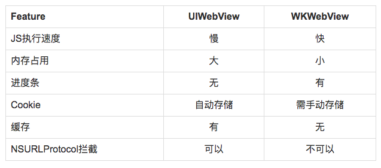
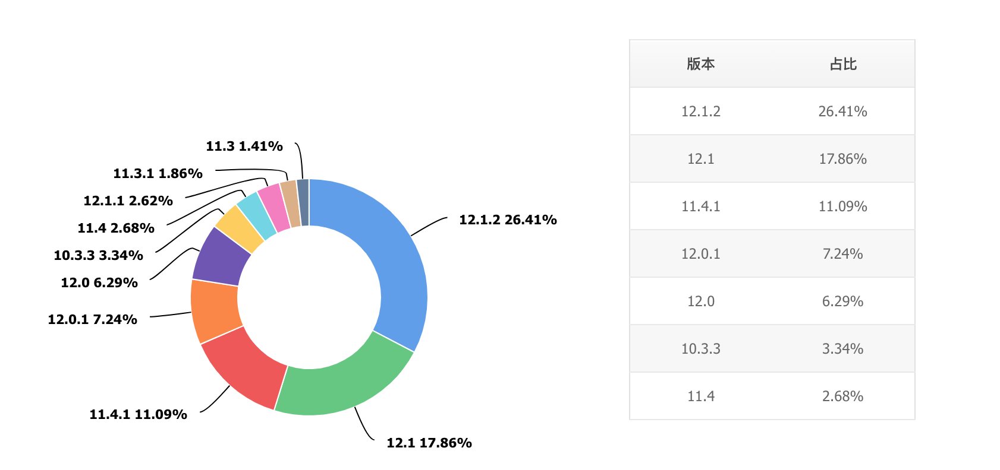

# H5容器

## IOS
UIWebView和WKWebView的比较和选择

WKWebView更好一点

iOS8 以后苹果推出了一套新的 WKWebView，对于 UIWebView 和 WKWebView 的区别，总结如下：

### WKWebView清理缓存

iOS 9以后终于可以使用 WKWebsiteDataStore 来清理缓存。后来Google一下，又发现iOS 8可以通过清理 Library 目录下的 Cookies 目录来清除缓存

+ WKWebView的缺点
+ 需要iOS9或更高版本(WKWebView在iOS8引入，但是很多功能，支持比较全面在iOS9以后的版本)
+ 不支持通过AJAX请求本地存储的文件
+ 不支持"Accept Cookies"的设置
+ 不支持"Advanced Cache Settings"(高级缓存设置)
+ App退出会清除HTML5的本地存储的数据
+ 不支持记录WebKit的请求
+ 不能进行截屏操作

## IOS系统占比

### 腾讯移动分析

> 75% of all devices are using iOS 12.
>

> 更新: 2019-01-21 10:07:31  
> 原文: <https://www.yuque.com/u3641/dxlfpu/zioa4o>