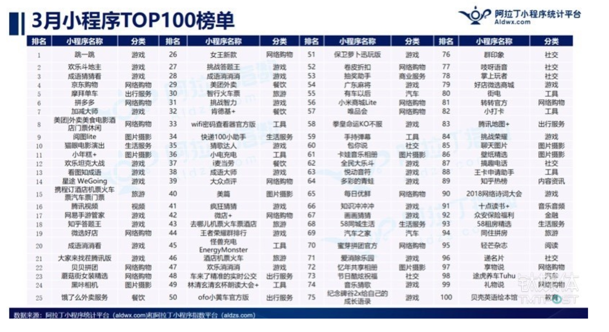

# 小程序百味杂陈

## 爆款小程序
1. 匿名聊天
2. 圣诞头像

## 裂变思路-创意裂变
首先我们说靠创意裂变：创意本身你能不能copy是一个难点；被刷过一次屏了，你再用就不好用了；若是趁热点的，你跟进也来不及。比如圣诞帽、西瓜足迹、高考录取通知书、七夕出租自己等，你也只能看看，望洋兴叹，为什么我当时没想到。

## 小程序TOP100榜单
出自于阿拉丁小程序

## 可参考的小程序
+ 手机进化史
+ 圣诞帽子
+ 小睡眠

## 小程序UI
[https://github.com/weilanwl/ColorUI](https://github.com/weilanwl/ColorUI)

[https://github.com/youzan/vant-weapp](https://github.com/youzan/vant-weapp)

[https://github.com/youzan/zanui-weapp](https://github.com/youzan/zanui-weapp)

[https://github.com/samwang1027/mpvue-zanui](https://github.com/samwang1027/mpvue-zanui) 【mpvue版】

[https://github.com/TalkingData/iview-weapp](https://github.com/TalkingData/iview-weapp)

[https://github.com/Tencent/weui-wxss](https://github.com/Tencent/weui-wxss)

Taro UI

> 更新: 2019-01-22 14:38:05  
> 原文: <https://www.yuque.com/u3641/dxlfpu/ipnl6q>