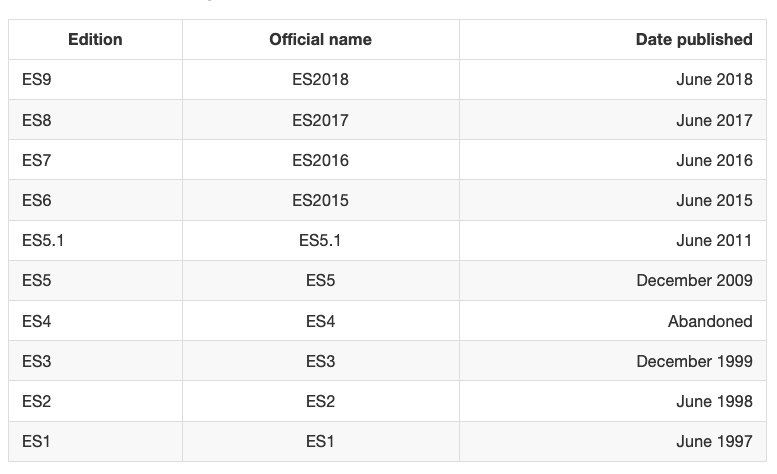
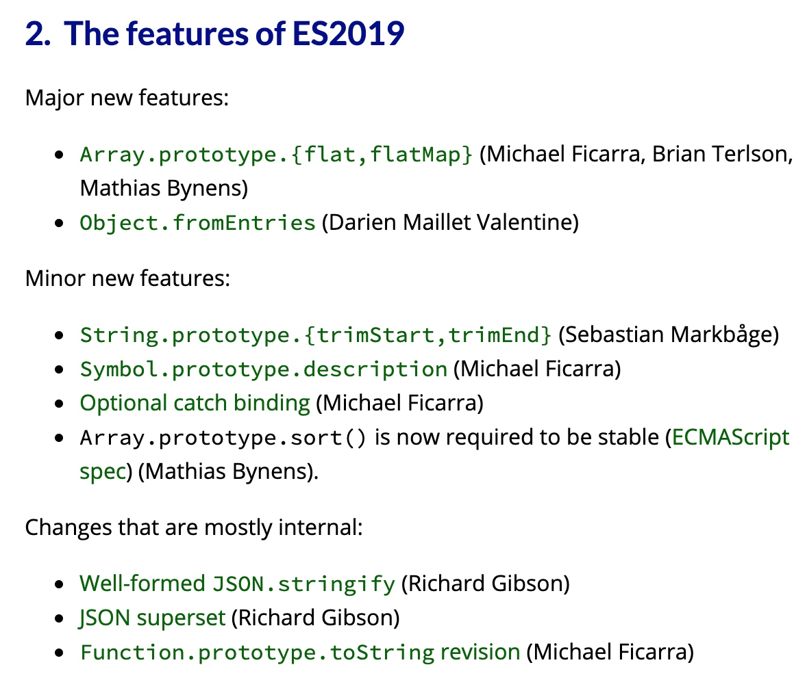
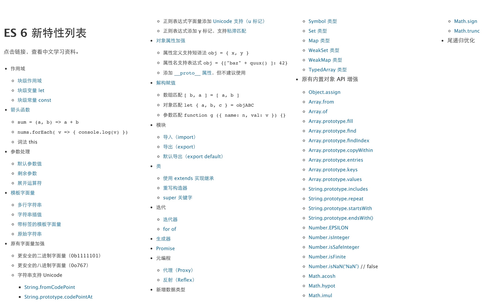
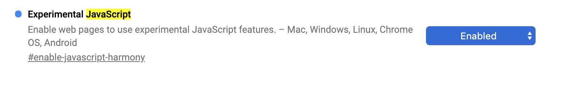
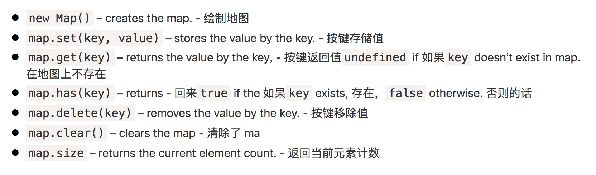
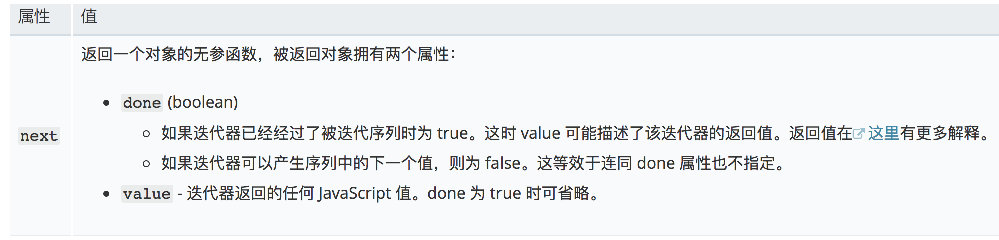
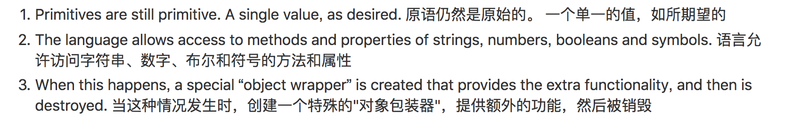
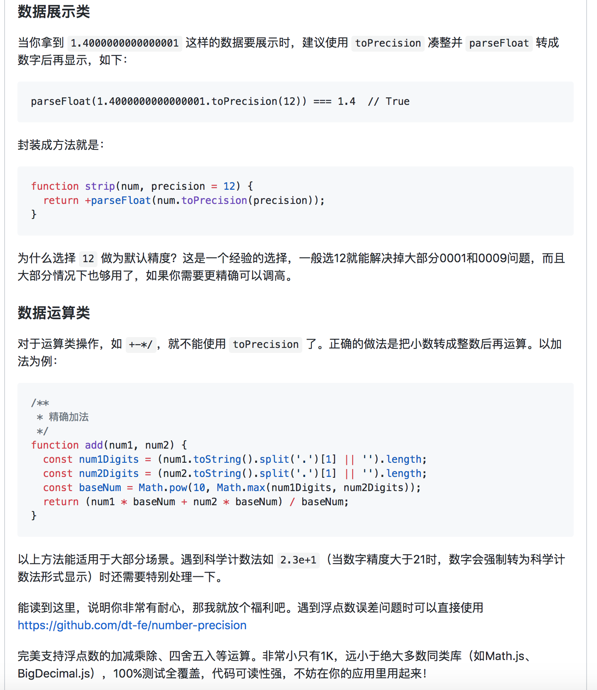
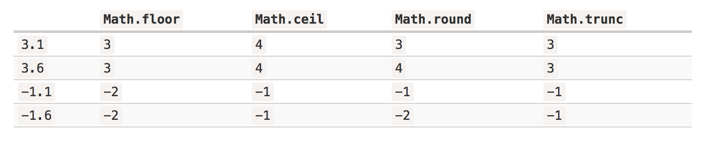

# ES6

## ES6到底包括多少？

JavaScript是EcmaScript的实现，其他的还有ActionScript

> 【阮一峰的说法】
>
> 仅仅四年后，ES6 已经经历了 ES2015、ES2016、ES2017、ES2018 三个版本的迭代
>
> 因此，ES6 既是一个历史名词，也是一个泛指，含义是 5.1 版以后的 JavaScript 的下一代标准，涵盖了 ES2015、ES2016、ES2017 等等，而 ES2015 则是正式名称，特指该年发布的正式版本的语言标准

每年6月份 TC39发布新的语言标准

从ES2015(ES6)开始，按照年份称呼ES release。 目前的 ECMAScript 版本是 ES2018，一般来说，现在就用 ES201X 就好了。

所以 阮一峰的ES6就是ESNext



参考这篇文章 <https://medium.freecodecamp.org/es5-to-esnext-heres-every-feature-added-to-javascript-since-2015-d0c255e13c6e>

### ES2018

ES2018

Rest/Spread Properties 休息 / 扩散属性

Asynchronous iteration 异步迭代

Promise.prototype.finally() 保证。原型。最后

Regular Expression improvements 正则表达式改进

### ES2019



##

## 来了解一下ES6的支持情况



<https://caniuse.com/#search=es6>

https://kangax.github.io/compat-table/es6/

## 打开chrome ES6支持

**enable-javascript-harmony**

chrome://flags

默认是diasbled

enable ES Harmony features. Based on the v8 source



## script module

```javascript
<script type="module" src="module.js"></script>
<script type="module">
  // or an inline script
  import {helperMethod} from './providesHelperMethod.js';
  helperMethod();
</script>
// providesHelperMethod.js
export function helperMethod() {
  console.info(`I'm helping!`);
}
```

###

> Edge默认支持，chrome和火狐需要 enable the \_Experimental Web \_*Platform* flag in `chrome:flags`

### 原生支持ES6 export和import模块

浏览器如果不支持的会忽略type=module，然后转而去加载nomudle的js，modern浏览器则会忽略这个，也不会去网络请求。

```
<script nomodule src="compiled.js"></script>
```
## let 和 const

let

* 暂时性死区 TDZ let声明变量前，对变量赋值会报错。
* 不存在变量提升
* 不允许重复声明
* 块级作用域

**声明变量的六种形式**

ES5 var function

ES6新增 let const class import 

## 变量的解构赋值

* 函数参数
* 字符串
* 数组
* 对象
* 遍历Map结构 

## Map



### Objects 和 maps 的比较
```
<code>[Objects](https://developer.mozilla.org/zh-CN/docs/Web/JavaScript/Reference/Global_Objects/Object)</code> 和 `Maps` 类似的是，它们都允许你按键存取一个值、删除键、检测一个键是否绑定了值。因此（并且也没有其他内建的替代方式了）过去我们一直都把对象当成 `Maps` 使用。不过 `Maps` 和 `Objects` 有一些重要的区别，在下列情况里使用 `Map` 会是更好的选择：

* 一个`Object`的键只能是`[字符串](https://developer.mozilla.org/zh-CN/docs/Web/JavaScript/Reference/String)`或者 <code>[Symbols](https://developer.mozilla.org/zh-CN/docs/Web/JavaScript/Reference/Global_Objects/Symbol)</code>，但一个 `Map` 的键可以是**任意值**，包括函数、对象、基本类型。
* Map 中的键值是有序的，而添加到对象中的键则不是。因此，当对它进行遍历时，Map 对象是按插入的顺序返回键值。
* 你可以通过 `size` 属性直接获取一个 `Map` 的键值对个数，而 `Object` 的键值对个数只能手动计算。
* `Map` 可直接进行迭代，而 `Object` 的迭代需要先获取它的键数组，然后再进行迭代。
* `Object` 都有自己的原型，原型链上的键名有可能和你自己在对象上的设置的键名产生冲突。虽然 ES5 开始可以用 `map = Object.create(null)` 来创建一个没有原型的对象，但是这种用法不太常见。
* `Map` 在涉及频繁增删键值对的场景下会有些性能优势。

for in 迭代

for of 迭代

forEach迭代

Map 与数组的关系

* 互相转换
* Map的合并复制
```
## 迭代行为



```javascript
let range = {
  from: 1,
  to: 5,
  [Symbol.iterator]() {
    this.current = this.from;
    return this;
  },

  next() {
    if (this.current <= this.to) {
      return { done: false, value: this.current++ };
    } else {
      return { done: true };
    }
  }
};


// 手动调用迭代器
let str = 'hello'

let iterator = str[Symbol.iterator]()

while(true) {
    let result = iterator.next()
    if (result.done) break
    console.log(result)
}
```

## 包装对象

原始类型

> 刚开始学习JS时，常听说：“JS中万物皆对象”，实际上这里的万物并不包含这里的Primitive Value



数值、字符串和布尔值的包装对象

```javascript
let str = "Hello";

str.test = 5;

alert(str.test);

结果是undefined
因为包装对象销毁了
```

六种原始类型

* undefined
* null
* symbol
* number
* string
* boolean
*

> All JavaScript values, except primitives, are objects.

## 引用类型

引用类型包括了 Object 类的所有，如 Date、Array、Function 等

使用过程中会遇到浅拷贝 深拷贝的问题

## 创建对象的方法

对象字面量

构造函数 使用new keyword

Object.create

using ES6 classes

### 实现new 操作符

新生成了一个对象

链接到原型

绑定 this

返回新对象

```javascript
function create() {
    // 创建一个空的对象
    let obj = new Object()
    // 获得构造函数
    let Con = [].shift.call(arguments) // Array.prototype.shift
    // 链接到原型
    obj.__proto__ = Con.prototype
    // 绑定 this，执行构造函数
    let result = Con.apply(obj, arguments)
    // 确保 new 出来的是个对象
    return typeof result === 'object' ? result : obj
}
```

### Object 一些api

```javascript
Object.getPrototypeOf
Object.getOwnPropertyDescriptor
Object.getOwnPropertyNames
Object.create 以o为prototype创建新的对象并返回
Object.defineProperty
Object.defineProperties() //定义多个属性
Object.definePropertyDescriptor() //读取属性访问器属性
Object.seal
Object.freeze
Object.preventExtensions
Object.isSealed
Object.isFrozen
Object.isExtensible
Object.keys 属性的遍历
hasOwnProperty()  //判断一个属性是否存在于实例中，还是存在于原型上
instanceOf
```

## 数值的扩展

在内部，一个数字以64位格式 IEEE-754表示，因此确切的有64位来存储数字: 其中52位用来存储数字，其中11位存储小数点位置(对于整数数字是零) ，1位代表符号。

### 进制

```javascript
let num = 255
num.toString(16) // ff
num.toString(2) // 11111111
```

### 比较

```javascript
0 === -0 true
Object.is(0, -0) === false
Object.is(NaN, NaN) === true
```

### 精度问题
```
<font style="color:#F5222D;">通常可以换算成整数，来避免精度问题。</font>
```
库推荐 https://github.com/nefe/number-precision

precision 翻译为精确度



### 精度损失

0.1 + 0.2 != 0.3

使用二进制系统，没有办法准确地存储0.1、0.2、0.3等等，就像没有办法将三分之一存储为十进制分数。

alert( 0.1.toFixed(20) ); // 0.10000000000000000555

```javascript
alert( 6.35.toFixed(1) ); // 6.3
// 和我们预期的6.4不一样是什么问题？
alert( 6.35.toFixed(20) ); // 6.34999999999999964473

// 因为0.5 = 1/2 在二进制系统中 能很好的表示被2的次幂整除的数字
alert( Math.round(6.35 * 10) / 10); 

// 6.35 -> 63.5 -> 64(rounded) -> 6.4
```

### string转化为number

```javascript
// 使用+ 或者Number() 来转换，如果一个值不完全是一个数字，它就失败了:
alert( +"100px" ); // NaN

// 但是parseInt和parseFloat宽松多了
alert( parseInt('100px') ); // 100
alert( parseFloat('12.5em') ); // 12.5
alert( parseInt('12.3') ); // 12, only the integer part is returned
alert( parseFloat('12.3.4') ); // 12.3

parseInt('a123') ); // NaN
parseInt('0xff', 16) ; // 255
```

### Math对象的方法

Math.pow() 幂函数

Math.max()

Math.random()

Math.floor 向下取整  Rounds down

Math.ceil 向上取整 Rounds up

Math.round 四舍五入

Math.trunc. 方法会将数字的小数部分去掉，只保留整数部分

Math.abs()



### 保留几位小数

toFixed() 

### Number的扩展

* Number.isNaN()
* Number.parseInt()
* Number.parseFloat()
* Number.isInteger()

## 数组

### 求差集并集

```javascript
// ES7方法

// 并集
let union = a.concat(b.filter(v => !a.includes(v))) // [1,2,3,4,5]
// 交集
let intersection = a.filter(v => b.includes(v)) // [2]
// 差集
let difference = a.concat(b).filter(v => !a.includes(v) || !b.includes(v)) // [1,3,4,5]
```

### 添加/删除条目
```
arr.push

arr.pop 尾部操作

arr.shift 从数组中删除第一个元素，并返回该元素的值

arr.unshift 将一个或多个元素添加到数组的开头，并返回新数组的长度。

arr.splice(index\[, deleteCount, elem1, ..., elemN])

arr.slice(start, end)  **返回一个新数组**，它将所有项复制到 索引”start”到”end”(不包括”end”). 开始和结束都可能是负的
```
### 在数组中搜索

2、3、4查询索引

1. find
2. indexOf(item, from)
3. lastIndexOf(item, from)
4. includes(item, from)
5. filter(fn). 当fn返回true 保存该元素

### 数组的遍历

1. map
2. sort 改变原数组
3. reverse 改变原数组
4. split 将字符串分割成数组
5. reduce 建议总是指定初始值，如果没有初始值，那么将以数组的第一个元素作为初始值，并从第二个元素开始迭代。如果是空数组，就会报错。

### 清除数组的最简单方法

> arr.length = 0;

## String的扩展

### 访问字符串

**str.charAt(0)**

str\[0]

### 截取字符串

let str = "stringify";

str.slice(0, 5) // strin

str.slice(-4, -1) // gif

### 大小写

toUpperCase()

toLowerCase()

### 包含关系

includes()

startsWdith()

endsWith()

### 重复字符串

repeat()

### 字符串遍历接口

for ... of ...

### 字符串补全

padStart

padEnd

## 判断类型

* instanceof
* typeof
* Array.isArray()
* isNaN()
* Object.prototype.toString()

typeof 对于基本类型 对null不好使 其他都能正确的返回对象

**<font style="color:#F5222D;">对于 null 来说，虽然它是基本类型，但是会显示 object，这是一个存在很久了的 Bug</font>**

### 终极方案 Object.prototype.toString.call()

```javascript
  function type (obj) {
    return Reflect.apply(Object.prototype.toString, obj, []).replace(/^\[object\s(\w+)\]$/, '$1').toLowerCase()
  }
  
  type(new String('123')) // string

```

## 函数的扩展

**知识点：**

函数参数默认值

rest参数

箭头函数

### 尾调用 Tail call

什么是调用堆栈 call stack?

尾调用：某个函数的最后一步是调用另一个函数。

区分什么不是尾调用？

```javascript
function f(){
	var a = 1
  var b = 2
  return g(a + b)
}
f()

// 等同于
function f(){
	return g(3)
}
f()
```

### 尾递归

1

尾调用自身称为尾递归 调用栈只有一层

尾递归，只存在一个调用帧，永远不会发生“栈溢出”错误

> 为了解决递归时调用栈溢出的问题，除了把递归函数改为迭代循环的形式外，改为尾递归的形式也可以解决（虽然目前大部分浏览器没有对尾递归（尾调用）做优化，依然会导致栈溢出，但了解尾递归的优化方式还是有价值的。而且我们可以通过一个统一的工具函数把尾递归转化为不会溢出的形式，这些下文会一一展开）。

尾递归和普通递归的写法？

```javascript
// 普通递归
function Fibonacci(n, ac1 = 1, ac2 = 1) {
    if (n <= 1)
        return ac1
    return Fibonacci(n - 1) + Fibonacci(n - 2)
}
```

```javascript
function Fibonacci2(n, ac1 = 1, ac2 = 1) {
    if (n <= 1)
        return ac2
    return Fibonacci2(n-1, ac2, ac1 + ac2)
}
```

**2 斐波那契数列**

前两项之和等于后一项

用递推公式表示

F(1)=1，F(2)=1, F(n)=F(n-1)+F(n-2)（n>=3，n∈N\*）

1, 1, 2, 3, 5, 8, 13, 21, 34, 55, 89, 144, 233，377，610，987，1597，2584，4181，6765，10946，17711，28657，46368.....

**3 如何改写尾递归？**

> 尾递归的实现，往往需要改写递归函数，确保最后一步只调用自身。做到这一点的方法，就是把所有用到的内部变量改写成函数的参数

4 尾递归优化的实现 - 自己实现尾递归优化

在某些环境，不支持尾递归优化，而且只在严格模式下生效。

用循环代替递归

使用蹦床函数 trampline 可以将递归转为循环

### 箭头函数

* 没有arguments
* this取决于定义时候所在的对象
* 箭头函数有些场合不能使用 不能当做构造函数

Tips:

1. 函数尽量不要修改外部变量的值
2. 函数如果没有返回值 就是undefined
3. 使用 ‘?’ Or ‘||’ 代替if else
4. 函数的默认参数
5. 函数只做一件事情，如果那件事很大，就值得分成几个小函数
6. 函数声明只会提升到代码块的最顶端，如果定义在if语句中，就是在if语句内

### 函数式编程

http://www.ruanyifeng.com/blog/2017/02/fp-tutorial.html

http://www.ruanyifeng.com/blog/2017/02/fp-tutorial.html

## 正则的扩展

* 反向饮用
* 零宽断言
* 量词
* 字符类 \w \d
* 预定义字符【元字符】
* test 和 exec
* 贪婪与懒惰
* 分组
* 字符转义


> 更新: 2020-03-13 15:24:04  
> 原文: <https://www.yuque.com/u3641/dxlfpu/pumvxn>