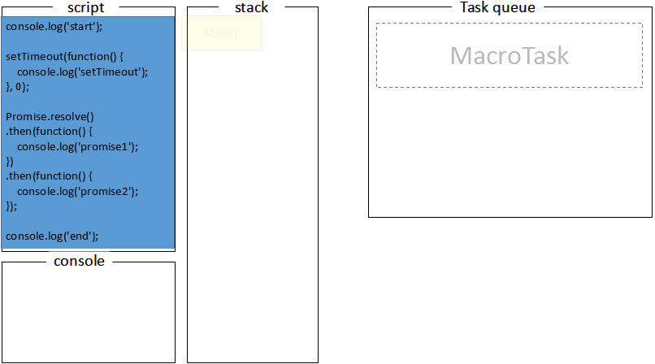
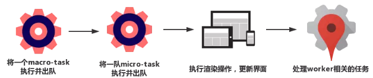
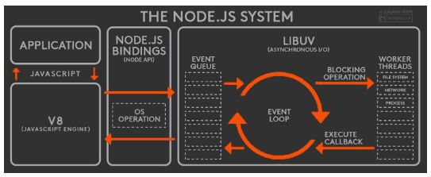
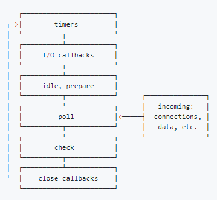
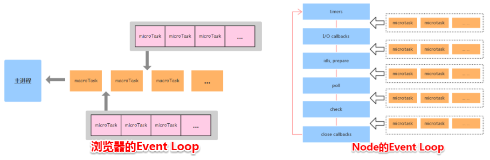
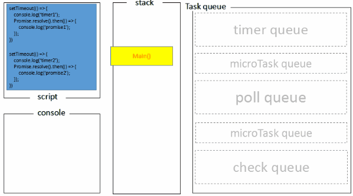

# 事件循环

## 浏览器的事件循环

JavaScript 只是一门解释型语言

事件循环机制是由运行时环境实现的, 具体来说有浏览器、Node。

javascript 在浏览器端运行是单线程的，这是由浏览器决定的 有些操作比如说获取远程数据、I/O操作等，他们都很耗时，如果采用同步的方式，那么进程在执行这些操作时就会因为耗时而等待 所以 为了协调事件，用户交互，脚本，渲染，网络等，用户代理必须使用事件循环。

```javascript
Promise.resolve().then(()=>{
  console.log('Promise1')
  setTimeout(()=>{
    console.log('setTimeout2')
  },0)
})
setTimeout(()=>{
  console.log('setTimeout1')
  Promise.resolve().then(()=>{
    console.log('Promise2')
  })
},0)
console.log(33)

// 输出 33 Promise1，setTimeout1，Promise2，setTimeout2

//1 执行栈的同步代码 宏任务1 console.log(33) 宏任务2 setTimeout1 放入宏任务队列
// 2 执行微任务1 then回调函数 console.log('promise1') 宏任务3 setTimeout2 放入宏任务队列
// 3 执行宏任务2 console.log('setTimeout1') 微任务2 加入微任务队列并执行 console.log('promise2')
// 4 执行宏任务3 console.log('setTimeout2')
```

一次完整的事件循环机制：

1. 检查macrotask队列是否为空，非空则到2，为空则到3

2. 执行macrotask中的一个任务

3. 继续检查microtask队列是否为空，若有则到4，否则到5

4. 取出microtask中的任务执行，执行完成返回到步骤3

5. **执行视图更新**

**动画展示：**



> 首先，全局代码（main()）压入调用栈执行，打印start；
>
> 接下来setTimeout压入macrotask队列，promise.then回调放入microtask队列，最后执行console.log(‘end’)，打印出end；
>
> 至此，调用栈中的代码被执行完成，回顾macrotask的定义，我们知道全局代码属于macrotask，macrotask执行完，那接下来就是执行microtask队列的任务了，执行promise回调打印promise1；
>
> promise回调函数默认返回undefined，promise状态变为fullfill触发接下来的then回调，继续压入microtask队列，event loop会把当前的microtask队列一直执行完，此时执行第二个promise.then回调打印出promise2；
>
> 这时microtask队列已经为空，从上面的流程图可以知道，接下来主线程会去做一些UI渲染工作（不一定会做），然后开始下一轮event loop，执行setTimeout的回调，打印出setTimeout；
>
> 这个过程会不断重复，也就是所谓的事件循环。

**关于\*\*\*\*requestAnimationFrame**

浏览器只保证requestAnimationFrame的回调在重绘之前执行，没有确定的时间，何时重绘由浏览器决定

> 回顾上面的事件循环示意图，update rendering（视图渲染）发生在本轮事件循环的microtask队列被执行完之后，也就是说执行任务的耗时会影响视图渲染的时机。通常浏览器以每秒60帧（60fps）的速率刷新页面，据说这个帧率最适合人眼交互，大概16.7ms渲染一帧，所以如果要让用户觉得顺畅，单个macrotask及它相关的所有microtask最好能在16.7ms内完成。
>
> 但也不是每轮事件循环都会执行视图更新，浏览器有自己的优化策略，例如把几次的视图更新累积到一起重绘，重绘之前会通知requestAnimationFrame执行回调函数，也就是说requestAnimationFrame回调的执行时机是在一次或多次事件循环的UI render阶段。

### task queue

事件循环中的异步任务队列有两种：macro（宏任务）队列和 micro（微任务）队列。宏任务队列可以有多个，微任务队列只有一个。

* 常见的 macro-task 比如：setTimeout、setInterval、 setImmediate、script（整体代码）、 I/O 操作、UI 渲染等。
* 常见的 micro-task 比如: process.nextTick、new Promise().then(回调)、MutationObserver(html5 新特性) 等。



## 浏览器内核是多进程，多线程

以 Chrome 浏览器中为例，当你打开一个 Tab 页时，其实就是创建了一个进程，一个进程中可以有多个线程（下文会详细介绍），比如渲染线程、JS 引擎线程、HTTP 请求线程等等。当你发起一个请求时，其实就是创建了一个线程，当请求结束后，该线程可能就会被销毁。

* 进程之间相互独立，但同一进程下的各个线程之间共享程序的内存空间(包括代码段、数据集、堆等)及一些进程级的资源(如打开文件和信号)。
* 线程则是进程内的一个独立执行单元

工厂与工人的关系 

工厂是进程，工人是线程

多个工厂之间独立存在。

工厂的空间是工人们共享的

浏览器内核是多线程，在内核控制下各线程相互配合以保持同步，一个浏览器通常由以下常驻线程组成：

* GUI 渲染线程
* JavaScript引擎线程
* 定时触发器线程
* 事件触发线程 【当一个事件被触发时该线程会把事件添加到待处理队列的队尾，等待JS引擎的处理。这些事件可以是当前执行的代码块如定时任务、也可来自浏览器内核的其他线程如鼠标点击、AJAX异步请求等，但由于JS的单线程关系所有这些事件都得排队等待JS引擎处理。】
* 异步http请求线程 【在XMLHttpRequest在连接后是通过浏览器新开一个线程请求， 将检测到状态变更时，如果设置有回调函数，异步线程就产生状态变更事件放到 JavaScript引擎的处理队列中等待处理。】

1. GUI 渲染线程\
   主要负责页面的渲染，解析 HTML、CSS，构建 DOM 树，布局和绘制等。\
   当界面需要重绘或者由于某种操作引发回流时，将执行该线程。\
   该线程与 JS 引擎线程互斥，当执行 JS 引擎线程时，GUI 渲染会被挂起，当任务队列空闲时，JS 引擎才会去执行 GUI 渲染。
2. **JS 引擎线程**\
   该线程当然是主要负责处理 JavaScript 脚本，执行代码。\
   也是主要负责执行准备好待执行的事件，即定时器计数结束，或者异步请求成功并正确返回时，将依次进入任务队列，等待 JS 引擎线程的执行。\
   当然，<font style="color:#F5222D;">该线程与 GUI 渲染线程互斥</font>，当 JS 引擎线程执行 JavaScript 脚本时间过长，将导致页面渲染的阻塞。
3. 定时器触发线程\
   负责执行异步定时器一类的函数的线程，如： setTimeout，setInterval。\
   主线程依次执行代码时，遇到定时器，会将定时器交给该线程处理，当计数完毕后，**事件触发线程**会将计数完毕后的事件加入到任务队列的尾部，等待 JS 引擎线程执行。
4. 事件触发线程\
   主要负责将准备好的事件交给 JS 引擎线程执行。\
   比如 setTimeout 定时器计数结束， ajax 等异步请求成功并触发回调函数，或者用户触发点击事件时，该线程会将整装待发的事件依次加入到任务队列的队尾，等待 JS 引擎线程的执行。
5. **异步请求线程**\
   负责执行异步请求一类的函数的线程，如： Promise，axios，ajax 等。\
   主线程依次执行代码时，遇到异步请求，会将函数交给该线程处理，**当监听到状态码变更，如果有回调函数，事件触发线程会将回调函数加入到任务队列的尾部，等待 JS 引擎线程执行**。

## 为什么 JavaScript 是单线程？

> 其实这与它的用途有关。作为浏览器脚本语言，JavaScript 的主要用途是与用户互动，以及操作 DOM。若以多线程的方式操作这些 DOM，则可能出现操作的冲突。假设有两个线程同时操作一个 DOM 元素，线程 1 要求浏览器删除 DOM，而线程 2 却要求修改 DOM 样式，这时浏览器就无法决定采用哪个线程的操作。当然，我们可以为浏览器引入“锁”的机制来解决这些冲突，但这会大大提高复杂性，所以 JavaScript 从诞生开始就选择了单线程执行。
>
> 另外，因为 JavaScript 是单线程的，在某一时刻内只能执行特定的一个任务，并且会阻塞其它任务执行。那么对于类似 I/O 等耗时的任务，就没必要等待他们执行完后才继续后面的操作。在这些任务完成前，JavaScript 完全可以往下执行其他操作，当这些耗时的任务完成后则以回调的方式执行相应处理。这些就是 JavaScript 与生俱来的特性：异步与回调

## Node 事件循环

> Node 中的 Event Loop 和浏览器中的是完全不相同的东西。Node.js 采用 V8 作为 js 的解析引擎，而 I/O 处理方面使用了自己设计的 libuv，libuv 是一个基于事件驱动的跨平台抽象层，封装了不同操作系统一些底层特性，对外提供统一的 API，事件循环机制也是它里面的实现（下文会详细介绍）。



<font style="color:#F5222D;">Node.js 的运行机制如下:</font>

* V8 引擎解析 JavaScript 脚本。
* 解析后的代码，调用 Node API。
* libuv 库负责 Node API 的执行。它将不同的任务分配给不同的线程，形成一个 Event Loop（事件循环），以异步的方式将任务的执行结果返回给 V8 引擎。
* V8 引擎再将结果返回给用户。

### Node 事件循环6个阶段

其实 libuv 引擎中的事件循环分为 6 个阶段，它们会按照顺序反复运行。每当进入某一个阶段的时候，都会从对应的<font style="color:#F5222D;">回调队列中</font>取出函数去执行。当队列为空或者执行的回调函数数量到达系统设定的阈值，就会进入下一阶段。



* timers 阶段：这个阶段执行 timer（setTimeout、setInterval）的回调
* I/O callbacks 阶段：处理一些上一轮循环中的少数未执行的 I/O 回调
* idle, prepare 阶段：仅 node 内部使用
* poll 阶段：获取新的 I/O 事件, 适当的条件下 node 将阻塞在这里
* check 阶段：执行 setImmediate() 的回调
* close callbacks 阶段：执行 socket 的 close 事件回调

#### timers

执行 setTimeout 和 setInterval 回调

如果有多个setTimeout，就会执行多个setTimeout回调函数，回调函数里面的微任务并不会执行，在所有的回调函数执行完了后，再执行微任务。

setTimeout 设计在 poll 阶段为空闲时，且设定时间到达后执行，但它在 timer 阶段执行

#### poll

#### check

> 外部输入数据–>轮询阶段(poll)–>检查阶段(check)–>关闭事件回调阶段(close callback)–>定时器检测阶段(timer)–>I/O 事件回调阶段(I/O callbacks)–>闲置阶段(idle, prepare)–>轮询阶段（按照该顺序反复运行）…

**Node中的事件循环**



```javascript
setTimeout(()=>{
    console.log('timer1')
    Promise.resolve().then(function() {
        console.log('promise1')
    })
}, 0)
setTimeout(()=>{
    console.log('timer2')
    Promise.resolve().then(function() {
        console.log('promise2')
    })
}, 0)
```

Node 端运行结果：`timer1=>timer2=>promise1=>promise2`

* 全局脚本（main()）执行，将 2 个 timer 依次放入 timer 队列，main()执行完毕，调用栈空闲，任务队列开始执行；
* 首先进入 timers 阶段，执行 timer1 的回调函数，打印 timer1，并将 promise1.then 回调放入 microtask 队列，同样的步骤执行 timer2，打印 timer2；
* 至此，timer 阶段执行结束，event loop 进入下一个阶段之前，执行 microtask 队列的所有任务，依次打印 promise1、promise2



**<font style="color:#F5222D;">主意：区别来了！！！</font>**

> * 一开始执行栈的同步任务（这属于宏任务）执行完毕后（依次打印出 start end，并将 2 个 timer 依次放入 timer 队列）,会先去执行微任务（**这点跟浏览器端的一样**），所以打印出 promise3
> * 然后进入 timers 阶段，执行 timer1 的回调函数，打印 timer1，并将 promise.then 回调放入 microtask 队列，同样的步骤执行 timer2，打印 timer2；这点跟浏览器端相差比较大，**timers 阶段有几个 setTimeout/setInterval 都会依次执行**，并不像浏览器端，每执行一个宏任务后就去执行一个微任务（

### process.nextTick

独立于 Event Loop 之外的，它有一个自己的队列，当每个阶段完成后，如果存在 nextTick 队列，就会清空队列中的所有回调函数，并且优先于其他 microtask 执行

```javascript
setTimeout(() => {
  console.log("timer1");
  Promise.resolve().then(function() {
    console.log("promise1");
  });
  process.nextTick(() => {
    console.log("nextTick");
    process.nextTick(() => {
      console.log("nextTick");
      process.nextTick(() => {
        console.log("nextTick");
        process.nextTick(() => {
          console.log("nextTick");
        });
      });
    });
  });
  
}, 0);

process.nextTick(() => {
    console.log("b");
    process.nextTick(() => {
        console.log("c");
      });    
});

console.log('a')

打印顺序如下
a
b
c
timer1
nextTick
nextTick
nextTick
nextTick
promise1
```

### 总结

<font style="color:#F5222D;">浏览器和 Node 环境下，microtask 任务队列的执行时机不同</font>

Node 端，microtask 在事件循环的各个阶段之间执行

浏览器端，microtask 在事件循环的 macrotask 执行完之后执行

## 参考

<https://blog.fundebug.com/2019/01/15/diffrences-of-browser-and-node-in-event-loop/>

https://nodejs.org/zh-cn/docs/guides/event-loop-timers-and-nexttick/#what-is-the-event-loop


> 更新: 2019-08-01 17:42:33  
> 原文: <https://www.yuque.com/u3641/dxlfpu/lx8ltg>