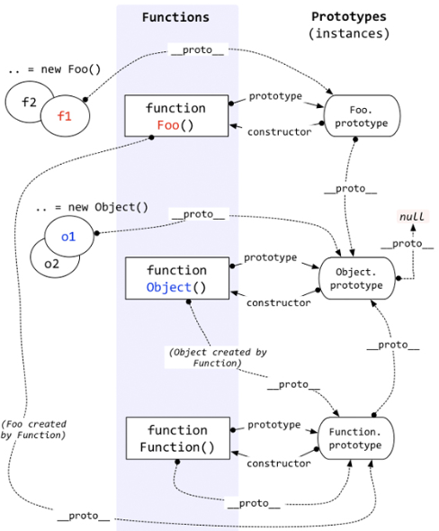
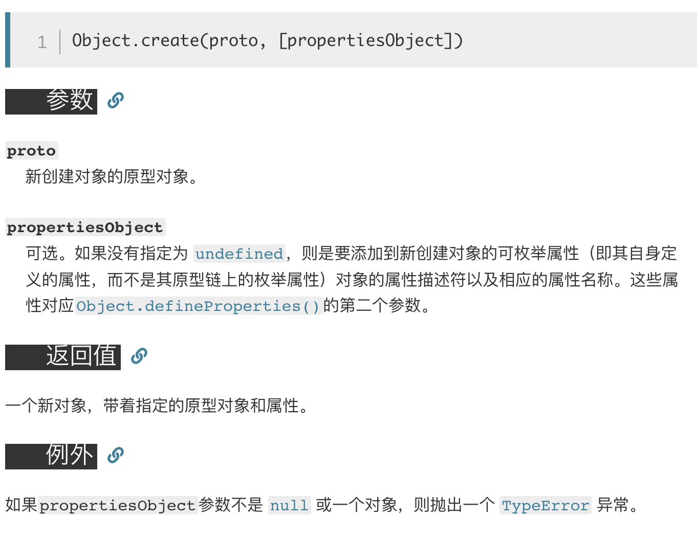

# 原型 继承

## 读懂一张图



##

new Foo().**proto** = Foo.ptototype

function Foo().ptototype.**ptoto** = Object.prototype

Foo.**proto** = Function.prototype 

Function.prototype.**proto** = Object.prototype

Object.prototype.**proto** = null

// constrctor

Object.prototype.constrctor = function Object()

 function Object().**proto** = Function.prototype

Function.prototype.constrctor = function Function()

function Function().**proto** = Function.prototype

## Object.create

Object.create()方法创建一个新对象，使用现有的对象来提供新创建的对象的\_\_proto\_\_

把新建对象的\_\_proto\_\_指向自己



## Function 对象

Function.prototype是引擎创造的

函数就是对象

> var sum = new Function('a', 'b', 'return a + b');

Function 是最顶层的构造器。它构造了系统中所有的对象，包括用户自定义对象，系统内置对象，甚至包括它自已

Object 是最顶层的对象，所有的对象都将继承 Object 的原型

Object 也是一个函数对象 所以说 Object 是被 Function 构造出来的。

## prototype

#### prototype 如何产生的

当我们声明一个函数时，这个属性就被自动创建了。

> <font style="color:#D73A49;background-color:#F6F8FA;">function</font><font style="background-color:#F6F8FA;"> </font><font style="color:#6F42C1;background-color:#F6F8FA;">Foo</font><font style="background-color:#F6F8FA;">() {}</font>

prototype 属性。这是一个显式原型属性，只有函数才拥有该属性

class是prototype的语法糖，最后通过babel转化

Chrome：51 版起便可以支持 97% 的 ES6 新特性。

> ES6 classes are syntactical sugar to provide a much simpler and clearer syntax to create objects and deal with inheritance.

## **proto**

这是每个对象都有的隐式原型属性，指向了创建该对象的构造函数的原型

因为在 JS 中是没有类的概念的，为了实现类似继承的方式，通过 *proto* 将对象和原型联系起来组成原型链，得以让对象可以访问到不属于自己的属性。

## constructor

constructor是prototype对象的属性

constructor 是一个公有且不可枚举的属性。一旦我们改变了函数的 prototype ，那么新对象就没有这个属性了

### 作用

让实例对象知道是什么函数构造了它

## <font style="color:#000000;">function</font><font style="color:#000000;"> </font><font style="color:#000000;">Foo</font><font style="color:#000000;">() {} </font>

function 就是一个语法糖\
内部调用了new Function(...)

## new 的过程

### 实现一个new

```javascript
function create() {
    // 创建一个空的对象
    let obj = new Object()
    // 获得构造函数 arguments[0]是构造函数
    let Con = [].shift.call(arguments)
    // 链接到原型
	obj.__proto__ = Con.prototype
    // 绑定 this，执行构造函数
    let result = Con.apply(obj, arguments)
    // 确保 new 出来的是个对象
    return typeof result === 'object' ? result : obj
}
```

## Function.proto === Function.prototype

**Function.**proto**.**proto** === Object.prototype**

首先引擎创建了 Object.prototype ，然后创建了 Function.prototype ，并且通过 **proto** 将两者联系了起来

因为 Function.prototype 是引擎创建出来的对象，引擎认为不需要给这个对象添加 prototype 属性。

## 总结

* `Object` 是所有对象的爸爸，所有对象都可以通过 `__proto__` 找到它
* `Function` 是所有函数的爸爸，所有函数都可以通过 `__proto__` 找到它
* `Function.prototype` 和 `Object.prototype` 是两个特殊的对象，他们由引擎来创建
* 除了以上两个特殊对象，其他对象都是通过构造器 `new` 出来的
* 函数的 `prototype` 是一个对象，也就是原型
* 对象的 `__proto__` 指向原型， `__proto__` 将对象和原型连接起来组成了原型链

## 参考文章

<https://github.com/KieSun/Blog/issues/2>


> 更新: 2019-02-13 11:46:39  
> 原文: <https://www.yuque.com/u3641/dxlfpu/ov6wbl>