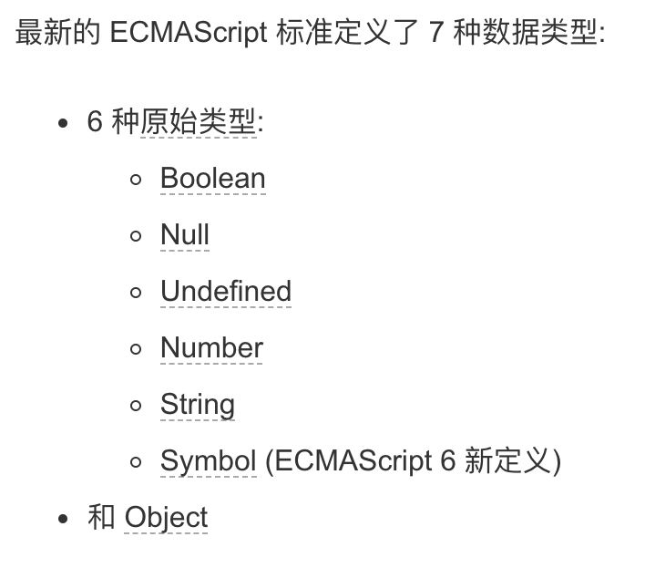

# 深浅拷贝



## 引用类型

 对象是指内存中的可以被 标识符引用的一块区域.

Object( Function Date )

### 对象

<font style="color:#333333;">在 Javascript 里，对象可以被看作是一组属性的集合</font>

<font style="color:#333333;">属性使用键来标识，它的键值可以是一个字符串或者符号值（Symbol）。</font>

ECMAScript定义的对象中有两种属性：数据属性和访问器属性。

一个 Javascript 对象就是键和值之间的映射, 使得对象非常符合 哈希表。

### <font style="color:#333333;">访问器属性</font>

<font style="color:#333333;">访问器属性有一个或两个访问器函数 (get 和 set) 来存取数值</font>

### 数组也是对象

数组是一种使用整数作为键(integer-key-ed)属性和长度(length)属性之间关联的常规对象

数组对象还继承了 Array.prototype 的一些操作数组的便捷方法。例如, indexOf (搜索数组中的一个值) or push (向数组中添加一个元素)，等等。 这使得数组是表示列表或集合的最优选择。

## 包装类型

操作原始类型的时候，JS会自动包装为包装类型。

## 浅拷贝

### Object.assign(target, ...sources)

浅拷贝是涉及到引用类型的复制时遇到的问题

浅拷贝之后目标对象 a 的基本类型值没有改变，但是引用类型值发生了改变，因为 Object.assign() 拷贝的是属性值。假如源对象的属性值是一个指向对象的引用，它也只拷贝那个引用地址。

### 使用展开运算符

```javascript
let a = {
    age: 1
}
let b = {...a}
a.age = 2
console.log(b.age) // 1
```

### 缺点

但是拷贝只解决了第一层的问题 如果接下去的值中还有对象的话 两者享有相同的引用

## 实现一个Object.assign

判断原生 Object 是否支持该函数，如果不存在的话创建一个函数 assign，并使用 Object.defineProperty 将该函数绑定到 Object 上

## 深拷贝

### JSON.parse(JSON.stringify(obj))

#### 缺点

* 会忽略 `undefined`
* 会忽略 `symbol`
* 不能序列化函数
* 不能解决循环引用的对象

该函数是内置函数中处理深拷贝性能最快的

#### lodash 深拷贝


> 更新: 2019-01-13 14:41:43  
> 原文: <https://www.yuque.com/u3641/dxlfpu/mfx2fi>