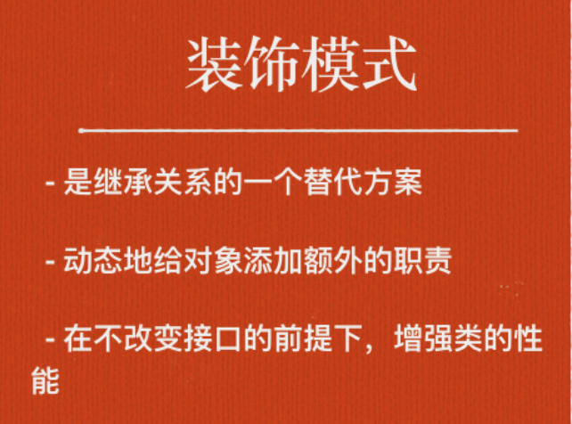

# 装饰器

## 所谓ES6的常用应用


+ const/let
+ 箭头函数
+ Promise
+ async await
+ 解构/扩展运算符
+ Object assgin
+ class static
+ 数组遍历api
+ Reflect

```javascript
Reflect.defineProperty(Vue.prototype, this.name, {
  value: this,
  writable: false,
  enumerable: false,
  configurable: false
});
```


## 包装模式
装饰模式和适配器模式都是 包装模式 (Wrapper Pattern)，它们都是通过封装其他对象达到设计的目的的，但是它们的形态有很大区别。


+ 适配器模式我们使用的场景比较多，比如连接不同数据库的情况，你需要包装现有的模块接口，从而使之适配数据库 —— 好比你手机使用转接口来适配插座那样；





## 装饰类
```javascript
// 装饰类
@annotation
class MyClass { }

function annotation(target) {
   target.annotated = true;
}

装饰方法或属性
```


[https://github.com/mqyqingfeng/Blog/issues/109](https://github.com/mqyqingfeng/Blog/issues/109)


## 装饰方法
装饰方法本质上还是使用 Object.defineProperty() 来实现的。


Decorators 的本质是利用了 ES5 的 Object.defineProperty 属性，这三个参数其实是和 Object.defineProperty 参数一致的


以上我们都是用于修饰类方法，我们获取值的方式为：

> const method = descriptor.value;
>


方法装饰器有3个参数

+ target
+ key 方法名称
+ desciptor 描述对象


```javascript
@gang('The Warriors', 'Coney Island')
class Group1 {
	constructor(){

  }
}


@gang('The Riffs', 'Gramercy Park')
class Group2 {
	constructor(){

  }
}


@gang('Turnbull ACs', 'Gunhill')
class Group3 {
	constructor(){

  }
}


function gang(name, location) {
 return function(target) {

    target.locName = name;
    target.location = location;

  }

}

console.log('location=',Group1.location)
console.log('location=',Group2.location)
console.log('location=',Group3.location)
```


### 


## 应用


装饰模式经典的应用是 AOP 编程，比如“日志系统”


### log注释
```javascript
class Math {
  @log
  add(a, b) {
    return a + b;
  }
}

function log(target, name, descriptor) {
  var oldValue = descriptor.value;

  descriptor.value = function(...args) {
    console.log(`Calling ${name} with`, args);
    return oldValue.apply(this, args);
  };

  return descriptor;
}

const math = new Math();

// Calling add with [2, 4]
math.add(2, 4);
```


### mixin


```javascript
const SingerMixin = {
  sing(sound) {
    alert(sound);
  }
};

const FlyMixin = {
  // All types of property descriptors are supported
  get speed() {},
  fly() {},
  land() {}
};

@mixin(SingerMixin, FlyMixin)
class Bird {
  singMatingCall() {
    this.sing('tweet tweet');
  }
}

var bird = new Bird();
bird.singMatingCall();
// alerts "tweet tweet"

function mixin(...mixins) {
  return target => {
    if (!mixins.length) {
      throw new SyntaxError(`@mixin() class ${target.name} requires at least one mixin as an argument`);
    }

    for (let i = 0, l = mixins.length; i < l; i++) {
      const descs = Object.getOwnPropertyDescriptors(mixins[i]);
      const keys = Object.getOwnPropertyNames(descs);

      for (let j = 0, k = keys.length; j < k; j++) {
        const key = keys[j];

        if (!target.prototype.hasOwnProperty(key)) {
          Object.defineProperty(target.prototype, key, descs[key]);
        }
      }
    }
  };
}
```


### debonce


```javascript
function _debounce(func, wait, immediate) {
		// return 一个function
    // 缓存timeout定时器ID
    var timeout = null; 

  	// wrapper function
    // 闭包 return的fn 就被称为闭包。
    return function () {
      	// 缓存this
        var context = this;
        var args = arguments;

      	//连续触发fn 如果 假设一个用户一直触发这个函数，且每次触发函数的间隔小于wait，防抖的情况下只会调用一次
        if (timeout) clearTimeout(timeout);
        if (immediate) {
            // 是否马上调用 
          	// 第一次按下 立即调用 
            // 然后再wait之内连续按下，timeout有了，不会立即调用，会清除timeout定时器，直到wait之后，timeout = null
            var callNow = !timeout;
            timeout = setTimeout(function(){
                timeout = null;
            }, wait)
            if (callNow) func.apply(context, args)
        }
      	// 不难看出如果用户调用该函数的间隔小于wait的情况下，上一次的时间还未到就被清除了，并不会执行函数
        // 大于wait 函数才会被执行
        else {
            timeout = setTimeout(function(){
                func.apply(context, args)
            }, wait);
        }
    }
}

function debounce(wait, immediate) {
  return function handleDescriptor(target, key, descriptor) {
    const callback = descriptor.value;

    if (typeof callback !== 'function') {
      throw new SyntaxError('Only functions can be debounced');
    }

    var fn = _debounce(callback, wait, immediate)

    // 这样写什么意思？
    // return 一个descriptor
    return {
      ...descriptor,
      value() {
        fn()
      }
    };
  }
}
```


### 钢铁侠的例子


```javascript
function decorateArmour(target, key, descriptor) {
  // 装饰的是init方法，必须调用init
  const method = descriptor.value;
  let moreDef = 100;
  let ret;
  descriptor.value = (...args)=>{
    args[0] += moreDef;
    ret = method.apply(target, args);
    return ret;
  }
  return descriptor;
}

class Man{
  constructor(def = 2,atk = 3,hp = 3){
    this.init(def,atk,hp);
  }

  @decorateArmour
  init(def,atk,hp){
    this.def = def; // 防御值
    this.atk = atk;  // 攻击力
    this.hp = hp;  // 血量
  }
  toString(){
    return `防御力:${this.def},攻击力:${this.atk},血量:${this.hp}`;
  }
}

var tony = new Man();

console.log(`当前状态 ===> ${tony}`);
// 输出：当前状态 ===> 防御力:102,攻击力:3,血量:3
```


## playground
[jsfiddle.net/wcrowe/o5owvteL/](http://jsfiddle.net/wcrowe/o5owvteL/)


## 参考


[http://taobaofed.org/blog/2015/11/16/es7-decorator/](http://taobaofed.org/blog/2015/11/16/es7-decorator/)


> 更新: 2019-08-05 14:42:29  
> 原文: <https://www.yuque.com/u3641/dxlfpu/bap4a5>