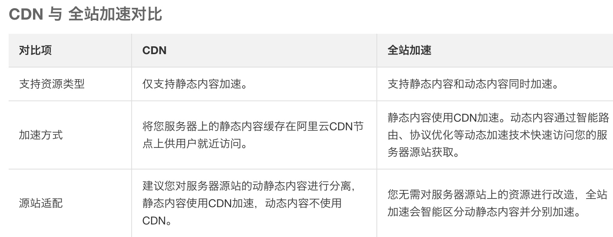

# CDN

## CDN加速那些事情

把加速域名指向CNAME地址 访问加速域名的请求才能转发到CDN节点上

github page那里填入你的自定义加速域名

## 源站

OSS源站

自己的服务器

## 加速服务器

分布全球，就近访问，就近返回。没有内容，从源站访问，缓存在加速服务器。

## 全站加速

chouchou.lovefrontend.com  -> chouchou.lovefrontend.com.w.kunluncan.com

> 融合了动态加速和静态加速技术的CDN产品
>

静态内容 css js html  
动态内容 后端模板渲染

解决问题：  
单线源站、突发流量、网络拥塞等诸多因素导致

加速域名的源站，建议搭配使用 阿里云ECS 或 OSS对象存储，以达到最好的加速效果

## 给OSS添加CDN域名

### 源站信息

类型  
OSS域名 / orange-stone.oss-cn-hangzhou.aliyuncs.com

地址  
orange-stone.oss-cn-hangzhou.aliyuncs.com

回源端口  
80

用户访问这个域名  
static.lovefrontend.com

> 更新: 2019-02-14 15:04:23  
> 原文: <https://www.yuque.com/u3641/dxlfpu/ovges8>