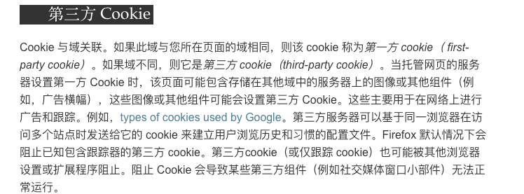

# cookie

# 创建


一个响应头

```java
Set-Cookie: <cookie名>=<cookie值>

Set-Cookie: <cookie-name>=<cookie-value> 
Set-Cookie: <cookie-name>=<cookie-value>; Expires=<date>
Set-Cookie: <cookie-name>=<cookie-value>; Max-Age=<non-zero-digit>
Set-Cookie: <cookie-name>=<cookie-value>; Domain=<domain-value>
Set-Cookie: <cookie-name>=<cookie-value>; Path=<path-value>
Set-Cookie: <cookie-name>=<cookie-value>; Secure
Set-Cookie: <cookie-name>=<cookie-value>; HttpOnly

Set-Cookie: <cookie-name>=<cookie-value>; SameSite=Strict
Set-Cookie: <cookie-name>=<cookie-value>; SameSite=Lax
Set-Cookie: <cookie-name>=<cookie-value>; SameSite=None

// Multiple attributes are also possible, for example:
Set-Cookie: <cookie-name>=<cookie-value>; Domain=<domain-value>; Secure; HttpOnly

```


下一次请求，浏览器都会默认携带该 cookie


```bash
Cookie: PHPSESSID=298zf09hf012fh2; csrftoken=u32t4o3tb3gg43; _gat=1
```


# 生命周期


设置过期时间


```java
Set-Cookie: id=a3fWa; Expires=Wed, 21 Oct 2015 07:28:00 GMT;
```


+ 会话 cookie，浏览器关闭之后会自动删除。会话期 cookie 不需要指定 Expires 或者 Max-Age
+ 持久性 Cookie，取决于过期时间 Expires 或有效期 Max-Age 指定的一段时间，该时间只与客户端有关，和服务端无关


# 限制访问
+ Secure
+ HttpOnly


# 作用域
+ domain
    - 如果设置 Domain 为父域名，Cookie 也被包含在子域名中
+ path
    - 如果设置 Path 为 /docs ，则 /docs/Web/ 也会匹配
+ semesite
    - None
        * 同站发送
        * 跨站也发送
    - Strict
        * 只在访问相同站点时发送 Cookie
    - Lax
        * 新版本浏览器，默认选项
        * 与 Strict 类似，但用户从外部站点导航至 URL 时除外。
        * Cookies are allowed to be sent with top-level navigations and will be sent along with GET request initiated by third party website. This is the default value in modern browsers.
        * Cookie允许通过顶级导航发送，并将与第三方网站发起的GET请求一起发送。 这是现代浏览器中的默认值。


# 安全
+ XSS
+ CSRF
    - 对用户输入进行过滤
    - 任何敏感操作需要确认
    - [https://www.owasp.org/index.php/Cross-Site_Request_Forgery_(CSRF)_Prevention_Cheat_Sheet](https://www.owasp.org/index.php/Cross-Site_Request_Forgery_(CSRF)_Prevention_Cheat_Sheet)


# 跟踪


Cookie 与域关联，如果此域与您所在的域名相同，则该 cookie 为第一方 cookie [first party cokie]


如果域名不同，则它是第三方 cookie


比如使用 a网站，该网站加载了c网站的代码，c网站的代码会设置第三方cookie，具体看下面这个例子


> baidu是如何知道用baidu搜索和人人影视的是同一个人呢？它其实是不知道的，它只知道是同一个浏览器访问过这两个网站。在浏览器里有个叫cookie的东西。在你第一访问baidu的时候，baidu就会给你编个号，比如9527，这编号就存在cookie里。当你打开人人影视的网站的时候，baidu的程序就知道9527来了，他最近对什么感兴趣呢？查一下，哦，最近你在baidu搜过xxxx，好的，查查看有没有类似的广告，好的，找到了，展示广告。当你点击广告后，人人影视就可以从baidu那里收到一笔钱了，baidu就可以从广告主那里收到一笔钱。
>
> 
>
> 
>
> 作者：王军
>

> 链接：[https://www.zhihu.com/question/21470620/answer/18334014](https://www.zhihu.com/question/21470620/answer/18334014)
>

> 来源：知乎
>

> 著作权归作者所有。商业转载请联系作者获得授权，非商业转载请注明出处。
>


[https://zhuanlan.zhihu.com/p/34591096](https://zhuanlan.zhihu.com/p/34591096)





> 更新: 2020-09-05 13:42:13  
> 原文: <https://www.yuque.com/u3641/dxlfpu/asu2by>