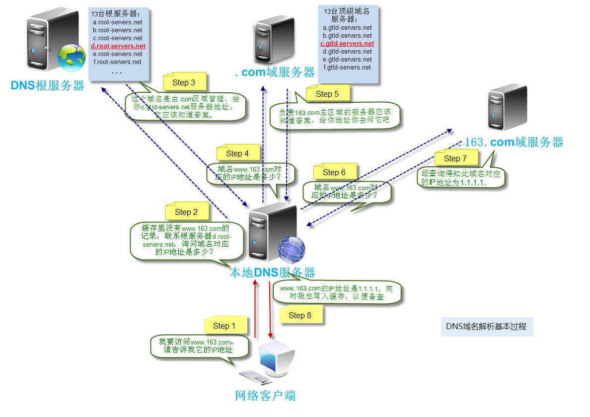
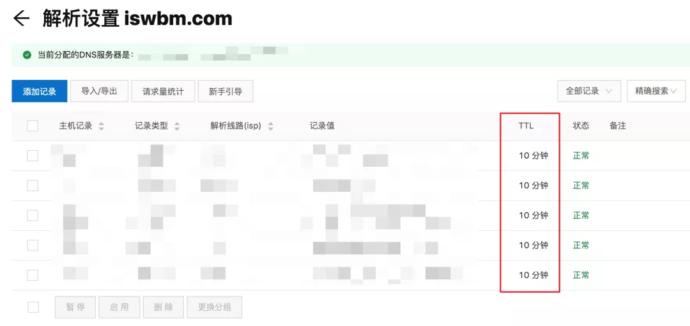
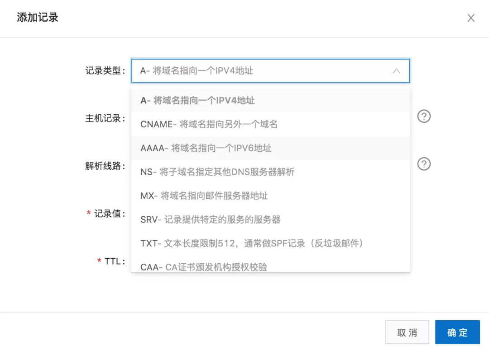

# dns

# DNS服务器


# 域名层级
主机名.次级域名.顶级域名.根域名


+ root
+ 顶级域名
+ 次级域名
+ 主机名


# 解析过程


递归和迭代


1. 主机向本地域名服务器的查询一般都是采用 递归查询


2. 本地域名服务器向根域名服务器的查询的 迭代查询




# DNS的缓存时间


配置 DNS 解析的时候，会有一个 TTL 参数（Time To Live），意思就是这个缓存可以存活多长时间，过了这个时间，本地 DNS 就会删除这条记录




# DNS 的记录类型


# 手动清理本地缓存
```bash
MacOS
$ sudo dscacheutil -flushcache
$ sudo killall -HUP mDNSResponder
```


# 工具
+ dig 查询DNS包括NS记录，A记录，MX记录等相关信息的工具
+ whois 查看域名的注册情况
+ nslookup 查询 DNS 解析结果的工具
+ host 可以看作dig命令的简化版本


```bash
dig +trace www.163.com
```


> 更新: 2020-08-22 11:39:51  
> 原文: <https://www.yuque.com/u3641/dxlfpu/xnh3am>