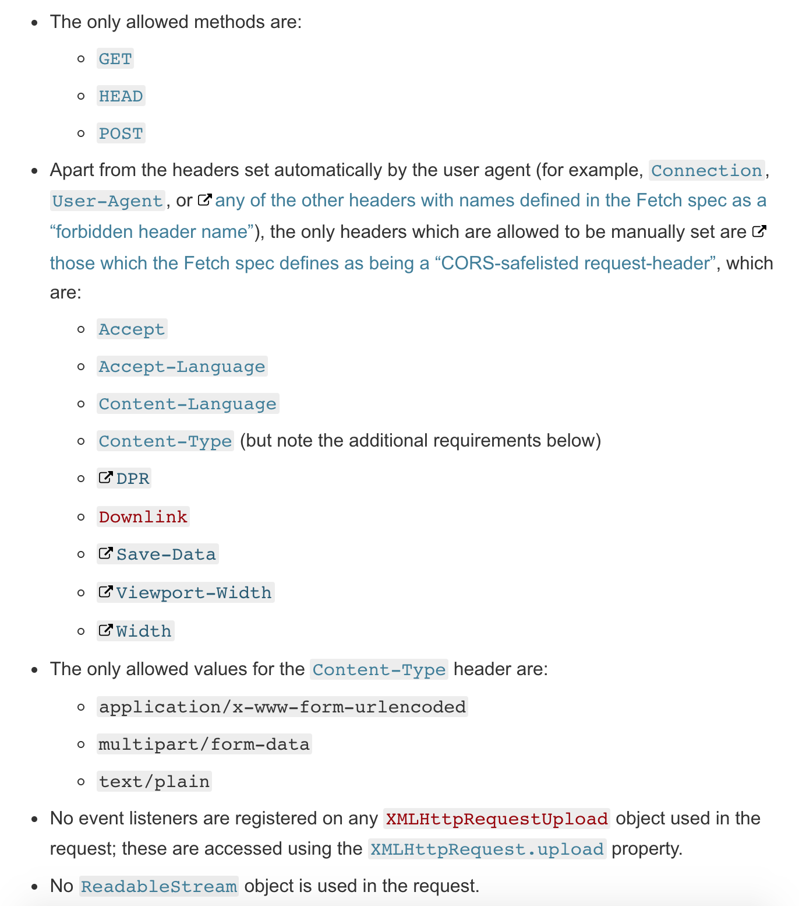
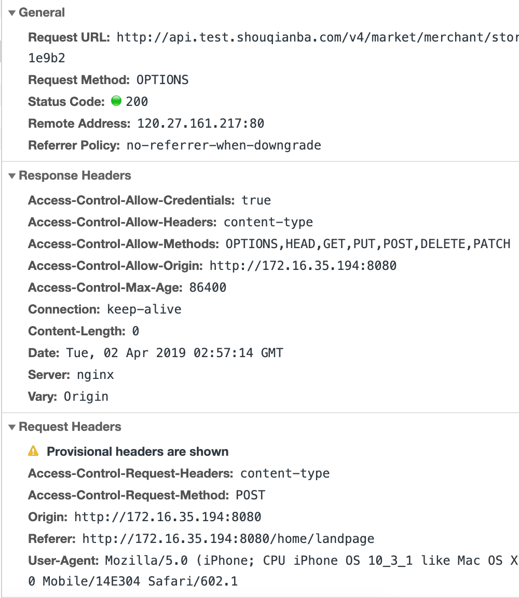

# get 请求会发预检请求吗

# 同源
是指，域名、协议、端口均为相同。

# simple request ?

  

---

# 非简单请求

当请求满足下述任一条件时，即应首先发送预检请求：

**使用了下面任一 HTTP 方法：【GET、POST、PUT之外的】**

+ PUT
+ DELETE
+ CONNECT
+ OPTIONS
+ TRACE
+ PATCH

**人为设置了对 CORS 安全的首部字段集合之外的其他首部字段。该集合为：**

+ Accept
+ Accept-Language
+ Content-Language
+ Content-Type (but note the additional requirements below)
+ DPR
+ Downlink
+ Save-Data
+ Viewport-Width
+ Width

**Content-Type 的值不属于下列之一: 【比如 application/json】**

+ application/x-www-form-urlencoded
+ multipart/form-data
+ text/plain

-----

# 一个OPTIONS请求
  

# FAQ

非简单请求的CORS请求，会在正式通信之前，增加一次HTTP查询请求，称为"预检"请求（preflight）。

## 是否每次都需要预检请求？
Access-Control-Max-Age 头指定了preflight请求的结果能够被缓存多少秒？

## 添加自定义的Header?
服务端设置Access-Control-Allow-Headers

## 一切的一切都符合简单请求了，还会发预检请求？
POST 仍然发送预先飞行请求的原因在于 XMLHttpRequestUpload 事件侦听器。

## JSONP
CORS与JSONP的使用目的相同，但是比JSONP更强大。JSONP只支持GET请求，CORS支持所有类型的HTTP请求。JSONP的优势在于支持老式浏览器，以及可以向不支持CORS的网站请求数据。

# 结论
**如果是get请求，加了自定义的Header，是会发预检请求的。**

> 更新: 2020-08-21 10:10:59  
> 原文: <https://www.yuque.com/u3641/dxlfpu/cc7u87>