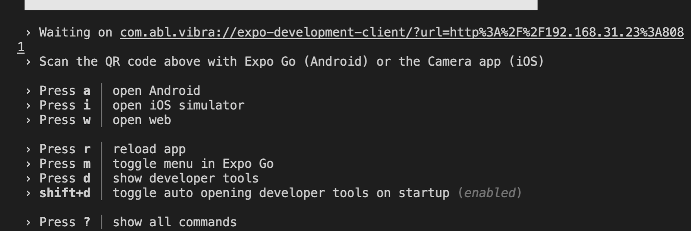

# expo-bare-template

修改了那些


# 初始化
```javascript
expo init --template bare-minimum

```


# react-native-unimodules


主要集成了 unimodules


> we'll need to install and configure the react-native-unimodules package to enable you to use packages from the Expo SDK.
>


[https://github.com/expo/expo/tree/master/packages/react-native-unimodules](https://github.com/expo/expo/tree/master/packages/react-native-unimodules)


[https://docs.expo.io/bare/installing-unimodules/](https://docs.expo.io/bare/installing-unimodules/)


```javascript
import { Asset, Constants, FileSystem } from 'react-native-unimodules';

```


另外修改了


# babel.config.js
```javascript
module.exports = function(api) {
  api.cache(true);
  return {
    presets: ['babel-preset-expo'],
  };
};

```


# tsconfig.json
```javascript
{
  "extends": "expo/tsconfig.base",
  "compilerOptions": {
    "strict": true
  }
}

```

# metro.config.js
```javascript
// Learn more https://docs.expo.io/guides/customizing-metro
const { getDefaultConfig } = require('expo/metro-config');

module.exports = getDefaultConfig(__dirname);

```

# app.json
```javascript
{
  "name": "mybareApp",
  "displayName": "mybareApp",
  "expo": {
    "name": "mybareApp",
    "slug": "mybareApp",
    "version": "1.0.0",
    "assetBundlePatterns": [
      "**/*"
    ]
  }
}

```

# run
```javascript
expo run:ios


expo run:android
```

# 
# expo-updates


# Updating your App Over-the-Air
  


> 更新: 2021-07-15 11:15:36  
> 原文: <https://www.yuque.com/u3641/dxlfpu/bvg2fy>