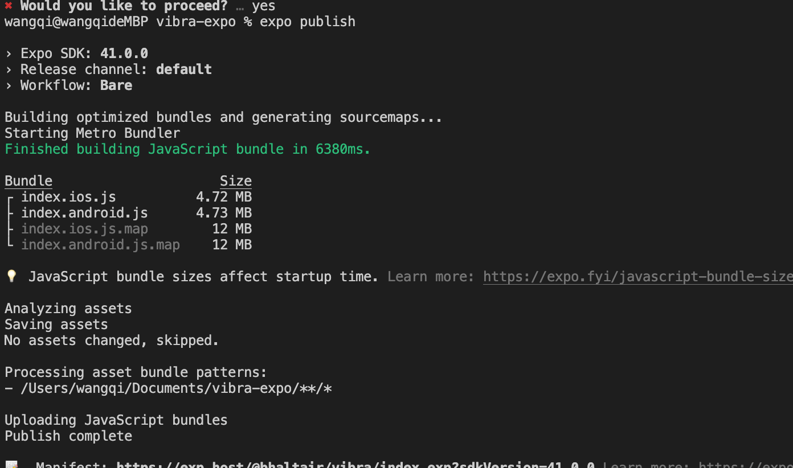

# expo-cli

# publish
Deploy a project to Expo hosting

如果使用 expo publish 发布更新，则需要设置 EXUpdatesURL 为 [https://exp.host/@username/slug](https://exp.host/@username/slug)

[https://exp.host/@bhaltair/vibra/index.exp?sdkVersion=41.0.0](https://exp.host/@bhaltair/vibra/index.exp?sdkVersion=41.0.0)

每次使用 expo publish,会上传到 expo 自己的 CDN 上

manifest [https://exp.host/@bhaltair/vibra/index.exp?sdkVersion=41.0.0](https://exp.host/@bhaltair/vibra/index.exp?sdkVersion=41.0.0)

# eject
# export
Export the static files of the app for hosting it on a web server

# prebuild

> 更新: 2021-08-17 14:34:42  
> 原文: <https://www.yuque.com/u3641/dxlfpu/vvnqys>