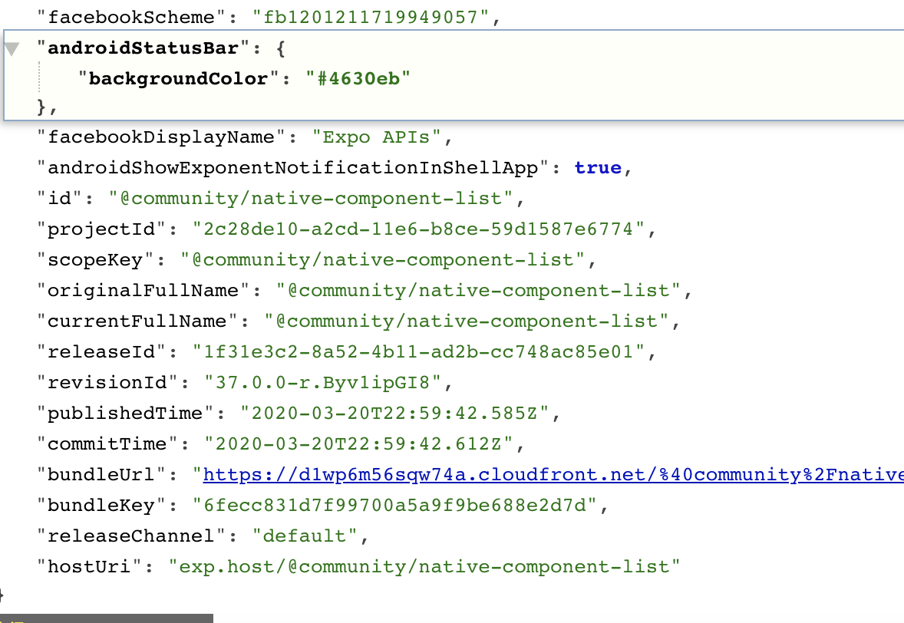
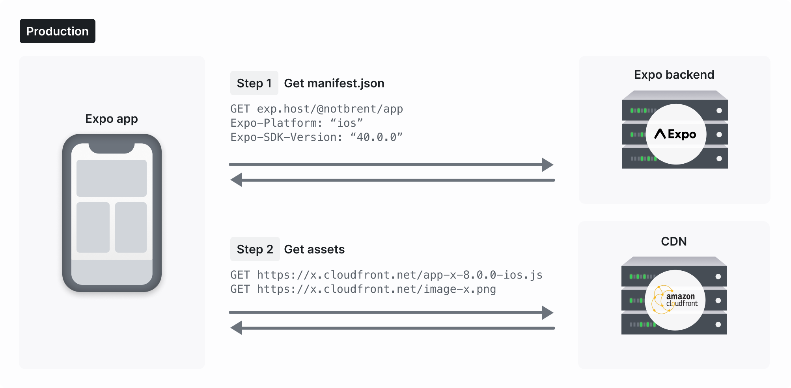

# expo-updates

[https://www.wddsss.com/main/displayArticle/267](https://www.wddsss.com/main/displayArticle/267)


[https://docs.expo.dev/bare/updating-your-app/](https://docs.expo.dev/bare/updating-your-app/)


[https://docs.expo.dev/bare/installing-updates/](https://docs.expo.dev/bare/installing-updates/)


[https://github.com/expo/expo/blob/master/packages/expo-updates/README.md](https://github.com/expo/expo/blob/master/packages/expo-updates/README.md)


# expo


此外，你需要将更新和它们各自的资产(JavaScript包、图像、字体等)托管在部署客户端应用程序可以访问的服务器上。expo-cli提供了几个简单的选项:


(1)expo export 创建预构建的更新包，你可以上传到任何静态托管网站(例如GitHub Pages)，


(2)expo publish 和部署您的更新到expo的更新服务，这是我们提供的服务的一部分。


```javascript
import codePush from 'react-native-code-push';

codePush.getUpdateMetadata().then((update: {description: string}) => {
  if (update) {
    that.setState({
      appVersion: update.description
    })
  }
});
```


## manifest-url
An Expo app manifest is similar to a web app manifest - it provides information that Expo needs to know how to run the app and other relevant data.


When you publish a project you are given a manifest URL. This is where your app will look for updates in the future. The URL you are given is not directly accessible in the web browser without adding some additional headers or parameters. 


```
<font style="color:#F5222D;">部分截图：</font>
```




一个 Demo:


[https://exp.host/@bhaltair/vibra/index.exp?sdkVersion=41.0.0](https://exp.host/@bhaltair/vibra/index.exp?sdkVersion=41.0.0)


[https://exp.host/@community/native-component-list](https://exp.host/@community/native-component-list)


[https://exp.host/@community/native-component-list/index.exp?sdkVersion=37.0.0](https://exp.host/@community/native-component-list/index.exp?sdkVersion=37.0.0)


---


expo publish 后，上传到 aws cloudfront，并且更新 revisionId 字段和别的


[https://d1wp6m56sqw74a.cloudfront.net/~assets/3add67963d4e149b704c02aa2b3d3910](https://d1wp6m56sqw74a.cloudfront.net/~assets/3add67963d4e149b704c02aa2b3d3910)


## expo publish


[https://docs.expo.dev/bare/updating-your-app/#served-update-requirements](https://docs.expo.dev/bare/updating-your-app/#served-update-requirements)


Android


```yaml
<meta-data android:name="expo.modules.updates.ENABLED" android:value="true"/>
<meta-data android:name="expo.modules.updates.EXPO_RELEASE_CHANNEL" android:value="default"/>
<meta-data android:name="expo.modules.updates.EXPO_SDK_VERSION" android:value="41.0.0" />
<meta-data android:name="expo.modules.updates.EXPO_UPDATES_CHECK_ON_LAUNCH" android:value="ALWAYS"/>
<meta-data android:name="expo.modules.updates.EXPO_UPDATES_LAUNCH_WAIT_MS" android:value="300000"/>
<meta-data android:name="expo.modules.updates.EXPO_UPDATE_URL" android:value="https://kiki-vibra.web.app/android-index.json" />
```

iOS

```yaml
  <dict>
    <key>EXUpdatesCheckOnLaunch</key>
    <string>ALWAYS</string>
    <key>EXUpdatesEnabled</key>
    <true/>
    <key>EXUpdatesLaunchWaitMs</key>
    <integer>300000</integer>
    <key>EXUpdatesSDKVersion</key>
    <string>41.0.0</string>
    <key>EXUpdatesURL</key>
    <string>https://exp.host/@bhaltair/vibra</string>
  </dict>
```

## 兼容性


## Release Channels

```
expo publish --release-channel <channel-name>
```


[https://docs.expo.dev/distribution/release-channels/#using-release-channels-in-the-bare-workflow](https://docs.expo.dev/distribution/release-channels/#using-release-channels-in-the-bare-workflow)


## 手动更新


```plain
try {
  const update = await Updates.checkForUpdateAsync();
  if (update.isAvailable) {
    await Updates.fetchUpdateAsync();
    // ... notify user of update ...
    Updates.reloadAsync();
  }
} catch (e) {
  // handle or log error
}
```


## How Expo Works  
```
<font style="color:#F5222D;">Publishing/Deploying an Expo app in Production</font>
```





When you publish an Expo app, we compile it into a JavaScript bundle with production flags enabled. That is, we minify the source and we tell Metro to build in production mode (which in turn sets __DEV__ to false amongst other things). After compilation, we upload that bundle, along with any assets that it requires (see Assets) to CloudFront. We also upload your Manifest (including most of your app.json configuration) to our server. This manifest will include a revisionId key which is a unique string (generated by Expo) you can use to identify a specific release of your app, just in case you didn't increment your app's version key. When publishing is complete, we'll give you a URL to your app which you can send to anybody who has the Expo Go app.


As soon as the publish is complete, the new version of your code is available to all your existing users. They'll download the updated version next time they open the app or refresh it, provided that they have a version of the Expo Go app that supports the sdkVersion specified in your app.json.


```
<font style="color:#F5222D;">Updates are handled differently on iOS and Android</font>. On Android, updates are downloaded in the background. This means that the first time a user opens your app after an update they will get the old version while the new version is downloaded in the background. The second time they open the app they'll get the new version. On iOS, updates are downloaded synchronously, so users will get the new version the first time they open your app after an update.
```


## 卸载 expo-updates


[https://github.com/expo/expo/blob/master/packages/expo-updates/README.md](https://github.com/expo/expo/blob/master/packages/expo-updates/README.md)


## 使用 expo-go 扫码


[https://expo.dev/@community/native-component-list](https://expo.dev/@community/native-component-list)


[https://expo.dev/@bhaltair/vibra](https://expo.dev/@bhaltair/vibra)


## Hosting Updates on Your Servers


比如 public-url 是 [https://kiki-vibra.web.app](https://kiki-vibra.web.app)


[https://kiki-vibra.web.app/ios-index.json](https://kiki-vibra.web.app/ios-index.json)

[https://kiki-vibra.web.app/android-index.json](https://kiki-vibra.web.app/android-index.json)


```
<font style="color:#F5222D;">build</font>
```


```yaml
expo build:android --public-url <path-to-android-index.json>
expo build:ios --public-url <path-to-ios-index.json>
```


## 术语


standalone apps - 独立应用


> 更新: 2023-04-27 15:44:42  
> 原文: <https://www.yuque.com/u3641/dxlfpu/ekkcgw>