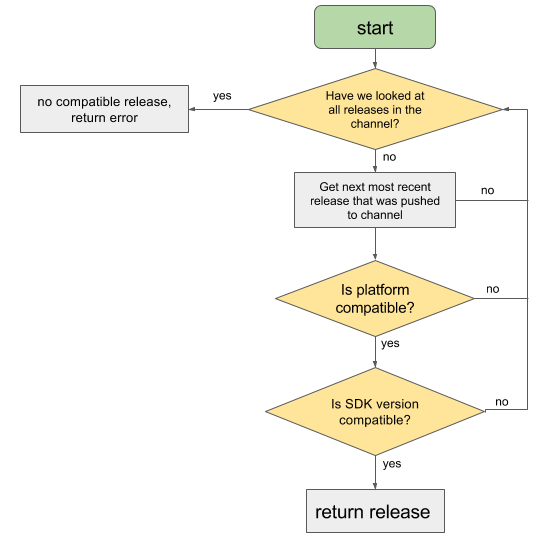

# expo 教程

# 介绍
Expo是一组工具、库和服务，可以通过编写JavaScript来构建本地的ios和Android应用程序。


Expo Apps是包含了Expo SDK的react native Apps,SDK是一个native-and-js的库，它包提供对设备系统的访问功能，像照相机、联系人、本地存储和其他硬件）。这意味着你不需要使用Xcode或Android的环境，或写任何代码也使得你的pure-JS项目非常便携，因为它可以运行在任何自然环境包含Expo SDK。


# template
[https://github.com/expo/examples](https://github.com/expo/examples)

[https://github.com/expo/expo/tree/master/templates](https://github.com/expo/expo/tree/master/templates)

# workflow
+ bare workflow 
+ Managed workflow 托管工作流


在管理工作流中，你只需要编写JavaScript / TypeScript，而Expo工具和服务会为你处理一切。

在裸工作流中，您可以完全控制本机项目的每个方面，而Expo工具和服务则比较有限。


Managed Expo projects don't support custom native code, including third-party libraries which require custom native components. In a managed project, you only write JavaScript.


托管工作流不支持写原生代码，任何时候都可以使用 expo eject 来完全控制，类似 create-react-app那个一样，暴露所有配置


## Managed 模式
Managed模式是由expo-cli生成的，其中自带了完整的Expo SDK，也就是大家最喜欢的Expo全家桶。


Expo全家桶为react native应用开发、调试、发布流程做了极大的简化，也是新手玩家的不二之选。


## Bare 模式


Bare模式带来了更高的可控性（Native层的自定义，选择性引入Expo SDK...），当然这种可控性对开发者带来的也就是更复杂的开发体验，对开发者的技能知识要求相对较高。


# Unimodules
> 还记得令人厌恶的Native Module的倒入过程吗？修改客户端代码对于react native开发者来说是一个极大的挑战，简简单单装个包动不动一天就过去了。在下一个版本中unimodules将彻底抹平这一步，只要npm install，只要npm install，只要npm install，就足够了。
>


<font style="color:#F5222D;">通过unimodules，我们可以在原生react-native应用开发中引入Expo的API</font>


+ 通过Expo工具链开发的应用可以更加无缝地转化成react native应用
+ unimodules输出的包通用性极高，甚至可以被Flutter所使用
+ 实现Native Module的大一统


# app.json
[https://docs.expo.io/versions/v41.0.0/config/app/](https://docs.expo.io/versions/v41.0.0/config/app/)


# metro.config.js
[https://docs.expo.io/versions/v41.0.0/config/metro/](https://docs.expo.io/versions/v41.0.0/config/metro/)

# Expo SDK
[https://docs.expo.io/versions/latest/](https://docs.expo.io/versions/latest/)


## AppLoading
## AppleAuthentication
## Checkbox
## Constants
## Contacts
## Crypto
## DateTimePicker
## Device 设备相关信息
## FileSystem
## Font
## ImagePicker
## KeepAwake
## LinearGradient
## Linking 和其他APP跳转
## Localization 国际化 i18n
## Location 位置
## Lottie 动画
## MapView 地图
## Network 网络信息
## Notifications 通知
## Payments 支付
## Permissions 权限
## Picker 选型
## ScreenCapture 截图
## ScreenOrientation 屏幕方向
## SecureStore 保密存储
## Sensors 传感器
## Slider 滑条
## SMS 短信
## SplashScreen 启动页
## SQLite 
## StatusBar
## StoreReview 去评分
## Svg
## TaskManager 后台任务
## Updates OTA更新
## WebView
# Guides
## Fundamentals 基础


### logging


<font style="color:#F5222D;">View logs with Expo tools</font>

<font style="color:#F5222D;"></font>

<font style="color:#F5222D;">access device logs</font>


### debugging


[https://docs.expo.dev/workflow/debugging/#my-app-crashes-on-certain-older-devices](https://docs.expo.dev/workflow/debugging/#my-app-crashes-on-certain-older-devices)


<font style="color:#F5222D;">React Native Debugger</font>


### using lib
[https://reactnative.directory/](https://reactnative.directory/)


```javascript
expo install @react-navigation/native
```

### Viewing logs


## UI Programming
## Assorted Guides 各种指南
### Routing & Navigation
使用 react-navigation

### Fonts
### Icons
@expo/vector-icons

```bash
import * as React from 'react';
import { View, StyleSheet } from 'react-native';
import { Ionicons } from '@expo/vector-icons';

export default function App() {
  return (
    <View style={styles.container}>
      <Ionicons name="md-checkmark-circle" size={32} color="green" />
    </View>
  );
}
```

### Authentication
### Light and Dark modes 黑暗模式


If working with an iOS emulator locally, you can use the command + shift + a shortcut to toggle between light and dark mode.


```javascript
import { Appearance, useColorScheme } from 'react-native';

function MyComponent() {
  let colorScheme = useColorScheme();

  if (colorScheme === 'dark') {
    // render some dark thing
  } else {
    // render some light thing
  }
}


// component
import React from 'react';
import { Text, StyleSheet, View, useColorScheme } from 'react-native';
import { StatusBar } from 'expo-status-bar'; // automatically switches bar style based on theme!

export default function App() {
  const colorScheme = useColorScheme();

  const themeTextStyle = colorScheme === 'light' ? styles.lightThemeText : styles.darkThemeText;
  const themeContainerStyle =
    colorScheme === 'light' ? styles.lightContainer : styles.darkContainer;

  return (
    <View style={[styles.container, themeContainerStyle]}>
      <Text style={[styles.text, themeTextStyle]}>Color scheme: {colorScheme}</Text>
      <StatusBar />
    </View>
  );
}

const styles = StyleSheet.create({
  container: {
    flex: 1,
    alignItems: 'center',
    justifyContent: 'center',
  },
  lightContainer: {
    backgroundColor: '#d0d0c0',
  },
  darkContainer: {
    backgroundColor: '#242c40',
  },
  lightThemeText: {
    color: '#242c40',
  },
  darkThemeText: {
    color: '#d0d0c0',
  },
```

### OTA Updates
```javascript
import * as Updates from 'expo-updates';

try {
  const update = await Updates.checkForUpdateAsync();
  if (update.isAvailable) {
    await Updates.fetchUpdateAsync();
    // ... notify user of update ...
    await Updates.reloadAsync();
  }
} catch (e) {
  // handle or log error
}
```

### Offline Support 离线支持


[https://docs.expo.dev/guides/offline-support/](https://docs.expo.dev/guides/offline-support/)


默认，静态资源会打包到代码中，OTA 的更新会从CDN下载


> EXPO可以在构建过程中将资源捆绑到您的独立二进制文件中，这样即使用户以前从未运行过您的应用程序，也可以立即使用它们。
>

使用 [NetInfo](https://reactnative.dev/docs/netinfo.html)<font style="color:rgb(27, 31, 35);"> API 监听网络状态</font>


### Splash screen 启动页
### App icons App 图标
### Status Bar 状态栏
```javascript
import React from 'react';
import { View } from 'react-native';
import { StatusBar } from 'expo-status-bar';

export default function Playlists() {
  return (
    <View>
      {/* other code here to show the screen */}

      {/* use light text instead of dark text in the status bar to provide more contrast with a dark background */}
      <StatusBar style="light" />
    </View>
  );
}
```

### Asset Caching 资产缓存
```javascript
async _loadAssetsAsync() {
    const imageAssets = cacheImages([
      'https://www.google.com/images/branding/googlelogo/2x/googlelogo_color_272x92dp.png',
      require('./assets/images/circle.jpg'),
    ]);

    const fontAssets = cacheFonts([FontAwesome.font]);

    await Promise.all([...imageAssets, ...fontAssets]);
  }
```

### Permissions 权限


<font style="color:#F5222D;">iOS</font>


要在iOS上请求权限，您必须描述请求权限的原因，并安装请求和使用权限的库。使用bare工作流时，您必须编辑项目Info.plist。


<font style="color:#F5222D;">Android</font>


In the bare workflow, permissions are controlled in your project AndroidManifest.xml.


### Linking
Linking from your app to other apps

比如跳转到别的App，拨打电话，发送邮件


<font style="color:#F5222D;">Universal/deep links </font>


### Environment variables 环境变量


> <font style="color:rgb(27, 31, 35);background-color:rgb(248, 248, 250);">npx cross-env MY_ENVIRONMENT=production expo publish</font>
>

<font style="color:rgb(27, 31, 35);background-color:rgb(248, 248, 250);"></font>

```javascript
module.exports = () => {
  if (process.env.MY_ENVIRONMENT === 'production') {
    return {
      /* your production config */
    };
  } else {
    return {
      /* your development config */
    };
  }
};
```

### publishing updates





<font style="color:#F5222D;">限制</font>

<font style="color:#F5222D;"></font>

<font style="background-color:#FADB14;">Some native configuration can't be updated by publishingIf you make any of the following changes in app.json, you will need to re-build the binaries for your app for the change to take effect:</font>


+ Increment the Expo SDK Version
+ Change anything under the ios, android, or notification keys
+ Change your app splash
+ Change your app icon
+ Change your app name
+ Change your app owner
+ Change your app scheme
+ Change your facebookScheme
+ Change your bundled assets under assetBundlePatterns


### User Interface Component Libraries


+ [React Native Paper](https://github.com/callstack/react-native-paper), and their [docs](https://callstack.github.io/react-native-paper/index.html)
+ [React Native UI Lib](https://github.com/wix/react-native-ui-lib), and their [docs](https://wix.github.io/react-native-ui-lib/).
+ [React Native Elements](https://react-native-training.github.io/react-native-elements/), and their [docs](https://react-native-training.github.io/react-native-elements/docs/getting_started.html)
+ [Native Base](https://nativebase.io/), and their [docs](https://docs.nativebase.io/)
+ [React Native Material UI](https://github.com/xotahal/react-native-material-ui), and their [docs](https://github.com/xotahal/react-native-material-ui/blob/master/docs/GettingStarted.md)
+ [React Native UI Kitten](https://akveo.github.io/react-native-ui-kitten/#/home), and their [docs](https://akveo.github.io/react-native-ui-kitten/#/docs/quick-start/getting-started)
+ [React Native iOS Kit](https://github.com/callstack/react-native-ios-kit), and their [docs](https://callstack.github.io/react-native-ios-kit/docs/installation.html)


## Bare workflow


### workflow


### updating your app


[https://docs.expo.dev/bare/updating-your-app/](https://docs.expo.dev/bare/updating-your-app/)

## Push Notifications


**1 with Expo's Push API**


<font style="color:#F5222D;">2 DIY：</font>

Here are a few things you'll have to handle yourself if you choose to write your own server for FCM and APNs:Differentiating between native iOS & Android device tokens on your backend

+ Twice the amount of backend code to write and maintain (code for communicating with FCM, and then code for communicating with APNs)
+ Fetching responses from FCM and APNs to check if your notification went through, error handling, credentials management

## Distributing Your App 应用分发
### building-standalone-apps


app.json


```javascript
 {
   "expo": {
    "name": "Your App Name",
    "icon": "./path/to/your/app-icon.png",
    "version": "1.0.0",
    "slug": "your-app-slug",
    "ios": {
      "bundleIdentifier": "com.yourcompany.yourappname",
      "buildNumber": "1.0.0"
    },
    "android": {
      "package": "com.yourcompany.yourappname",
      "versionCode": 1
    }
   }
 }
```


<font style="color:#F5222D;">The ios.buildNumber and android.versionCode distinguish different binaries of your app. Make sure to increment these for each build you upload to the App Store or Google Play Store.</font>


### Release Channel


On the production stack, release v1 of your app by running expo publish --release-channel prod-v1. You can build this version of your app into a standalone ipa by running expo build:ios --release-channel prod-v1. You can push updates to your app by publishing to the prod-v1 channel. The standalone app will update with the most recent compatible version of your app on the prod-v1 channel.


You can edit the native project's release channel by modifying the EXUpdatesReleaseChannel key in Expo.plist (iOS) or the releaseChannel meta-data tag value in AndroidManifest.xml (Android). [Read this guide](https://docs.expo.dev/bare/updating-your-app/) for more information on configuring OTA Updates in a bare app.


+ iOS
    - EXUpdatesReleaseChannel [default]

```yaml
  <dict>
    <key>EXUpdatesCheckOnLaunch</key>
    <string>ALWAYS</string>
    <key>EXUpdatesEnabled</key>
    <true/>
    <key>EXUpdatesLaunchWaitMs</key>
    <integer>300000</integer>
    <key>EXUpdatesSDKVersion</key>
    <string>41.0.0</string>
    <key>EXUpdatesURL</key>
    <string>https://exp.host/@bhaltair/vibra</string>
  </dict>
```

+ Android

```bash
<meta-data android:name="expo.modules.updates.ENABLED" android:value="true"/>
<meta-data android:name="expo.modules.updates.EXPO_RELEASE_CHANNEL" android:value="default" />
<meta-data android:name="expo.modules.updates.EXPO_SDK_VERSION" android:value="41.0.0" />
<meta-data android:name="expo.modules.updates.EXPO_UPDATES_CHECK_ON_LAUNCH" android:value="ALWAYS"/>
<meta-data android:name="expo.modules.updates.EXPO_UPDATES_LAUNCH_WAIT_MS" android:value="300000"/>
<meta-data android:name="expo.modules.updates.EXPO_UPDATE_URL" android:value="https://www.vibra.com/android-index.json" />
```

或者直接修改 app.config.ts

```json
  updates: {
    enabled: true,
    fallbackToCacheTimeout: 300000
  },
```


然后 expo prebuild


---


**<font style="color:#F5222D;">Release channels CLI tools</font>**


```yaml
expo publish:history [--release-channel ] [--count ]

expo publish:history --platform ios

expo publish:details --publish-id 80b1ffd7-4e05-4851-95f9-697e122033c3

```


### app-signing


<font style="color:#F5222D;">android</font>

<font style="color:#F5222D;"></font>

> Google requires all Android apps to be digitally signed with a certificate before they are installed on a device or updated. Usually a private key and its public certificate are stored in a keystore. In the past, APKs uploaded to the store were required to be signed with the app signing certificate (certificate that will be attached to the app in the Play Store), and if the keystore was lost there was no way to recover or reset it. Now, you can opt in to App Signing by Google Play and simply upload an APK signed with an upload certificate, and Google Play will automatically replace it with the app signing certificate. Both the old method (app signing certificate) and new method (upload certificate) are essentially the same mechanism, but using the new method, if your upload keystore is lost or compromised, you can contact the Google Play support team to reset the key.
>


1 上传证书签名

2 App 签名密钥


<font style="color:#F5222D;">iOS</font>


The 3 primary iOS credentials, all of which are associated with your Apple Developer account, are:


+ Distribution Certificate 分发证书
+ Provisioning Profiles 配置文件
+ Push Notification Keys 推送通知密钥


### Deploying to App Stores 注意事项


+ Make app loading seamless
+ Play nicely with the system UI
+ Tailor your app metadata 定制元数据
    - icon
    - primarycolor [在Android上，这将决定您的应用程序在多任务处理器中的颜色。目前iOS不使用此功能]
    - Make sure has a valid <font style="color:#F5222D;">iOS Bundle Identifier and Android Package</font>. Take care in choosing these, as you will not be able to change them later.
+ Versioning your App
+ Privacy Policy 隐私政策
+ iOS-specific guidelines
    - All apps in the App Store must abide by the [App Store Review Guidelines](https://developer.apple.com/app-store/review/guidelines/). 审核指南
    - Apple will ask you whether your app uses the IDFA？
+ Android Permissions
    - [https://docs.expo.dev/guides/permissions/#bare-workflow-1](https://docs.expo.dev/guides/permissions/#bare-workflow-1)
+ Common App Rejections
    - [https://docs.expo.dev/distribution/app-stores/#common-app-rejections](https://docs.expo.dev/distribution/app-stores/#common-app-rejections)
+ System permissions dialogs on iOS
+ Localizing your iOS app 国际化


### Test it on your device or simulator


[Android](https://docs.expo.dev/distribution/building-standalone-apps/#android)

+ **To run it on your Android emulator**, first build your project with the apk flag by running expo build:android -t apk, and you can drag and drop the .apk into the emulator.
+ **To run it on your Android device**, make sure you have the Android platform tools installed along with adb, then just run adb install app-filename.apk with [USB debugging enabled on your device](https://developer.android.com/studio/run/device.html#device-developer-options) and the device plugged in.


[iOS](https://docs.expo.dev/distribution/building-standalone-apps/#ios)

+ **To run it on your iOS simulator**, first build your project with the simulator flag by running expo build:ios -t simulator, then download the artifact with the link printed when your build completes. To install the resulting tar.gz file, unzip it and drag-and-drop it into your iOS simulator. If you'd like to install it from the command line, run tar -xvzf your-app.tar.gz to unpack the file, open a simulator, then run xcrun simctl install booted <path to .app>.
+ **To test a device build with Apple TestFlight**, download the .ipa file to your local machine. Within [App Store Connect](https://appstoreconnect.apple.com/apps), click the plus icon and create a New App. Make sure your bundleIdentifier matches what you've placed in app.json. Now, you need to use Xcode or [Transporter](https://apps.apple.com/app/transporter/id1450874784) (previously known as Application Loader) to upload the .ipa you got from expo build:ios. Once you do that, you can check the status of your build under Activity. Processing an app can take 10-15 minutes before it shows up under available builds.


### Uploading Apps to Store


### Hosting Updates on Your Servers


[https://docs.expo.dev/distribution/hosting-your-app/](https://docs.expo.dev/distribution/hosting-your-app/)


### Update your app


there are a couple reasons why you might want to rebuild and resubmit the native binaries: 什么情况下，需要重新打包？而不能热更新


+ If you want to change native metadata like the app's name or icon
+ If you upgrade to a newer SDK version of your app (which requires new native code)


### Optimizing Updates
## Expo Accounts


## Technical specs


### expo-updates


## 


> 更新: 2021-08-18 11:29:59  
> 原文: <https://www.yuque.com/u3641/dxlfpu/rozg7d>