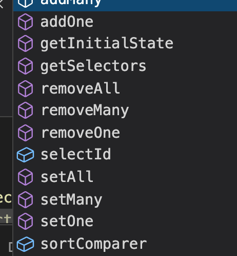

# redux-toolkit

# createEntityAdapter





[https://juejin.cn/post/6847902220415926279#heading-2](https://juejin.cn/post/6847902220415926279#heading-2)

```json
const booksAdapter = createEntityAdapter<Book>({
  // Assume IDs are stored in a field other than `book.id`
  selectId: book => book.bookId,
  // Keep the "all IDs" array sorted based on book titles
  sortComparer: (a, b) => a.title.localeCompare(b.title)
})

```

## CRUD Functions
+ addMany
+ addOne
+ getInitialState
+ getSelectors
+ removeAll
+ removeMany
+ removeOne
+ setAll
+ setMany
+ setOne
+ selectId
+ sortComparer
+ updateMany
+ updateOne
+ upsertMany
+ upsertOne 插入

---


+ addOne 添加一个enity
+ addMany 添加多个enity,传递一个数组，数组中的元素要符合enity的对象结构
+ setAll 传递一个enity数组，数组中的元素要符合enity的对象结构，将当前已经存在的enity内的所有数据替换成传递的
+ removeOne 删除一个
+ removeMany 删除多个
+ removeAll 删除所有
+ updateOne 更新一个
+ updateMany 更新多个
+ upsertOne 接受一个entity 如果存在则更新 不存在则添加
+ upsertMany 接受多个entity 如果存在则更新 不存在则添加

## Selector Functions
## getSelectors()
+ <font style="color:rgb(51, 51, 51);">selectIds 获取ID数组</font>
+ <font style="color:rgb(51, 51, 51);">selectEntities 获取实例对象，类似表</font>
+ <font style="color:rgb(51, 51, 51);">selectAll 返回一个所有实例对象的数组 但是属性都是用id展示</font>
+ <font style="color:rgb(51, 51, 51);">selectTotal 返回实例总数</font>
+ <font style="color:rgb(51, 51, 51);">selectById 通过id查询实例</font>

<font style="color:rgb(51, 51, 51);"></font>

```json
// 两种使用方式 其实就是指定了不同的作用域 一个是全局这种类型对象的一个是某一具体对象
const store = configureStore({
  reducer: {
    books: booksReducer
  }
})

const simpleSelectors = booksAdapter.getSelectors()
const globalizedSelectors = booksAdapter.getSelectors(state => state.books)

// Need to manually pass the correct entity state object in to this selector
const bookIds = simpleSelectors.selectIds(store.getState().books)

// This selector already knows how to find the books entity state
const allBooks = globalizedSelectors.selectAll(store.getState())

```

# createAsyncThunk 


[https://redux-toolkit.js.org/api/createAsyncThunk](https://redux-toolkit.js.org/api/createAsyncThunk)


```javascript
export const fetchProducts = createAsyncThunk(
  "products/fetchProducts", async (_, thunkAPI) => {
     try {
        //const response = await fetch(`url`); //where you want to fetch data
        //Your Axios code part.
        const response = await axios.get(`url`);//where you want to fetch data
        return await response.json();
      } catch (error) {
         return thunkAPI.rejectWithValue({ error: error.message });
      }
});

const productsSlice = createSlice({
   name: "products",
   initialState: {
      products: [],
      loading: "idle",
      error: "",
   },
   reducers: {},
   extraReducers: (builder) => {
      builder.addCase(fetchProducts.pending, (state) => {
        state. products = [];
          state.loading = "loading";
      });
      builder.addCase(
         fetchProducts.fulfilled, (state, { payload }) => {
            state. products = payload;
            state.loading = "loaded";
      });
      builder.addCase(
        fetchProducts.rejected,(state, action) => {
            state.loading = "error";
            state.error = action.error.message;
      });
   }
});


export const selectProducts = createSelector(
  (state) => ({
     products: state.products,
     loading: state.products.loading,
  }), (state) =>  state
);
export default productsSlice;

// 22323

import { useSelector, useDispatch } from "react-redux";

import {
  fetchProducts,
  selectProducts,
} from "path/productSlice.js";
Then Last part calling those method inside your competent like this

const dispatch = useDispatch();
const { products } = useSelector(selectProducts);
React.useEffect(() => {
   dispatch(fetchProducts());
}, [dispatch]); 
```

# Redux-persist
[https://www.cloudsavvyit.com/9778/how-to-persist-your-redux-store/](https://www.cloudsavvyit.com/9778/how-to-persist-your-redux-store/)

[https://github.com/rt2zz/redux-persist/blob/master/docs/migrations.md](https://github.com/rt2zz/redux-persist/blob/master/docs/migrations.md)

```typescript
// usual imports omitted
import autoMergeLevel2 from "redux-persist/lib/stateReconciler/autoMergeLevel2";
 
const persistConfig = {
    key: "root",
    storage,
    stateReconciler: autoMergeLevel2
};
 
// store configuration omitted
```


> 更新: 2023-08-11 14:58:29  
> 原文: <https://www.yuque.com/u3641/dxlfpu/zknfm3>