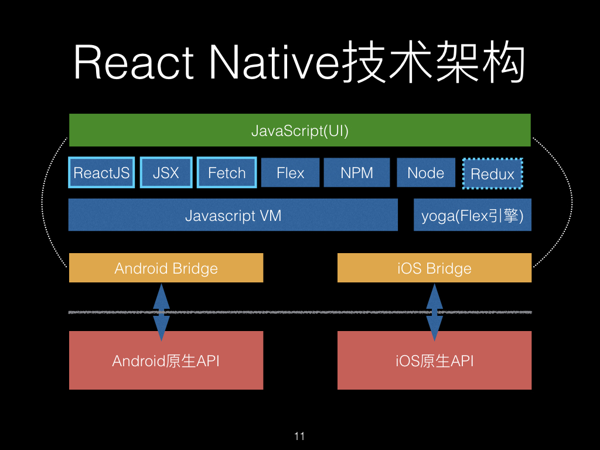

# rn 原理一探究竟

# 技术架构





跨平台、热更新


> <font style="color:rgb(37, 43, 58);">早期的RN版本中打出来的包都只有一个jsbundle，而这个jsbundle里面包含了所有代码（RN源码、第三方库代码和自己的业务代码）</font>
>

<font style="color:rgb(37, 43, 58);"></font>

<font style="color:rgb(37, 43, 58);">势必带来一个问题，不同业务加载重复的公共包</font>

<font style="color:rgb(37, 43, 58);"></font>

# debug 模式
在debug模式下，RN app是从本地的packager server加载js代码的，加载的地址如下：

```

iOS:       [http://localhost:8081/index.bundle?platform=ios&dev=true&minify=false](http://localhost:8081/index.bundle?platform=ios&dev=true&minify=false)

Android: [http://localhost:8081/index.bundle?platform=android&dev=true&minify=false](http://localhost:8081/index.bundle?platform=android&dev=true&minify=false)

```

iOS - AppDelegate.m


```cpp
- (NSURL *)sourceURLForBridge:(RCTBridge *)bridge
{
#if DEBUG
  return [[RCTBundleURLProvider sharedSettings] jsBundleURLForBundleRoot:@"index" fallbackResource:nil];
#else
  return [[NSBundle mainBundle] URLForResource:@"main" withExtension:@"jsbundle"];
#endif
}
```

# rn 加载机制


> 更新: 2021-05-13 17:00:19  
> 原文: <https://www.yuque.com/u3641/dxlfpu/tra62q>