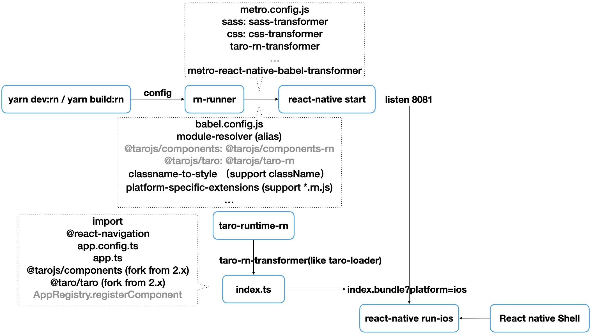

# taro3-rn 示例项目

# 介绍

[https://github.com/zhiqingchen/taro-rfcs/blob/master/rfcs/0000-react-native-support.md](https://github.com/zhiqingchen/taro-rfcs/blob/master/rfcs/0000-react-native-support.md)

1. 将编译打包方案统一为[metro](https://facebook.github.io/metro/)，更贴合 React Native 生态体系。
    1. 相比 webpack + metro 的方式，可提升编译速度，整体方案也更为清晰。
    2. 相比 webpack 多 entry 模式，可降低包大小。同时解决多 entry 模式存在的一些问题，如[#7512](https://github.com/NervJS/taro/issues/7512)。
    3. 提供更好的 sourcemap 支持，优化开发体验。
    4. 与 React Native APP 项目自身的 metro 配置，如分包等，可灵活合并。
2. 运行时模块，按照 Taro 3 定义的标准进行改造。
    1. 与小程序及 H5 内部的写法保持基本一致，通过 metro transformer (类似 taro loader) 生成入口及页面代码，通过 taro-runtime-rn 包提供的方法包装入口组件及页面组件。
    2. 提升对页面事件处理函数的支持度。
    3. 增加对 Tab Bar 相关 API 的封装。
3. 提升 API 及组件的支持度。
    1. 按社区调研结果优先级及难易程度进行支持，仍然以 expo 体系为主。
    2. API 及组件可按需集成，对于依赖原生的 API 和组件，提供完整的原生集成文档。
    3. 视工作量情况，逐步提升支持度，同时欢迎社区贡献。
4. 提供更灵活的 React Native APP 接入方案。
    1. 不再锁定 React Native 版本，用户可在项目中自行安装 >=0.60 版本的 React Native，对于 >=0.57 && <=0.59 版本的支持将在后续推出。
    2. 除 React Navigation 外不强制依赖其他 Native Modules，用户可按需引入所需的原生依赖。相应原生依赖未安装时，相关接口不可用，但不会阻断程序运行。同时用户可根据自身应用情况，对所需 API 接口或组件进行替换。
    3. 不需要灵活定制的用户，仍可以使用我们提供的包含所需原生依赖壳工程项目，快速开始开发。
    4. 

# Taro-Mortgage-Calculator

首个 Taro 3 多端统一实例 - 支持 React Native，Weapp，H5。

[https://github.com/wuba/Taro-Mortgage-Calculator](https://github.com/wuba/Taro-Mortgage-Calculator)

# taro-native-shell
[https://github.com/NervJS/taro-native-shell](https://github.com/NervJS/taro-native-shell)

Taro 原生 React Native 壳子，和 React Native init 的工程的区别是，移除了 index.js，集成了[react-native-unimodules](https://github.com/unimodules/react-native-unimodules)。

# 已经知道的问题

designWidth 设置 375，有问题

> 更新: 2021-05-19 18:03:00  
> 原文: <https://www.yuque.com/u3641/dxlfpu/prayd3>