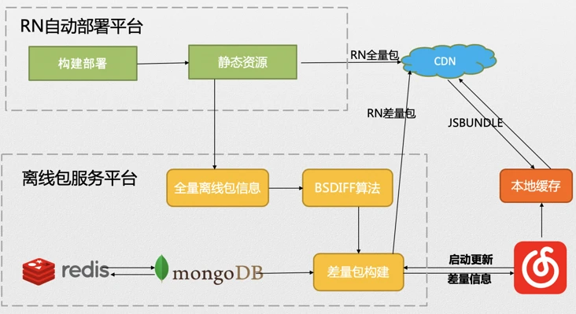
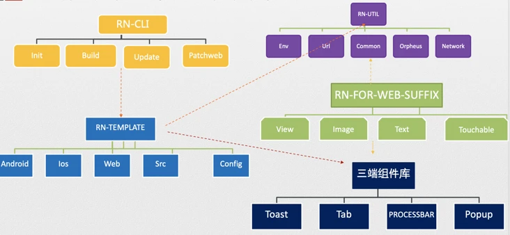

# 云音乐 React Native 体系建设与发展

# 历史
<font style="color:rgb(33, 37, 41);">17 年 3 月份，为了解决商城性能和用户体验问题，云音乐技术团队组建了一只 4 人 ReactNative 开发小分队：我负责 RN 前端开发，安卓和 iOS 两位开发负责在云音乐 App 里面嵌入 RN Native SDK，还有一位 Java 开发来负责部署平台工作。</font>

<font style="color:rgb(33, 37, 41);">商城 RN 应用上线后，其他团队表示有兴趣尝试，但当时 RN 项目开发没有脚手架，项目创建通过原始拷贝进行，缺少 forweb 支持，RN 预加载只接入了 iOS 一端。</font>

<font style="color:rgb(33, 37, 41);">种种原因，导致 RN 开发效率低下，音乐人业务原本有兴趣用 RN 来开发新应用，开发到一半改成了 H5。</font>

<font style="color:rgb(33, 37, 41);">从 17 年 3 月份到 19 年 9 月份，RN 版本始终为 0.33，核心开发团队人员流失一半，部署平台无人维护，项目开发缺少脚手架，缺少 forweb 支持，一共上线 RN 应用为 2.5 个（商城、音乐人、三元音箱）。</font>

<font style="color:rgb(33, 37, 41);"></font>

# 双端预加载


## 离线包平台



<font style="color:rgb(33, 37, 41);">主要流程如下：</font>

1. <font style="color:rgb(33, 37, 41);">RN 自动部署平台先构建出全量包，传到 CDN 上，然后通知离线包服务平台</font>
2. <font style="color:rgb(33, 37, 41);">离线包服务平台收到全量包信息，用 diff 算法算出差量包，存储相关的信息，发布差量包。</font>
3. <font style="color:rgb(33, 37, 41);">APP 启动的时候访问离线包服务，根据返回的信息来读取本地缓存还是去远程取对应的全量包或差量包。</font>

<font style="color:rgb(33, 37, 41);"></font>

# 3 端方案


Taro 根据 RN 规范自己实现了一套 DSL，对函数和事件做了自定义。


## 底层构建
<font style="color:rgb(33, 37, 41);">根据 RN 元素和组件定义，从最底层开始用 WEB 相关特性来实现整套 RN API，这个就是</font>[react-native-web](https://github.com/necolas/react-native-web)<font style="color:rgb(33, 37, 41);">。这种方案也是目前业界主流模式。</font>

<font style="color:rgb(33, 37, 41);"></font>

<font style="color:rgb(33, 37, 41);"></font>

# 新开发流程
开发了rn-cli脚手架，rn-util常用工具库，rn-template工程初始化模板等配套工具，形成了一整套 RN 开发的基础设施





# 后续
后续的具体规划围绕性能、效率、监控三大方向展开


## 统一bridge
<font style="color:rgb(33, 37, 41);">之前的 bridge 主要有 2 个问题：</font>

1. <font style="color:rgb(33, 37, 41);">用法不一致。需要写 2 套语法分别支持 RN 和 web。</font>
2. <font style="color:rgb(33, 37, 41);">支持不一致。有的协议 web 有 RN 没有，反之同样。</font>


大前端这边统一了两端 API，重构了底层协议来支持上面的功能

```java
// 查看 net.nefetch 是否支持，
mnb.checkSupport({
    module: 'net',
    method: 'nefetch'
}).then(res => {

})

/* 手动添加方法 */
mnb.addMethod({
    schema: 'page.info',
    name: 'getPageInfo'
});

/* 添加之后即可调用 */
mnb.getPageInfo().then((result) => {
    // ...
}).catch((e) => {
    // ...
});

```


## RN 拆包
<font style="color:rgb(33, 37, 41);">RN 应用在大部分主流机型上性能表现良好，但是在部分 Android 低端机出现卡顿现象。为了解决这个问题，启动拆包专项，主要分成 2 部分。</font>

1. <font style="color:rgb(33, 37, 41);">拆包。将现在的完整 JSBundle 拆成基础包和业务包，分别载入。</font>
2. <font style="color:rgb(33, 37, 41);">容器预加载。在 App 启动的时候就预热 RN 容器，这样可以大幅度减少容器启动时间，提高载入速度。</font>


> 更新: 2021-05-18 15:19:11  
> 原文: <https://www.yuque.com/u3641/dxlfpu/osw34x>