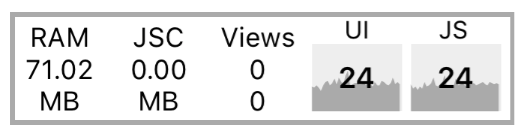
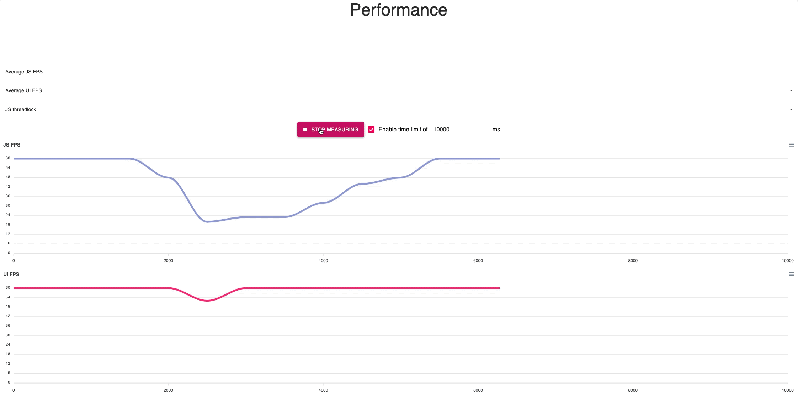
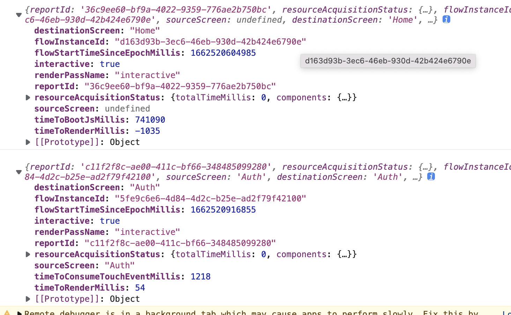

# 性能优化

[https://kikitrade.yuque.com/bun8m4/imrgc0/rfs5g3](https://kikitrade.yuque.com/bun8m4/imrgc0/rfs5g3)


+ <font style="color:rgb(36, 41, 47);">📌</font><font style="color:rgb(36, 41, 47);"> </font>[Optimize your React Native app performance](https://blog.logrocket.com/optimize-your-react-native-app-performance/)
+ <font style="color:rgb(36, 41, 47);">📌</font><font style="color:rgb(36, 41, 47);"> </font>[How to improve the performance of a React Native app](https://blog.codemagic.io/improve-react-native-app-performance/)
+ <font style="color:rgb(36, 41, 47);">📌</font><font style="color:rgb(36, 41, 47);"> </font>[Comparing the Performance between Native iOS (Swift) and React-Native](https://medium.com/the-react-native-log/comparing-the-performance-between-native-ios-swift-and-react-native-7b5490d363e2)


> <font style="color:rgb(28, 30, 33);">为了使 App 可以达到每秒 60 帧（足够流畅），并且能有类似原生 App 的外观和手感。</font>
>

<font style="color:rgb(28, 30, 33);"></font>

<font style="color:#E8323C;">请务必注意在release 模式下去测试性能。</font>JavaScript 线程的性能在开发模式下是很糟糕的。


Show Perf Monitor



<font style="color:#E8323C;"></font>

# 维度
+ 内存占用
+ CPU 占用
+ 帧
    - JS 帧率 
        * 60 fps
    - UI 帧率
        * 60 fps
+ 渲染
    - FlatList
        *  请确保你使用了getItemLayout，它通过跳过对items的处理来优化你的渲染速度。
    - PureComponent


# 使用 flipper 插件


bamlab/react-native-flipper-performance-plugin




# shopify/react-native-performance


[https://github.com/Shopify/react-native-performance](https://github.com/Shopify/react-native-performance)


## 列表优化


FlatList vs FlashList


[https://twitter.com/naqvitalha/status/1547224093962883072?ref_src=twsrc%5Etfw%7Ctwcamp%5Etweetembed%7Ctwterm%5E1547224093962883072%7Ctwgr%5E6e6326c5fb04a95c3181c4fe288166cd256869ad%7Ctwcon%5Es1_&ref_url=https%3A%2F%2Fshopify.engineering%2Finstant-performance-upgrade-flatlist-flashlist](https://twitter.com/naqvitalha/status/1547224093962883072?ref_src=twsrc%5Etfw%7Ctwcamp%5Etweetembed%7Ctwterm%5E1547224093962883072%7Ctwgr%5E6e6326c5fb04a95c3181c4fe288166cd256869ad%7Ctwcon%5Es1_&ref_url=https%3A%2F%2Fshopify.engineering%2Finstant-performance-upgrade-flatlist-flashlist)

  


## RenderPassReport


This callback will be invoked everytime a profiled screen is rendered.


{"destinationScreen": "Home", "flowInstanceId": "f905c434-b169-4f86-bc17-df99755dd263", "flowStartTimeSinceEpochMillis": 1662520164615, "interactive": true, "renderPassName": "interactive", "reportId": "1873d1de-8f78-4567-bff3-f4dcc6158c04", "resourceAcquisitionStatus": {"components": {}, "totalTimeMillis": 0}, "sourceScreen": undefined, "timeToBootJsMillis": 300720, "timeToRenderMillis": 99}


+ timeToConsumeTouchEventMillis
+ timeToRenderMillis
    - The time taken to complete a render pass. Not available for an aborted render pass.
+ timeToBootJsMillis
    - The time taken for the JS code to boot up.
    - Only available when measuring the app-startup render times.





```txt
{"destinationScreen": "Home", "flowInstanceId": "f905c434-b169-4f86-bc17-df99755dd263", "flowStartTimeSinceEpochMillis": 1662520164615, "interactive": true, "renderPassName": "interactive", "reportId": "1873d1de-8f78-4567-bff3-f4dcc6158c04", "resourceAcquisitionStatus": {"components": {}, "totalTimeMillis": 0}, "sourceScreen": undefined, "timeToBootJsMillis": 300720, "timeToRenderMillis": 99}
```


```txt
{
  "reportId": "3edb5bb5-8799-4322-899d-f5b6faf5dade",
  "resourceAcquisitionStatus": {
    "totalTimeMillis": 5019,
    "components": {
      "AllRickAndMortyCharactersQuery": {
        "durationMillis": 891,
        "status": "completed"
      },
      "simulatedSlowOperation": {
        "durationMillis": 5019,
        "status": "completed"
      },
      "useAsyncStorage('some_key').setItem": {
        "durationMillis": 19,
        "status": "completed"
      },
      "AsyncStorage.setItem('some_key_2')": {
        "durationMillis": 19,
        "status": "completed"
      },
      "useAsyncStorage('some_key').getItem": {
        "durationMillis": 5,
        "status": "completed"
      },
      "AsyncStorage.getItem('some_key_2')": {
        "durationMillis": 8,
        "status": "completed"
      }
    }
  },
  "flowInstanceId": "bc738def-da39-4b7e-8965-c97110c12336",
  "sourceScreen": "PackageExamples",
  "destinationScreen": "SomeScreen",
  "flowStartTimeSinceEpochMillis": 1611603113725.3179,
  "timeToConsumeTouchEventMillis": 2.682223916053772,
  "renderPassName": "interactive",
  "timeToRenderMillis": 5085.299072265625,
  "interactive": true
}
```

# 参考
[https://juejin.cn/post/6844904041290432525#heading-53](https://juejin.cn/post/6844904041290432525#heading-53)


> 更新: 2023-03-24 14:21:14  
> 原文: <https://www.yuque.com/u3641/dxlfpu/mygro7>