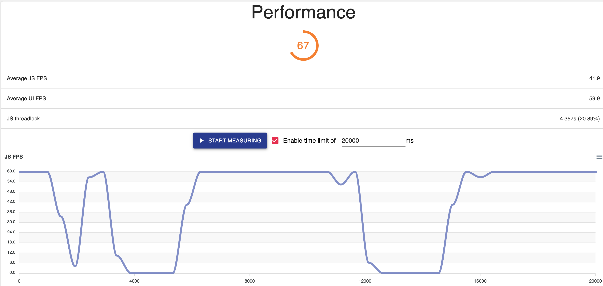
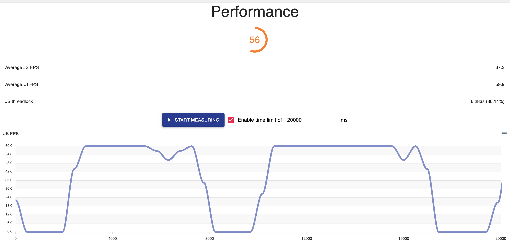
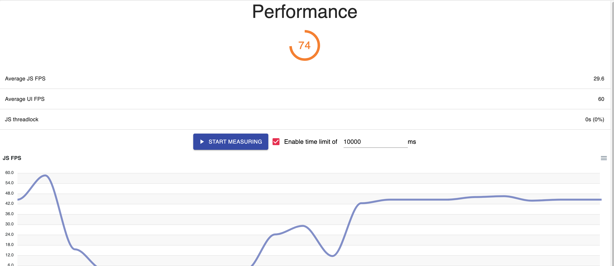
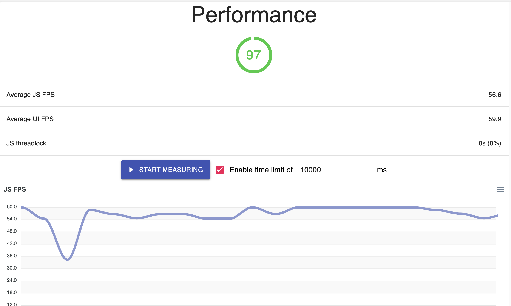
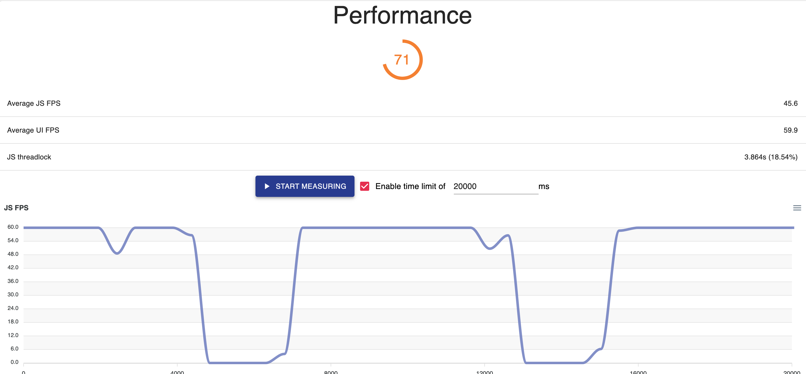
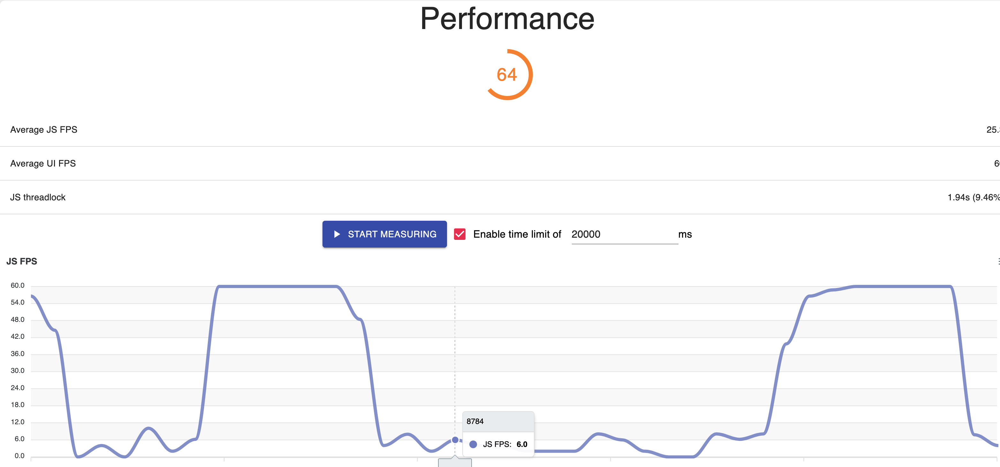
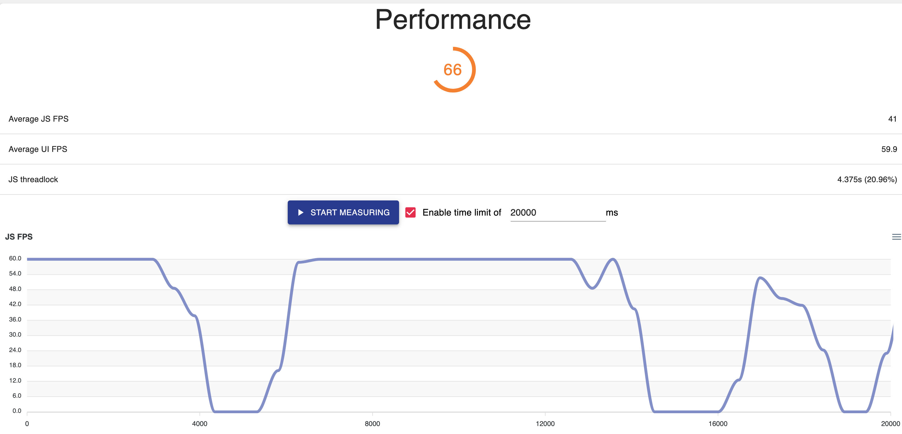
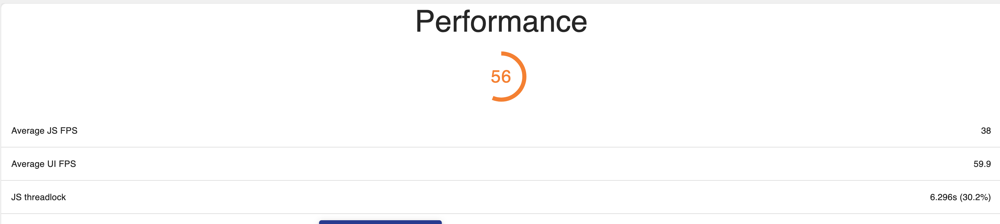

# 性能得分

# Home

# Trade

关闭接口定时，滑动列表

优化后

# P2P

# Deposit

# Withdraw

# Savings

# Social

# Wallet
优化前

优化后

# Merchant Center
Ads

Orders

> 更新: 2023-07-26 16:24:21  
> 原文: <https://www.yuque.com/u3641/dxlfpu/xf1yqe>