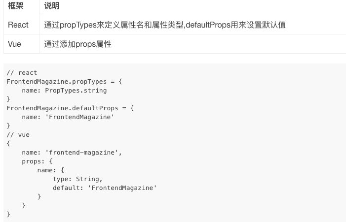

# React 玩一玩


## react slot


### 1 use chirdren


```plain
class BaseLayout extends React.Component {
  static Header = Header
  static Body = Body
  static Footer = Footer

  render() {
    const {children} = this.props
    const header = children.find(child => child.type === Header)
    const body = children.find(child => child.type === Body)
    const footer = children.find(child => child.type === Footer)
    
    return (
      <div class="container">
        <header>
          {header ? header.props.children : null}
        </header>
        <main>
          {body ? body.props.children : null}
        </main>
        <footer>
          {footer ? footer.props.children : null}
        </footer>
      </div>      
    )
  }
}

=

// This code...
<Button children={<span>Click Me</span>} />

// Is equivalent to this code...
<Button>
  <span>Click Me</span>
</Button>
```


### 2 use props


```javascript
function App({ user }) {
	return (
		<div className="app">
			<Nav>
				<UserAvatar user={user} size="small" />
			</Nav>
			<Body
				sidebar={<UserStats user={user} />}
				content={<Content />}
			/>
		</div>
	);
}

// Accept children and render it/them
const Nav = ({ children }) => (
  <div className="nav">
    {children}
  </div>
);

// Body needs a sidebar and content, but written this way,
// they can be ANYTHING
const Body = ({ sidebar, content }) => (
  <div className="body">
    <Sidebar>{sidebar}</Sidebar>
    {content}
  </div>
);

const Sidebar = ({ children }) => (
  <div className="sidebar">
    {children}
  </div>
);

const Content = () => (
  <div className="content">main content here</div>
);
```


## react 之 PropTypes验证


```javascript
import PropTypes from 'prop-types'

Footer.propTypes = {
  completedCount: PropTypes.number.isRequired,
  activeCount: PropTypes.number.isRequired,
  onClearCompleted: PropTypes.func.isRequired,
}
```





## 进阶


### 使用 PropTypes 进行类型检查


> import PropTypes from 'prop-types';
>


### Context
Context 提供了一个无需为每层组件手动添加 props，就能在组件树间进行数据传递的方法。


### 代码分割


1 动态import

当使用 Babel 时，你要确保 Babel 能够解析动态 import 语法而不是将其进行转换。对于这一要求你需要 babel-plugin-syntax-dynamic-import 插件。


> 动态 import() 语法目前只是一个 ECMAScript (JavaScript) 提案， 而不是正式的语法标准。预计在不远的将来就会被正式接受。
>


```javascript
import("./math").then(math => {
  console.log(math.add(16, 26));
});
```


2 基于路由的代码分割


## 和服务端进行交互


### 前端请求流程
在 Ant Design Pro 中，一个完整的前端 UI 交互到服务端处理流程是这样的：

1. UI 组件交互操作；
2. 调用 <font style="color:#F5222D;">model</font> 的 effect；
3. 调用统一管理的 <font style="color:#F5222D;">service</font> 请求函数；
4. 使用封装的 request.ts 发送请求；
5. 获取服务端返回；
6. 然后调用 reducer 改变 state；
7. 更新 model。


```javascript
// models/user.ts
import { queryCurrent } from '../services/user';
...
effects: {
  *fetch({ payload }, { call, put }) {
    ...
    const response = yield call(queryCurrent);
    ...
  },
}
  
// services/user.ts
import request from '../utils/request';

export async function query() {
  return request('/api/users');
}

export async function queryCurrent() {
  return request('/api/currentUser');
}
```


request.ts


https://github.com/ant-design/ant-design-pro/blob/master/src/utils/request.ts

## 开发趋势


css_modules

hooks

ts支持

开发启动快，支持一键开启 dll 等

以路由为单元的 code splitting 等


考虑将技术栈转移到

Umi

ant-design-pro   

ant-design-mobile

TS


> 更新: 2020-08-21 16:20:32  
> 原文: <https://www.yuque.com/u3641/dxlfpu/ibhusg>