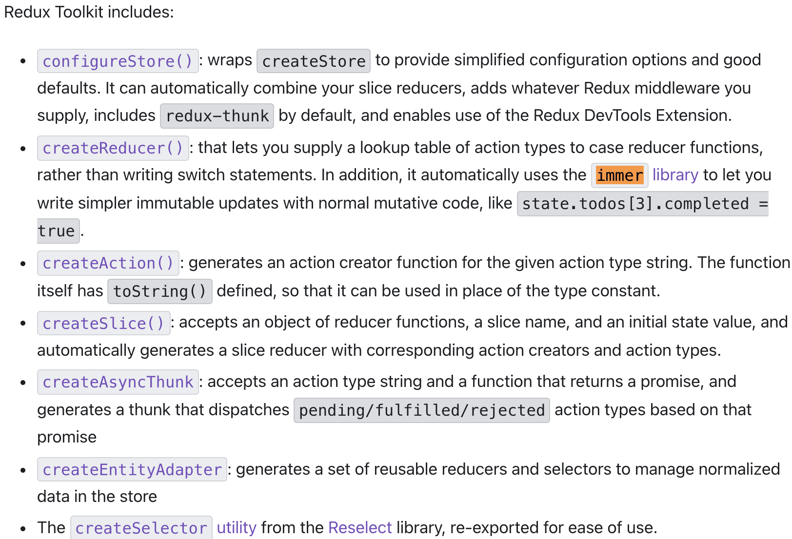

# RTK

# included

+ immer
+ reselect

# RTK-Query
RTK查询是作为@reduxjs/toolkit包中的一个可选的插件提供的。它的目的是解决数据获取和缓存的使用情况，提供一个紧凑但强大的工具集来为你的应用程序定义一个API接口层。它的目的是简化在网络应用中加载数据的常见情况，消除了自己手工编写数据获取和缓存逻辑的需要。

createReducer(): that lets you supply a lookup table of action types to case reducer functions, rather than writing switch statements. In addition, it automatically uses the immer library to let you write simpler immutable updates with normal mutative code, like state.todos[3].completed = true.

> 更新: 2021-10-20 16:44:01  
> 原文: <https://www.yuque.com/u3641/dxlfpu/brte35>