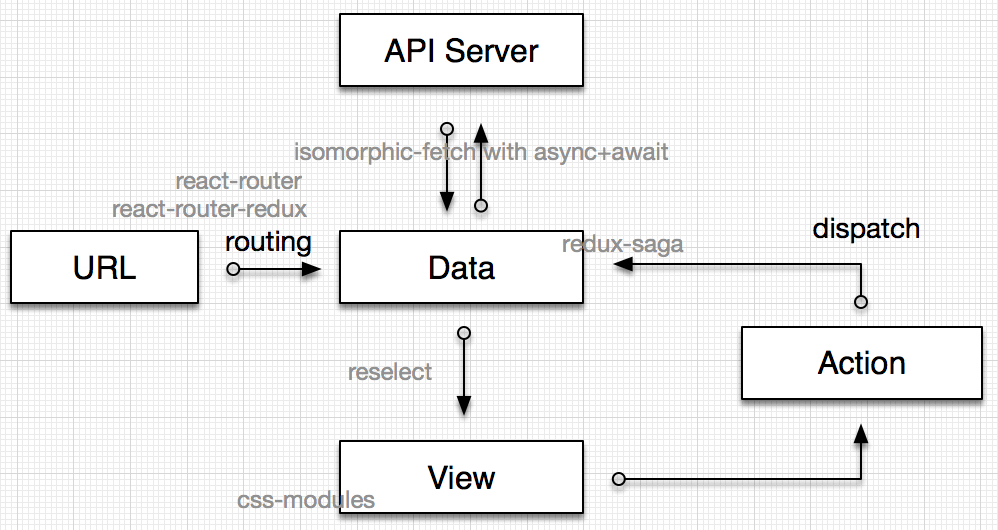
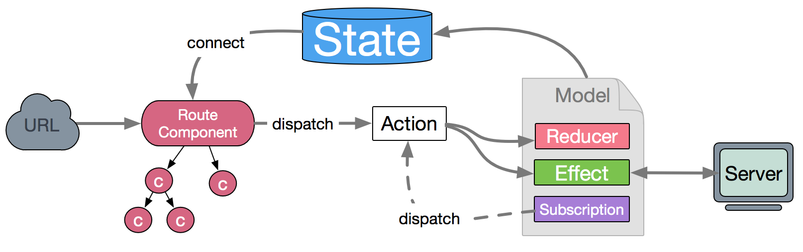

# Redux 相关

## 基础

* state是数据集合
* 组件可以派发(dispatch)行为(action)给store,而不是直接通知其它组件
* action发出命令后将state放入reucer加工函数中，返回新的state。 可以理解为加工的机器
* State的变化，会导致View的变化 其它组件可以通过订阅store中的状态(state)来刷新自己的视图
* reducer action发出命令后将state放入reucer加工函数中，返回新的state。 可以理解为加工的机器

## redux-logger中间件

## redux-thunk 中间件

這個Middleware改造了你的dispatch

Redux官网说，action就是Plain JavaScript Object。

Thunk允许action creator返回一个函数，而且这个函数第一个参数是dispatch。

这样Async Action其实就是发Ajax之前dispatch一发，收到服务器相应后dispatch一发，报错的话再来dispatch一发。为什么用？图个方便吧：

http://www.ruanyifeng.com/blog/2016/09/redux\_tutorial\_part\_two\_async\_operations.html

```plain
dispatch({
  type: ‘change_name’,
  name: ‘Peter’,
});
```

faq

1. Actions must be plain objects. Use custom middleware for async actions

> I see you return the request promise in the action.
>
> A promise is not a plain object and so the returned action would not be a plain object and hence the error

use thunk middleware your actions can be functions

```javascript
export function fetchOffers() {
  return function action(dispatch) {
    dispatch({ type: FETCH_OFFERS })

    const request = axios({
      method: 'GET',
      url: `${BASE_URL}/offers`,
      headers: []
    });
    
    return request.then(
      response => dispatch(fetchOffersSuccess(response)),
      err => dispatch(fetchOffersError(err))
    );
  }
}
```

fetchOffers is an action creator that returns a function as an actions

## redux-promise 中间件

## react-redux

### mapStateToProps

mapStateToProps函数的第二个参数 ownProps，是 MyComp 自己的 props。有的时候，ownProps 也会对其产生影响。比如，当你在 store 中维护了一个用户列表，而你的组件 MyComp 只关心一个用户（通过 props 中的 userId 体现）。

```javascript
const mapStateToProps = (state, ownProps) => {
  // state 是 {userList: [{id: 0, name: '王二'}]}
  return {
    user: _.find(state.userList, {id: ownProps.userId})
  }
}

class MyComp extends Component {
  
  static PropTypes = {
    userId: PropTypes.string.isRequired,
    user: PropTypes.object
  };
  
  render(){
    return <div>用户名：{this.props.user.name}</div>
  }
}

const Comp = connect(mapStateToProps)(MyComp);
```

当 state 变化，或者 ownProps 变化的时候，mapStateToProps 都会被调用，计算出一个新的 stateProps，（在与 ownProps merge 后）更新给 MyComp。

### mapDispatchToProps

如果mapDispatchToProps是一个对象，它的每个键名也是对应 UI 组件的同名参数，键值应该是一个函数，会被当作 Action creator ，返回的 Action 会由 Redux 自动发出。

举例来说，上面的mapDispatchToProps写成对象就是下面这样。

```javascript
const mapDispatchToProps = {
  onClick: (filter) => {
    type: 'SET_VISIBILITY_FILTER',
    filter: filter
  };
}
```

它的功能是，将 action 作为 props 绑定到 MyComp 上

### 辅助函数bindactioncreators

```javascript
1
const mapDispatchToProps = (dispatch: Dispatch) => (
	{
		Map: bindActionCreators(HomeActions.Map, dispatch),
		getTodoList: bindActionCreators(HomeActions.getTodoList, dispatch),
		fetchList: bindActionCreators(HomeActions.fetchList, dispatch)
	}
);

2
const mapDispatchToProps = (dispatch: Dispatch) => {
	return bindActionCreators({
		Map: HomeActions.Map,
		getTodoList: HomeActions.getTodoList,
		fetchList: HomeActions.fetchList
	}, dispatch)
};

3
const mapDispatchToProps = (dispatch: Dispatch) => {
	return bindActionCreators(HomeActions, dispatch)
};

```

类比Vuex

```javascript
  methods: {
    ...mapActions([
      'increment', // 将 `this.increment()` 映射为 `this.$store.dispatch('increment')`

      // `mapActions` 也支持载荷：
      'incrementBy' // 将 `this.incrementBy(amount)` 映射为 `this.$store.dispatch('incrementBy', amount)`
    ]),
```

## dava view action选型



### data - immutable 不可变

在 redux 的生态圈内，每个环节有多种方案，比如 Data 可以是 immutable 或者 plain object，在你选了 immutable 之后，用 immutable.js 还是 seamless-immutable，以及是否用 redux-immutable 来辅助数据修改，都需要选择。

同时在组织 Store 的时候，层次不要太深，尽量保持在 2 - 3 层。如果层次深，可以考虑用 [updeep](https://github.com/substantial/updeep) 来辅助修改数据。

immutable.js: 通过自定义的 api 来操作数据，需要额外的学习成本。不熟悉 immutable.js 的可以先尝试用 seamless-immutable，JavaScript 原生接口，无学习门槛。

### View 之 CSS 方案

css-modules: 配合 webpack 的 css-loader 进行打包，会为所有的 class name 和 animation name 加 local scope，避免潜在冲突。

```javascript
Header.jsx

import style from './Header.less';
export default () => <div className={style.normal} />;
Header.less

.normal { color: red; }
```

编译后，文件中的 style.normal 和 .normal 在会被重命名为类似 Header\_\_normal\_\_\_VI1de 。

可选

bem, rscss ，这两个都是基于约定的方案。但基于约定会带来额外的学习成本和不遍，

比如 rscss 要求所有的 Component 都是两个词的连接，比如 Header 就必须换成类似 HeaderBox 这样。

### Action <> Store，业务逻辑处理

#### 需求

统一处理业务逻辑，尤其是异步的处理。

#### 方案

[redux-saga](https://github.com/yelouafi/redux-saga): 用于管理 action，处理异步逻辑。可测试、可 mock、声明式的指令。

#### 可选

[redux-loop](https://github.com/raisemarketplace/redux-loop): 适用于相对简单点的场景，可以组合异步和同步的 action 。但他有个问题是改写了 `combineReducer`，会导致一些意想不到的兼容问题，比如我在特定场景下用不了 redux-devtool 。

[redux-thunk](https://github.com/gaearon/redux-thunk), [redux-promise](https://github.com/acdlite/redux-promise) 等: 相对原始的异步方案，适用于更简单的场景。在 action 需要组合、取消等操作时，会不好处理。

### Data- API Server

请求当然是在 action 里面处理的。reducer 必须是 pure function。

action 里处理异步,要用 redux-thunk。

#### 需求

异步请求。

#### 方案

[isomorphic-fetch](https://github.com/matthew-andrews/isomorphic-fetch): 便于在同构应用中使用，另外同时要写 node 和 web 的同学可以用一个库，学一套 api 。

然后通过 `async` + `await` 组织代码。

https://github.com/matthew-andrews/isomorphic-fetch

示例代码：
```
<font style="color:#D73A49;">import</font> <font style="color:#24292E;">fetch</font> <font style="color:#D73A49;">from</font> <font style="color:#032F62;">'</font><font style="color:#032F62;">isomorphic-fetch</font><font style="color:#032F62;">'</font>;

<font style="color:#D73A49;">export</font> <font style="color:#24292E;">async</font> <font style="color:#D73A49;">function</font> <font style="color:#6F42C1;">fetchUser</font>(<font style="color:#24292E;">uid</font>) {

  <font style="color:#D73A49;">return</font> <font style="color:#D73A49;">await</font> <font style="color:#6F42C1;">fetch</font>(<font style="color:#032F62;"><code></font><font style="color:#032F62;">/users/</font><font style="color:#24292E;">${</font><font style="color:#24292E;">uid</font><font style="color:#24292E;">}</font><font style="color:#032F62;"></code></font>).<font style="color:#005CC5;">then</font>(<font style="color:#24292E;">res</font> <font style="color:#D73A49;">=></font> <font style="color:#24292E;">res</font>.<font style="color:#6F42C1;">json</font>());

};
```
## 库

react绑定库

react-redux

redux APi

https://redux.js.org/api/api-reference

react-redux

https://react-redux.js.org/

redux-thunk

Thunk 是包装表达式以延迟其计算的函数。

https://github.com/reduxjs/redux-thunk/stargazers 

react-redux-typescript-guide

https://github.com/piotrwitek/react-redux-typescript-guide

redux-saga

https://github.com/redux-saga/redux-saga

An alternative side effect model for Redux apps

## redux store本地存储

通过订阅 store.subscribe，将state储存在localStorage，精确记录所有状态。网页关了刷新了、程序崩溃了、手机没电了，重新打开连接，都可以继续。

## react router 替代

<https://reach.tech/router>

## react 应用框架

### dva 
```
dva 首先是一个<font style="color:#F5222D;">基于 redux 和 redux-saga 的数据流方案</font>，然后为了简化开发体验，dva 还额外内置了 react-router 和 fetch，所以也可以理解为一个轻量级的应用框架。
```


### UmiJS

可插拔的企业级 react 应用框架。

## 参考

redux中文文档

<http://cn.redux.js.org/docs/basics/UsageWithReact.html>

React + Redux 最佳实践 

<https://github.com/sorrycc/blog/issues/1>

react-redux-typescript-guide

https://github.com/piotrwitek/react-redux-typescript-guide/blob/master/README.md

typescript学习资源合集

https://semlinker.com/ts-resource-list/

todomvc

<https://codesandbox.io/s/github/reduxjs/redux/tree/master/examples/todomvc>


> 更新: 2019-09-17 14:06:51  
> 原文: <https://www.yuque.com/u3641/dxlfpu/lgg25q>