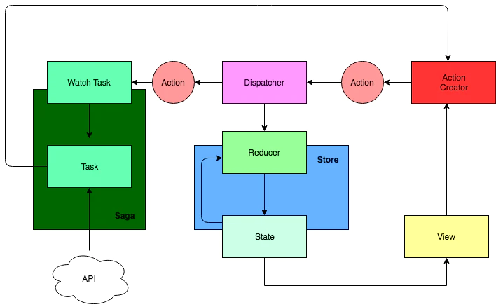

# redux-saga

# redux-thunk


action creator


```javascript
export const fetchTasksStarted = () => ({
  type:  "FETCH_TASKS_START"
});
export const fetchTasksSuccess = tasks => ({
  type: "FETCH_TASKS_SUCCESS",
  payload: tasks
});
export const fetchTasksError = errorMessage => ({
  type: "FETCH_TASKS_ERROR",
  payload: errorMessage
});
const fetchTasks =  () => async dispatch => {
    dispatch(fetchTasksStarted())
    try{
        const TaskResponse = await fetch("API URL")
const task = await taskResponse.json()
        dispatch(fetchTasksSuccess(tasks))
    }catch(exc){
        dispatch(fetchTasksError(error.message))
    }
}
```


fetchTasksReducer


```javascript
...
const INITIAL_STATE = {
  tasks: null,
  isFetching: false,
  errorMessage: undefined
};
const fetchTasksReducer = (state = INITIAL_STATE, action) => {
  switch (action.type) {
    case "FETCH_TASKS_START":
      return {
        ...state,
        isFetching: true
      };
    case "FETCH_TASKS_SUCCESS":
      return {
        ...state,
        isFetching: false,
        tasks: action.payload
      };
    case "FETCH_TASKS_ERROR":
      return {
        ...state,
        isFetching: false,
        errorMessage: action.payload
      };
    default:
      return state;
  }
};
export default fetchTasksReducer;
```

# redux-saga





## Saga 辅助函数
+ takeEvery
+ takeLatest
    - takeLatest(pattern, saga, ...args)
        * pattern: String | Array | Function
        * 当 action 被发起到 Store，并且匹配 pattern 时，则 takeLatest 会在后台启动一个新的 saga 任务，如果之前有一个 saga 任务启动了，并且仍在执行中，那么这个任务将被取消。
        * takeLatest 是由 take 和 fork 构建的高级 API
    - takeLatest(channel, saga, ...args)
+ throttle

## Effect 创建函数
+ take(pattern)
    - take(channel)
+ call(fn, ...args)
    - 创建一个 Effet
    - fn 可以是一个普通函数，也可以是一个 Generator 函数，middleware 会调用该函数
    - call([context, fnName], ...args)
        * **yield call([localStorage, 'getItem'], 'redux-saga')**
+ put(action)
+ fork
+ spawn
+ cancel
+ select

## Effect 组合


# 参考


[记一次redux-saga的项目实践总结](https://juejin.im/post/6844903700389953544#heading-17)


[redux-saga 官方文档](https://redux-saga.js.org/docs/recipes/index.html)


> 更新: 2020-09-05 14:39:02  
> 原文: <https://www.yuque.com/u3641/dxlfpu/ggyl8g>