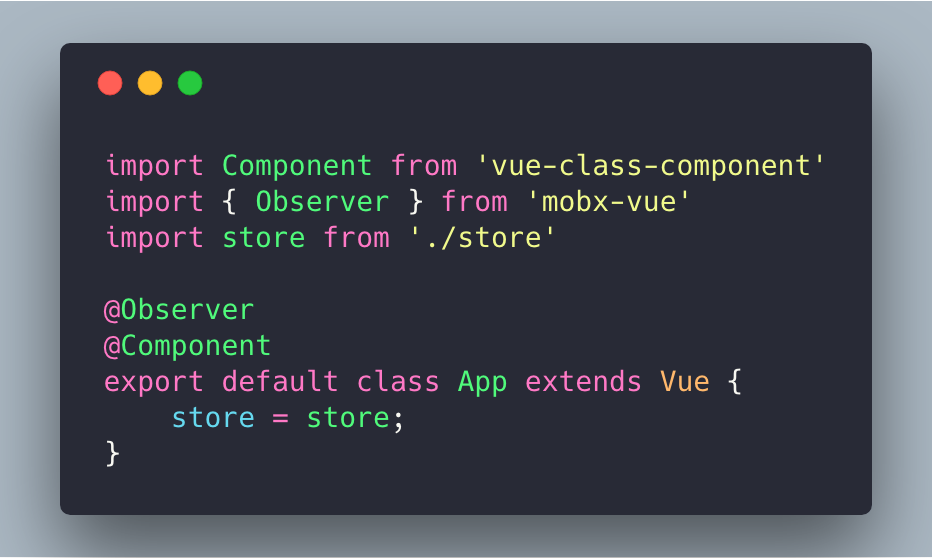

# 状态管理一窥

> 随着页面复杂度越来越高，在一个组件文件中，要做UI渲染、事件处理、状态管理等等事情
>
> 
>
> 页面组件层级变的复杂后，跨组件间的数据通信也变的很繁琐，需要将数据上提到父节点，通过property传输数据、回调方法更新父节点状态等等。
>


## Redux


### 异步处理


Redux-thunk


## Mobx


[https://github.com/mobxjs/mobx-vue](https://github.com/mobxjs/mobx-vue)





## Vuex


Mutations


Actions


Modules


## EventBus


```javascript
import Vue from 'vue';
export const EventBus = new Vue();

// The event handler function.
const clickHandler = function(clickCount) {
  console.log(`Oh, that's nice. It's gotten ${clickCount} clicks! :)`)
}

// Listen to the event.
EventBus.$on('i-got-clicked', clickHandler);

// Stop listening.
EventBus.$off('i-got-clicked', clickHandler);
```


> 更新: 2020-03-13 17:45:29  
> 原文: <https://www.yuque.com/u3641/dxlfpu/xhga70>