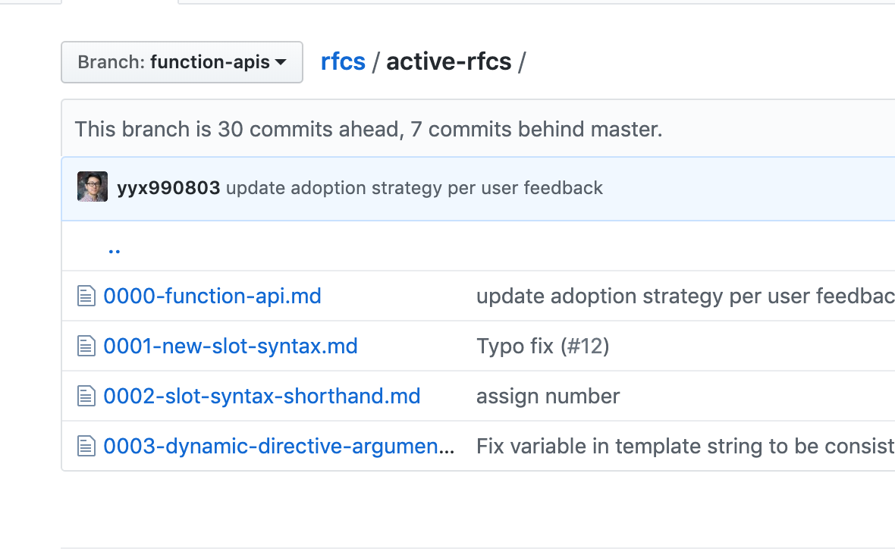

# 3.0 - Vue 意见征求稿 的相关讨论

## 最近you发布了vue的function rfc 引发了很多的争论


> + 介绍了 Vue 3 里基于函数的 API。
> + 许多我们正在使用的特性都会被弃用，诸如 data、computed、methods、watch、mixin、extends 和生命周期函数。Vue 组件主要由一个叫做 setup() 的函数构成，这个函数会返回所有的 method、计算属性和监听器。
> + 如果你想继续使用旧版功能，Vue 会提供一个兼容版本。
>


function api https://github.com/vuejs/rfcs/blob/function-apis/active-rfcs/0000-function-api.md 





## function api


```javascript
import { state, computed } from "vue";
export default {
  setup() {
    // Pet name
    const petNameState = state({ name: "", touched: false });
    const petNameComment = computed(() => {
      if (petNameState.touched) {
        return "Hello " + petNameState.name;
      }
      return null;
    });
    const onPetNameBlur = () => {
      petNameState.touched = true;
    };

    // Pet size
    const petSizeState = state({ size: "", touched: false });
    const petSizeComment = computed(() => {
      if (petSizeState.touched) {
        switch (this.petSize) {
          case "Small":
            return "I can barely see your pet!";
          case "Medium":
            return "Your pet is pretty average.";
          case "Large":
            return "Wow, your pet is huge!";
          default:
            return null;
        }
      }
      return null;
    });
    const onPetSizeChange = () => {
      petSizeState.touched = true;
    };

    // All properties we can bind to in our template
    return {
      petName: petNameState.name,
      petNameComment,
      onPetNameBlur,
      petSize: petSizeState.size,
      petSizeComment,
      onPetSizeChange
    };
  }
};

```


**就我看下来，感觉还蛮好的，比之前的写法简介了很多，相对于之前对象的键值对形式，显式的声明data computed methods 这些，简洁了很多，还有了命名空间。我喜欢****易于理解的函数和组件。**

****

## 完善的 Typescript 支持
新语法可以有完整的 Typescript 支持，这在 Vue 2.x 基于对象的语法中很难实现。 


## [热心网友在reddit发的帖子](https://www.reddit.com/r/vuejs/comments/c319el/vue_3_will_change_vue_in_a_big_way_current_syntax/)


## [后来尤在hackernews上的回复](https://news.ycombinator.com/item?id=20239377)
> + Vue 3.0 会有一个标准版本，包含新 API 和旧 API，同时会额外提供一个轻量版本，这个版本会删除一些旧 API，以使 Vue 更小更快。
> + 新的 API 完全是额外加到 Vue 2.x 里的，不会有任何 break change。
>


> 更新: 2019-06-25 14:58:52  
> 原文: <https://www.yuque.com/u3641/dxlfpu/vzn1l1>