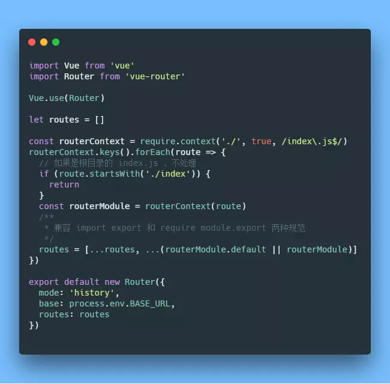

# 3.0 工程 - Vue cli 3.0 工程优化

# 主要的脉络是按照这个


[https://juejin.im/post/5c4a6fcd518825469414e062#heading-17](https://juejin.im/post/5c4a6fcd518825469414e062#heading-17)


## 第三方库使用cdn加载


```javascript
const CompressionPlugin = require('compression-webpack-plugin')
module.exports = {
  chainWebpack: config => {
      // 省略其它代码 ······
      // #region 忽略生成环境打包的文件

      var externals = {
        vue: 'Vue',
        axios: 'axios',
        'element-ui': 'ELEMENT',
        'vue-router': 'VueRouter',
        vuex: 'Vuex'
      }
      config.externals(externals)
    const cdn = {
        css: [
          // element-ui css
          '//unpkg.com/element-ui/lib/theme-chalk/index.css'
        ],
        js: [
          // vue
          '//cdn.staticfile.org/vue/2.5.22/vue.min.js',
          // vue-router
          '//cdn.staticfile.org/vue-router/3.0.2/vue-router.min.js',
          // vuex
          '//cdn.staticfile.org/vuex/3.1.0/vuex.min.js',
          // axios
          '//cdn.staticfile.org/axios/0.19.0-beta.1/axios.min.js',
          // element-ui js
          '//unpkg.com/element-ui/lib/index.js'
        ]
      }
      config.plugin('html')
        .tap(args => {
          args[0].cdn = cdn
          return args
        })
      // #endregion
    }
  }
}

```


## 用Mixin封装store操作 


解决频繁的复制-粘贴劳作


```javascript
// news/index.vue
import Vue from 'vue'
import newsMixin from '@/mixins/news-mixin'
export default {
  name: 'news',
  mixins: [newsMixin],
  data () {
    return {}
  },
  async created () {
    await this.NEWS_LIST()
    console.log(this.getNewsResponse)
  }
}

```


## 拆分路由


## 自动导入路由





> 更新: 2019-04-30 17:48:21  
> 原文: <https://www.yuque.com/u3641/dxlfpu/dxfx4s>