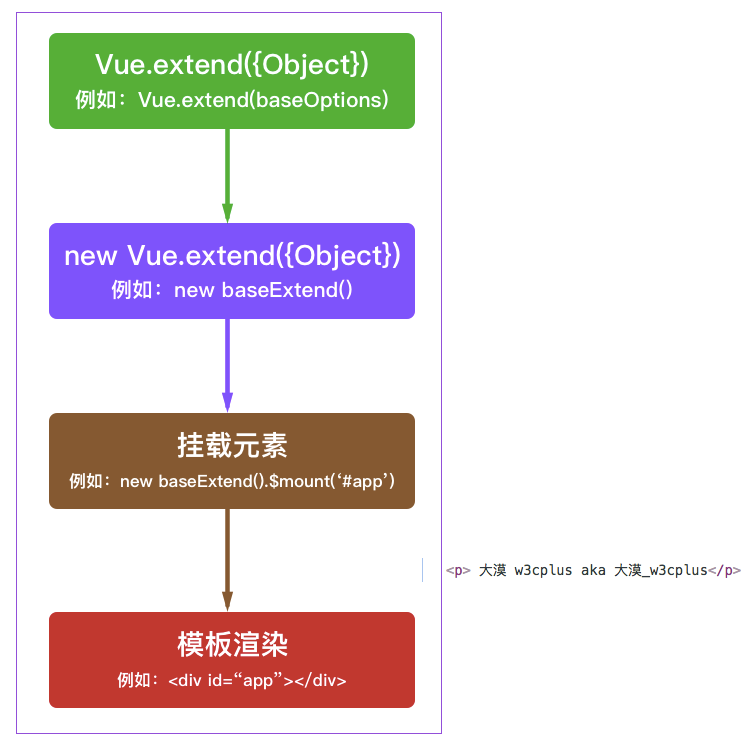

# Vue 对比 React

## jsx
### $createElement
```plain
// @returns {VNode}
createElement(
  // {String | Object | Function}
  // 一个 HTML 标签字符串，组件选项对象，或者
  // 解析上述任何一种的一个 async 异步函数，必要参数。
  'div',
  // {Object}
  // 一个包含模板相关属性的数据对象
  // 这样，您可以在 template 中使用这些属性。可选参数。
  {
    // (详情见下一节)
  },
  // {String | Array}
  // 子节点 (VNodes)，由 `createElement()` 构建而成，
  // 或使用字符串来生成“文本节点”。可选参数。
  [
    '先写一些文字',
    createElement('h1', '一则头条'),
    createElement(MyComponent, {
      props: {
        someProp: 'foobar'
      }
    })
  ]
)
```


### render function
render(h) 中的 h 其实就是 this.$createElement


label 部分我们想写成模板，input 的部分根据 type 生成特性的内容


默认的slot 就是 this.$slots.default

```plain
<script>
  export default {
    name: 'field',
    props: ['type', 'label'],
    created() {
      this.$slots.default = [ this.renderField() ]
    },
    methods: {
      renderField() {
        const h = this.$createElement
        const tag = this.type === 'textarea' ? 'textarea' : 'input'
        const type = this.type === 'textarea' ? '' : this.type
        return h(tag, { props: { type } })
      }
    }
  }
</script>
```


但是这有个问题，这么做我们就破坏了 slot 的更新规则


没法再组件内部触发 renderField 的执行，除非用 watch，但是需要 watch 的 prop 多的话也很麻烦

## 选项API


name

parent


组件类型

   functional


模板内使用的资源

   components

   directives

   filters


组合

   extends

   mixins

   

接口

   props/propsData

   model

   inheriAttrs


本地的响应式属性

   data

   computed

   

事件和生命周期

   watch

   created

   mounted

   beforeDestroy


渲染

   template/render


## vue对比react
相同的

+ 使用 Virtual DOM
+ 提供了响应式 (Reactive) 和组件化 (Composable) 的视图组件。
+ 将注意力集中保持在核心库，而将其他功能如路由和全局状态管理交给相关的库。


两类组件：

更抽象一点来看，我们可以把组件区分为两类：一类是偏视图表现的 (presentational)，一类则是偏逻辑的 (logical)。我们推荐在前者中使用模板，在后者中使用 JSX 或渲染函数。


状态管理  
React 社区在状态管理方面非常有创新精神 (比如 Flux、Redux)，而这些状态管理模式甚至 Redux 本身也可以非常容易的集成在 Vue 应用中


## Component  Mixin Directive
> Component 只提供了最基础的『代码分治』能力；
>
> 
>
> Mixin 可以解决的是纯『代码维度』上的复用；
>
> 
>
> Directive 适合对 HTML『元素级别』的复用，比如当你需要去处理 Form 表单上 Input/Select… 等各种元素的属性和事件；
>
> 
>
> Scoped Slot 提供了父组件访问子组件 Scoped 的能力，非常适合实现一些『容器型组件』，比如 vuejs-redux、apollo-vue、Element's 的几个复杂组件；
>
> 
>
> Functional 组件的初衷大概是解决 vue 组件都需要实例化（会更占内存）的问题，非常适合用来实现纯 UI 的『展示型组件』；
>
> 
>
> Render 函数接近编译器非常底层，当你需要定义一些需要深入到组件生命周期钩子去做事情时必不可少
>


## 


## 取消watch


```javascript
    vm.$watch 返回一个取消观察函数，用来停止触发回调：
    var unwatch = vm.$watch('a', cb)
    // 之后取消观察
    unwatch()
```


## v-model是语法糖
```plain
<input v-model="searchText">
等价于：
<input
  v-bind:value="searchText"
  v-on:input="searchText = $event.target.value"
/>
```

## 作用域插槽 slot-scope


在 2.5.0+，slot-scope 不再限制在 template 元素上使用，而可以用在插槽内的任何元素或组件上。


可以通过 slot-scope 特性从子组件获取数据


```html
//data-show.vue

<template>

<div>

  <ul>

       <li v-for="item in list">

           <span>{{item.title}}</span>

           <slot v-bind:item="item">

           </slot>

       </li>

   </ul>

</div>

</template>

//list.vue

<template>

<p>列表页</p>

   <data-show :list="list">

       <template slot-scope="slotProps">

           <span v-if="slotProps.item.complete">✓</span>

           <span v-else>x</span>

       </template>

   </data-show>

</template>
```


## <font style="color:#404040;">Vue.extend 创建一个扩展实例构造器</font>
<font style="color:#404040;"></font>

创建vue组件的特殊构造函数


不但要创建构造器，还要new一个实例，还要挂载到特定的元素


总结：component是extend的亲民版，但在实现某些特殊需求的时候，就需要用到extend，如alert组件，你肯定希望alert可以动态插入到body中，而不需要在dom文档流中放一个莫名其妙的alert





```javascript
var MyComponent = Vue.extend({
  template: '<div>Hello!</div>'
})

// 创建并挂载到 #app (会替换 #app)
new MyComponent().$mount('#app')

// 同上
new MyComponent({ el: '#app' })

// 或者，在文档之外渲染并且随后挂载
var component = new MyComponent().$mount()
document.getElementById('app').appendChild(component.$el)
```


## inheritAttrs
我们都知道假如使用子组件时传了a,b,c三个prop，而子组件的props选项只声明了a和b，那么渲染后c将作为html自定义属性显示在子组件的根元素上。


## $listeners
-> 在创建更高层次的组件时非常有用。


它可以通过 v-on=”$listeners” 传入内部组件


## 改变props
牢记单项数据流

```plain
props: ['initialCounter'],
data: function () {
  return {
    counter: this.initialCounter
  }
}
```


## 


> 更新: 2019-09-11 22:27:52  
> 原文: <https://www.yuque.com/u3641/dxlfpu/vv1ve2>