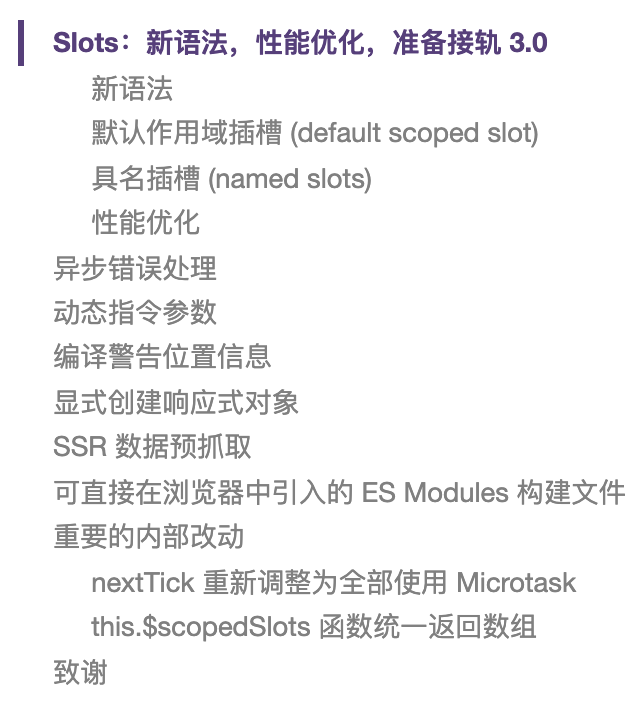
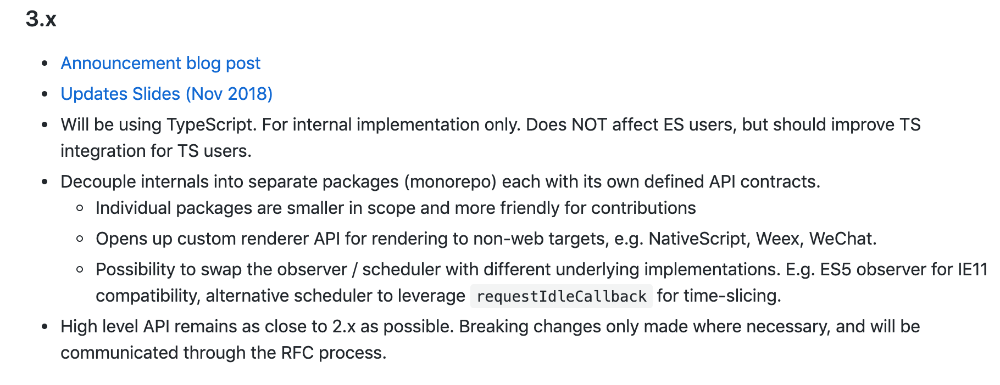

# vue 2.6 新版本特性

## 2月份发布的vue 2.6版本

## 3.x版本 将使用TS进行开发

[https://docs.google.com/presentation/d/1yhPGyhQrJcpJI2ZFvBme3pGKaGNiLi709c37svivv0o/edit#slide=id.p](https://docs.google.com/presentation/d/1yhPGyhQrJcpJI2ZFvBme3pGKaGNiLi709c37svivv0o/edit#slide=id.p)

### 对TS的支持

[Vue CLI](https://cli.vuejs.org/zh/) 内置了 TypeScript 工具支持。在 Vue 的下一个大版本 (3.x) 中也计划了相当多的 TypeScript 支持改进，包括内置的基于 class 的组件 API 和 TSX 的支持。

> 更新: 2019-05-24 14:29:38  
> 原文: <https://www.yuque.com/u3641/dxlfpu/xy9wbl>