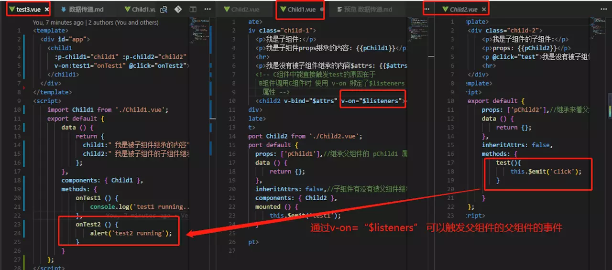

# vue 组件通信场景

常见使用场景可以分为三类：

* <font style="color:#4A4A4A;">父子通信：\ </font><font style="color:#4A4A4A;">父向子传递数据是通过 props，子向父是通过 events（ </font><code><font style="color:#4A4A4A;">$emit</font></code><font style="color:#4A4A4A;">）；\ </font><font style="color:#4A4A4A;">通过父链 / 子链也可以通信（ </font><code><font style="color:#4A4A4A;">$parent</font></code><font style="color:#4A4A4A;"> / </font><code><font style="color:#4A4A4A;">$children</font></code><font style="color:#4A4A4A;">）；\ </font><font style="color:#4A4A4A;">ref 也可以访问组件实例；\ </font><font style="color:#4A4A4A;">provide / inject API； \ </font><code><font style="color:#4A4A4A;">$attrs</font><font style="color:#4A4A4A;">/</font><font style="color:#4A4A4A;">$listeners</font></code>
* <font style="color:#4A4A4A;">兄弟通信： Bus；Vuex</font>
* <font style="color:#4A4A4A;">跨级通信： Bus；Vuex；provide / inject API、 </font><code><font style="color:#4A4A4A;">$attrs</font><font style="color:#4A4A4A;">/</font><font style="color:#4A4A4A;">$listeners</font></code>

## 父子爷孙组件通信

多级组件嵌套需要传递数据时，通常使用的方法是通过 vuex。但如果仅仅是传递数据，而不做中间处理，使用 vuex 处理，未免有点大材小用。为此 Vue2.4 版本提供了另一种方法—-$attrs/$listeners

### $attrs

$attrs 里存放的是**父作用域中不作为 prop  的特性绑定 (class 和 style 除外) 而且在子组件中也没有props注册的属性**

***

> <font style="color:#413F3F;background-color:#FAFAFA;">父组件要传的值(age,name),在子组件中, 没用props注册. 在子组件中包含在</font>`$attrs`<font style="color:#413F3F;background-color:#FAFAFA;">中, 以</font>`object`<font style="color:#413F3F;background-color:#FAFAFA;">的形式访问到.</font>

### $listeners

> 子组件可以触发父组件的事件（不需要用什么那些麻烦的vuex或者一个空的 Vue 实例作为事件总线，或者又是什么vm.$on )



## provide inject 通信

使用Vue.observable实现数据响应式

```javascript
  // provide() {
  //   this.theme = Vue.observable({
  //     color: "blue"
  //   });
  //   return {
  //     theme: this.theme
  //   };
  // },
  // methods: {
  //   changeColor(color) {
  //     if (color) {
  //       this.theme.color = color;
  //     } else {
  //       this.theme.color = this.theme.color === "blue" ? "red" : "blue";
  //     }
  //   }
  // }
```

## <font style="color:#34495E;">最小化的跨组件状态存储器</font>

<font style="color:#34495E;">  
</font>Vue.observable( object )  2.6.0 新增

> 返回的对象可以直接用于渲染函数和计算属性内，并且会在发生改变时触发相应的更新。也可以作为最小化的跨组件状态存储器，用于简单的场景：


> 更新: 2019-05-24 14:11:02  
> 原文: <https://www.yuque.com/u3641/dxlfpu/lv3ow2>