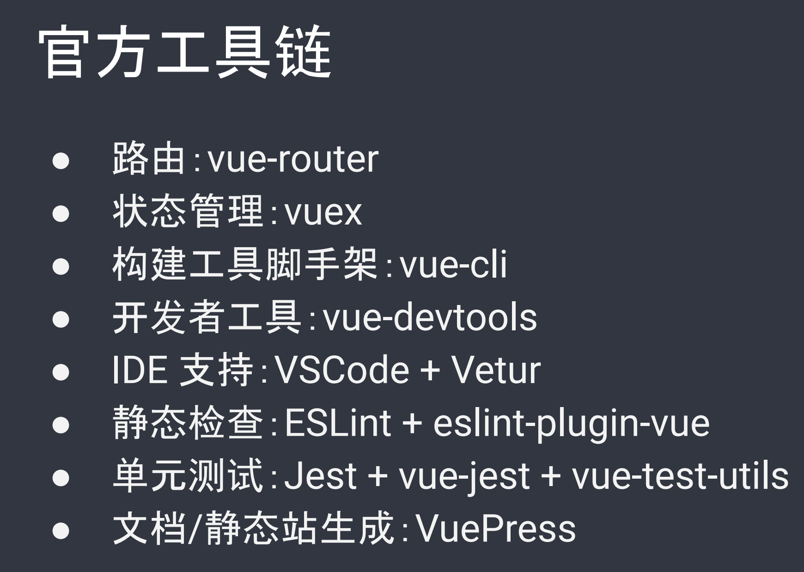

# 平安分享

## 官方工具链

## 移动端方案

## 3.0设计目标
● 更小

● 更快

● 加强 API 设计一致性

● 加强 TypeScript 支持

● 提高自身可维护性

● 开放更多底层功能

### Function-based API
对比 Class API

○ 更灵活的逻辑复用能力

○ 更好的 TypeScript 类型推导支持

○ 更好的性能

○ Tree-shaking 友好

○ 代码更容易被压缩

> 更新: 2019-09-12 21:33:41  
> 原文: <https://www.yuque.com/u3641/dxlfpu/oafxzt>