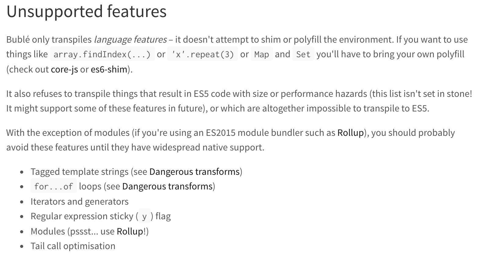

# 开发一个vue ui库

## 选择rollup打包
### 插件列表
+ rollup-plugin-babel


### Tree Shaking
Tree Shaking），就是rollup可以按需打包代码，对于系统中引入了但是没有使用的代码，不会打包到最终文件中。


### 打包方式
+ amd - 输出成AMD模块规则，RequireJS可以用
+ cjs - CommonJS规则，适合Node，Browserify，Webpack 等
+ es - 默认值，不改变代码
+ iife - 输出自执行函数，最适合导入html中的script标签，且代码更小
+ umd - 通用模式，amd,cjs,iife都能用 **允许它和CommonJS/AMD/全局变量一起工作**


### c-mobile报错



### wenwen-ui的rollup配置文件例子


```javascript
import resolve from 'rollup-plugin-node-resolve';
import commonjs from 'rollup-plugin-commonjs';
import vue from 'rollup-plugin-vue';
import buble from 'rollup-plugin-buble';

export default {
  input: 'packages/index.js',
  output: {
    name: 'wenwen-ui',
    exports: 'named',
  },
  plugins: [
    resolve({
      jsnext: true,
      main: true,
      browser: true,
    }),
    commonjs(),
    vue({
      compileTemplate: true
    }),
    buble(),
  ],
};
```


### 例子2
[https://github.com/gluons/rollup-vue-example/blob/master/rollup.config.js](https://github.com/gluons/rollup-vue-example/blob/master/rollup.config.js)


## vue-cli如果依赖不支持目标浏览器
如果有依赖需要 polyfill，你有几种选择：

如果该依赖基于一个目标环境不支持的 ES 版本撰写: 将其添加到 vue.config.js 中的 transpileDependencies 选项。这会为该依赖同时开启语法语法转换和根据使用情况检测 polyfill


[https://cli.vuejs.org/zh/guide/browser-compatibility.html#usebuiltins-usage](https://cli.vuejs.org/zh/guide/browser-compatibility.html#usebuiltins-usage)


## 参考


[组件库rollup打包体积优化](https://juejin.im/post/5b25f324f265da59921a02d5#heading-2)

https://juejin.im/post/5b25f324f265da59921a02d5#heading-2

[](https://segmentfault.com/a/1190000009932242#articleHeader0)[使用rollup构建你的JavaScript项目【一】](https://segmentfault.com/a/1190000009932242)


> 更新: 2019-01-16 18:32:16  
> 原文: <https://www.yuque.com/u3641/dxlfpu/gu6kun>