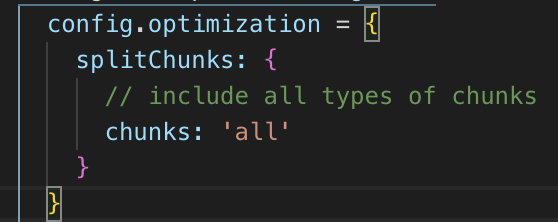

# 性能优化


## CDN引入
## UI库按需加载
## code spliting 路由组件的懒加载
## 分析 - webpack-bundle-analyzer


1. webpack提供的externals可以配合外部资源CDN轻松大幅度减少打包体积，适用于echarts、jQuery、lodash这种暴露了一个全局变量的库
2. 遇到webpack打包性能问题，先执行npm run build --report分析一波，然后根据分析结果来做相应的优化，谁占体积大就干谁
3. 运行时构建
4. 如果在应用中你只使用了渲染函数(render functions)（在单文件组件中，会把组件编译成render function），而不需要html 模板(templates)，那么其实你不需要vue的模板编译器，这样在webpack打包的时候大约会减少25%的体积。当使用import vue from 'vue'时，默认使用运行时构建，你也可以改变webpack的配置：

```javascript
resolve: {
  alias: {
    'vue$': 'vue/dist/vue.esm.js' // Use the full build
  }
},
```


## webpack4 splitChunks插件


在webpack4，代码分割 CommonChunkPlugin的寿终正寝，使用splitChunks插件


在我们的应用中，应该尽可能的减少主包的体积和**vendor**.j的体积，


CommonChunkPlugin会把所有node_modules打包成一个bundle.js


**即使我们只在一个路由中使用 lodash，它也会与所有其他依赖项一起被捆绑在 vendor.js 中，因此它总是会被加载。**

**  
**

****

**所以优化呢？**


> 更新: 2019-09-21 17:26:41  
> 原文: <https://www.yuque.com/u3641/dxlfpu/nzz6bc>