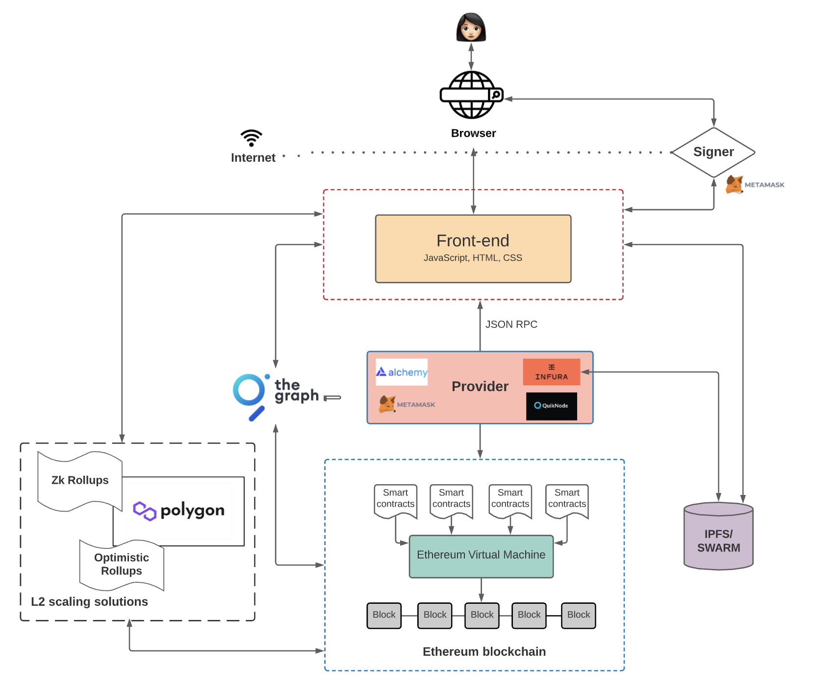

# Blockchain Developer

general knowledge

+ Storage
    - IPFS
    - swarm https://www.ethswarm.org/
+ Cryptography 密码学
+ Consensus protocols 共识
+ blockchain interoperability 跨链
+ Mining and incentive models
+ Blockchains
    - EVM Based
    - Solana
    - TON
    - L2 BlockChains：Arbitrum
+ Types of Blockchains: PoW, PoS, and Private
+ Blockchain forking
+ Oracles 第三方服务
    - Hybrid Smart Contracts 
    - Chainlink

Smart Contracts

+ ERC Tokens
    - ERC-20，ERC-721，ERC-1155和ERC-777。
+ IDEs：Remix
+ Decentralized Storage
+ Frameworks:Truffle
+ Security
    - Fuzz Testing
    - audits
+ Platforms
    - OpenZeppelin

Dapp

+ Applicability
    - DeFi
    - Dao
    - NFT
    - Payments
+ Node as a service
    - Infura
    - Alchemy
+ Testing
    - Automated testing
    - end-to-end automated testing
        * dAppeteer
        * Playwright
+ Security
+ Side Chain   定期汇总，不必在链上执行每笔交易
    - Polygon
    - zkRollups
    - Optimistic Rollups
    - ****

> 更新: 2023-08-14 14:34:47  
> 原文: <https://www.yuque.com/u3641/dxlfpu/wv4dsip0e708qk1p>