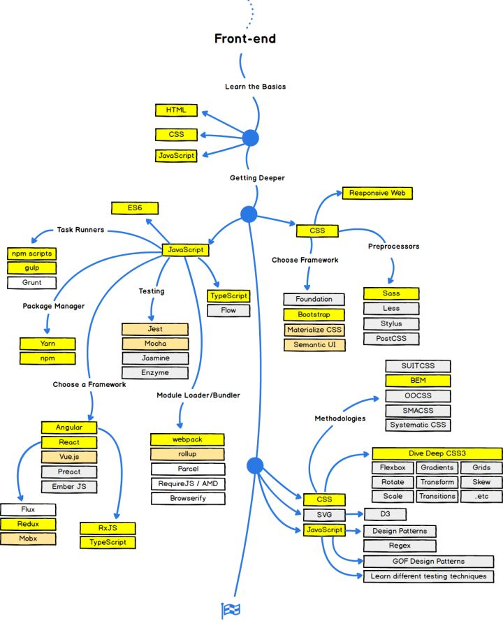

# Frontend Roadmap

# Best Practices
## Frontend Performance Best Practices
[https://roadmap.sh/best-practices/frontend-performance](https://roadmap.sh/best-practices/frontend-performance)

+ TTFB Time To First Byte < 1.3s
+ use WOFF2 font format
+ [Debugging React performance with React 16 and Chrome Devtools.](https://building.calibreapp.com/debugging-react-performance-with-react-16-and-chrome-devtools-c90698a522ad)
+ [Critical CSS](https://csswizardry.com/2022/09/critical-css-not-so-fast/)
+ [Critical Rendering Path](https://developers.google.com/web/fundamentals/performance/critical-rendering-path/measure-crp)
+ Performance tools
    - [https://pagespeed.web.dev/](https://pagespeed.web.dev/)
    - Lighthouse
    - webpagetest.org
    - [包体积](https://bundlephobia.com/)
    - [图像压缩](https://squoosh.app/)
+ [Front-End-Performance-Checklist](https://github.com/thedaviddias/Front-End-Performance-Checklist)

## API Best Practice
+ Auth
    - Max Retry/Jail in Login
    - Sensitive Data Encryption (AES RSA)
    - authentication mechanisms
        * JWT
        * avoid using basic authentication 
        * OAUTH
        * OpenID Connect  建立在OAuth 2.0之上的身份验证协议，使用户能够使用一组凭据对多个网站和应用程序进行身份验证。它通常用于跨多个网站和应用程序的单点登录 （SSO）
        * SAML  是一种基于 XML 的标准，用于在各方之间交换身份验证和授权数据。它通常用于跨多个域或组织的 SSO
        * 支持 MFA
+ Access Control
    - Throttle Requests
    - Restrict Private APIs 
+ Input
    - Use standard Authorization header for sending tokens
    - Avoid Client-Side Encryption
    - Use an API Gateway for caching, Rate Limit policies, and other security features.
+ OAuth
    - Use state parameter to avoid CSRF attacks
+ Processing
    - Avoid Personal ID in URLs
    - Prefer UUIDs
+ Output
    - X-Frame-Options: Deny
    - Content-Security-Policy: default-src 'none'  防止XSS
+ CI & CD
    - Rollback Solution
+ Monitoring
    - Use centralized logins 

# Build Tools
Module Bundlers 

+ vite
+ webpack
+ esbuild
+ rollup

# Testing
+ Testing Levels
    - unit
        * Vitest
        * Jest
    - Integration
    - E2E [System Testing]
        * playwright
        * cypress
+ Testing Approaches
    - White-Box
    - Black-Box Testing
+ Types of Black Box Testing
    - Functional Test
    - Non-Functional Test
        * 性能 负载 压力 扩展 兼容性
        * 主要是改善用户体验

[https://www.softwaretestingmaterial.com/software-testing/](https://www.softwaretestingmaterial.com/software-testing/)

# Authentication Strategies
+ JWT
+ OAuth
+ SSO
+ Basic Auth
+ Session Auth

# Security
+ CORS
+ HTTPS
+ OWASP Security Risks

# Web Components
+ Custom Elements
+ HTML Templates
+ Shadow DOM

# PWA
+ Performance
    - PRPL 模式 [https://web.dev/apply-instant-loading-with-prpl/](https://web.dev/apply-instant-loading-with-prpl/)
        * link preload
        * pre cache
            + Workbox
        * lazy load
            + split the entire bundle and lazy load chunks on demand.
    - RAIL Model  [https://web.dev/rail/](https://web.dev/rail/)
        * Idle 空闲时间来执行非关键任务
        * Load 网页完全加载所需的时间应小于 1 秒
    - Performance Metrics
        * FCP
        * LCP
        * FID 首次输入延迟
        * TTL 
        * TTFB 第一个字节的时间
        * TBT 总阻塞时间
        * CLS 累计布局偏移
    - 灯塔 LightHouse
    - Devtools
+ Web API
    - Storage
    - Web sockets
    - Server Sent Events
    - Service workers
    - 

# Bonus
+ UI / UX Knowledge
+ Design Systems
+ Visual Programmin
    - Animations GSAP, Lottie, Framer Motion or MoJs
    - WebGL
    - 2D Graphics: Canvas, PixiJS, PhaserJS
    - 3D Graphics: ThreeJS, BabylonJS
+ WebAssembly
+ Qwik
    - 全栈SSR框架，而且 Qwik 采用了一系列策略优化页面的首屏性能，做的无论应用体积多大，首屏性能 PageSpeed 测试基本都能达到满分
    - qwik 使用 Resumability，比起传统水合机制
    - [https://juejin.cn/post/7186161640121827387?searchId=202308141530381D3CEECA39C1EAFDBBD9#heading-5](https://juejin.cn/post/7186161640121827387?searchId=202308141530381D3CEECA39C1EAFDBBD9#heading-5)

> 更新: 2023-08-14 15:44:51  
> 原文: <https://www.yuque.com/u3641/dxlfpu/sg1qh09ncxea865e>