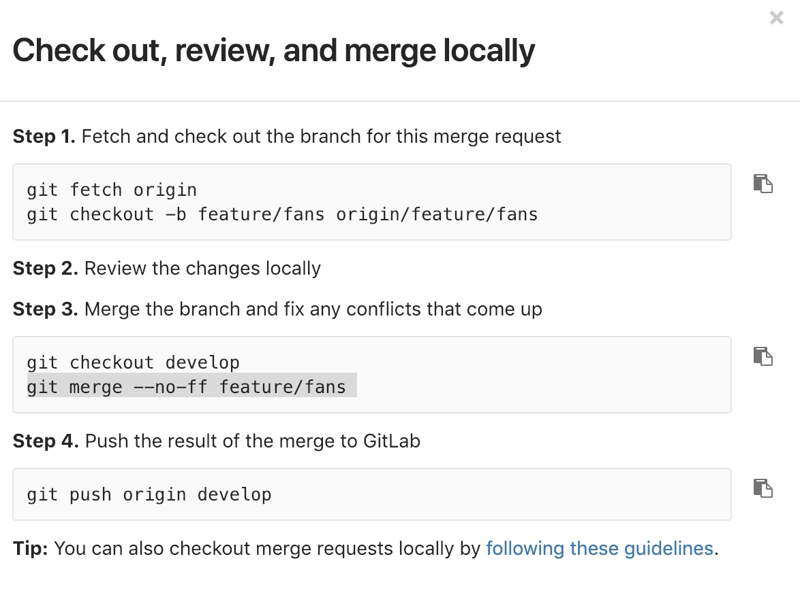
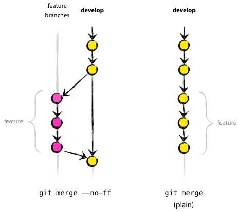

# Git

# Basic
## 配置


查看所有配置

git config --global --list


设定命令的别名
```
git config --global alias.<aliasname> <commandname>
```


## git-flow

> brew install git-flow-avh
>

[https://danielkummer.github.io/git-flow-cheatsheet/](https://danielkummer.github.io/git-flow-cheatsheet/)


## tj/git-extras
git 的一些快捷操作


## git hooks - husky
Git hooks made easy 


## commit
[https://juejin.im/post/5afc5242f265da0b7f44bee4#heading-3](https://juejin.im/post/5afc5242f265da0b7f44bee4#heading-3)


git cz 命令替代我们的 git commit 命令, 帮助我们生成符合规范的 commit message.


## stash


暂时储存现状

git stash


显示暂存清单

git stash list


使用最新的暂存

git stash pop

git stash pop stash@{1}


删除指定的暂存

git stash drop

git stash drop stash@{1}


删除所有的暂存

git stash clear


## cherry-pick
可以只撿某些 Commit 來用


如果加上 --no-commit 參數，撿過來的 Commit 不會直接合併，而是會先放在暫存區：


## log


+ git log --oneline 紧凑查看
+ git log --graph 图形显示
+ git log a ^master 查看只在a分支里的修改
+ git log --grep 正则取一个log
+ git shortlog master 生成一个简报


## rebase


## merge


git merge no-ff


> The "no-ff" stands for "no fast forward".
>


如果它检测到您当前的 HEAD 是您试图合并的提交的祖先。 快进指的是，git 只是将分支指针移动到传入的提交上，而不是构造一个合并提交。 这种情况通常发生在执行 git pull 而不做任何局部更改时。








# FAQ


## Git commits 历史是如何做到如此清爽的？


<font style="color:#F5222D;">我 rebase 纯粹是因为我不喜欢 git log --graph 的时候一堆 branch 扰乱视线。另外，难道你不知道 rebase 不一定要 squash 的？</font>


在开发一个feature或者修个bug的时候，一般都会在最终要merge进的分支上开个新的分支，所有的工作都commit到这个新的分支上。feature写完或者bug修完


在要merge之前，**rebase新分支到最后要merge的分支上**，这相当于把你在新分支上的所有新commit依次cherry pick到要merge的分支的最新commit后面，这样后续的merge就一定会是一个非常爽的fast forward。


而且在rebase的同时可以进行squash，把逻辑上相似的commit都塞到一个commit里面，然后给他一个描述性比较强的commit message。


这套操作下来之后commit历史会非常清晰一目了然，看某些同事的项目的commit历史里面各种save, save work, fix bug, fix bug again的确是一种煎熬


好的commit应该反映出一个项目是怎么一步步开发下来的，是**软件开发的航海日志**，黑匣子，任何码农都应该建立良好的commit习惯。


## 删除远端tag


git tag new_tag_name old_tag_name // 重命名tag


git push origin :refs/tags/0.1.0


git push origin --tags // 推送tag


## wosai git规范


版本号：  
版本号格式为：A.B.C，其中A-C均为数字, eg. 0.2.8


A版本 Major版本


release分支：新建release分支时，在原有的版本号的B位数值+1，满十进位,将C的值置为0


hotfix分支：新建hotfix分支时，在原版本号的C位数值+1，满十不进位


命名  
除master、develop分支外，其他分支均采用分支类型/分支名称的形式命名


master


develop


feature/xxx -> 新功能分支，某个功能点正在开发阶段，


release/xxx -> 发布定期要上线的功能


hotfix/xxx -> 修复线上代码的 bug


# 参考
[Git - Reference](https://git-scm.com/docs)

[https://cs.fyi/guide/git-cheatsheet](https://cs.fyi/guide/git-cheatsheet)


> 更新: 2023-08-14 15:02:14  
> 原文: <https://www.yuque.com/u3641/dxlfpu/mqvka2>