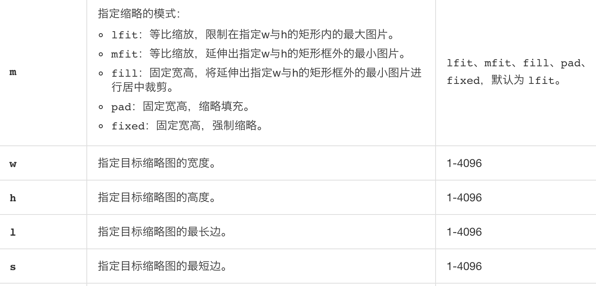

# 图片缩放实战

产品过来说用户上传的图片被压缩变形了 要求我做裁剪组件


我总结了几种办法；


## 阿里云OSS图片处理参数


<font style="color:#333333;">1 固定宽高，自动裁剪</font>

将图自动裁剪成宽度为 100，高度为 100 的效果图。

[http://image-demo.oss-cn-hangzhou.aliyuncs.com/example.jpg?x-oss-process=image/resize,m_fill,h_100,w_100](http://image-demo.oss-cn-hangzhou.aliyuncs.com/example.jpg?x-oss-process=image/resize,m_fill,h_100,w_100)


### 处理参数
1

多个 action 之间效果顺序执行，格式为image/action1,param_value1/action2,param_value2


2

图片处理提供以下功能：

+ 获取图片信息
+ 图片格式转换
+ 图片缩放、裁剪、旋转
+ 图片添加图片、文字、图文混合水印
+ 自定义图片处理样式
+ 通过管道顺序调用多种图片处理功能


3

**图片缩放**

缩略方式：有不使用缩略、等比例缩小、等比例放大和指定宽高缩放四种方式供选择


指定宽高缩放




## Object-fit


Object-fit: contain


> object-fit CSS 属性指定可替换元素的内容应该如何适应到其使用的高度和宽度确定的框。
>


contain

被替换的内容将被缩放，以在填充元素的内容框时保持其宽高比。 整个对象在填充盒子的同时保留其长宽比，因此如果宽高比与框的宽高比不匹配，该对象将被添加“黑边”。


cover

被替换的内容在保持其宽高比的同时填充元素的整个内容框。如果对象的宽高比与内容框不相匹配，该对象将被剪裁以适应内容框。


## 背景图法


```javascript
background-position: center center;
background-size: cover;
background-repeat: no-repeat;
```


> 更新: 2019-09-19 18:04:57  
> 原文: <https://www.yuque.com/u3641/dxlfpu/qiodgz>