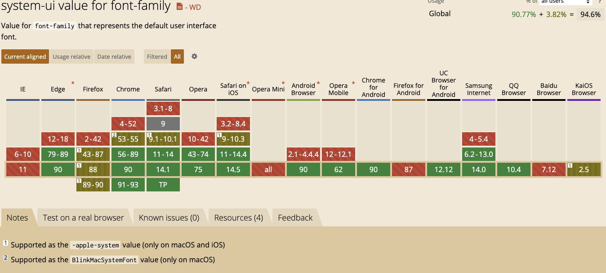
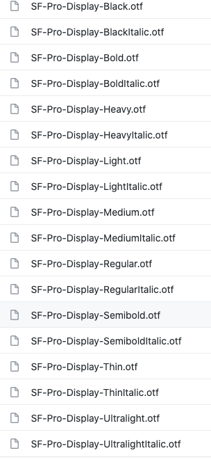

# 字体

## 系统默认字体
```css
body {
    font-family: -apple-system, BlinkMacSystemFont, sans-serif;
  	font-family: -apple-system, system-ui, BlinkMacSystemFont;
}
```

Safari and Firefox use SF for -apple-system; 

Chrome recognizes BlinkMacSystemFont:


> -apple-system 是在以 WebKit 为内核的浏览器（如 Safari）中，调用 Apple（苹果公司）系统（iOS, macOS, watchOS, tvOS）中默认字体（现在一般情况下，英文是 San Francisco，中文是苹方
>
> 
>
> BlinkMacSystemFont 是在 Chrome 中实现调用 Apple 的系统字体
>
> ————————————————
>

来了解下 system-ui 标准





+ <font style="color:rgb(51, 51, 51);">Supported as the -apple-system value (only on macOS and iOS) </font>在一些稍低版本 Mac OS X 和 iOS 上的 Safari、Firefox
+ <font style="color:rgb(51, 51, 51);">Supported as the BlinkMacSystemFont value (only on macOS) </font>针对Mac OS X 上的 低版本浏览器，使用系统默认字体


<font style="color:rgb(51, 51, 51);">为了在 macOS 和 iOS 的兼容性，还得使用 -apple-system</font>


## 关于 SF Pro
SF Pro

SF Pro Display


这俩应该是一个字体族

```css
SFPro-Regular;
SFPro-Bold;
SFPro-Semibold

SFProDisplay
SFProDisplay-Medium
SFProDisplay-Regular
SFProDisplay-Bold

// 下面2个一样的，区别不大，可能letter-spacing有调整
SFPro-Bold
SFProDisplay-Bold

// 这2个显示效果不一样
SFPro-Regular;
SFPro;
```




使用 webfont

> <font style="color:rgb(36, 39, 41);">Note:</font>**<font style="color:rgb(36, 39, 41);">this answer violates Apple's font license terms</font>**<font style="color:rgb(36, 39, 41);">, which state that</font>_<font style="color:rgb(36, 39, 41);">"[...]you may use the Apple Font solely for creating mock-ups of user interfaces to be used in software products running on Apple’s iOS, iPadOS, macOS or tvOS operating systems, as applicable"</font>_<font style="color:rgb(36, 39, 41);">.</font>
>

```css
@font-face {
  font-family: "San Francisco";
  font-weight: 400;
  src: url("https://applesocial.s3.amazonaws.com/assets/styles/fonts/sanfrancisco/sanfranciscodisplay-regular-webfont.woff");
}
```

## macOS Font


+ Helvetica 英文字体，【Arial，大多数平台都支持】
+ San Francisco：同样是Mac OS X EL Capitan上最新发布的西文字体，感觉和Helvetica看上去差别不大，目前已经应用在Mac OS 10.11+、iOS 9.0+、watch OS等最新系统上
+ 苹方简（PingFang SC），最新的中文字体，fallback的中文字体【Hiragino Sans GB 冬青黑体，Heiti SC 黑体】


macOS 10.15.7


## sans-serif
```css
font-family: ui-sans-serif, system-ui, -apple-system, BlinkMacSystemFont, "Segoe UI", Roboto, "Helvetica Neue", Arial, "Noto Sans", sans-serif, "Apple Color Emoji", "Segoe UI Emoji", "Segoe UI Symbol", "Noto Color Emoji";
```

先匹配 ui-sans-serif，应该匹配的是浏览器的显示字体，兼容性很差，只支持safari

The default user interface sans-serif font.


然后匹配 system-ui，

```css
system-ui, -apple-system, BlinkMacSystemFont
```


最后匹配表情包

```css
"Apple Color Emoji", "Segoe UI Emoji", "Segoe UI Symbol", "Noto Color Emoji";
```


> 更新: 2023-08-11 17:11:43  
> 原文: <https://www.yuque.com/u3641/dxlfpu/vg19c9>