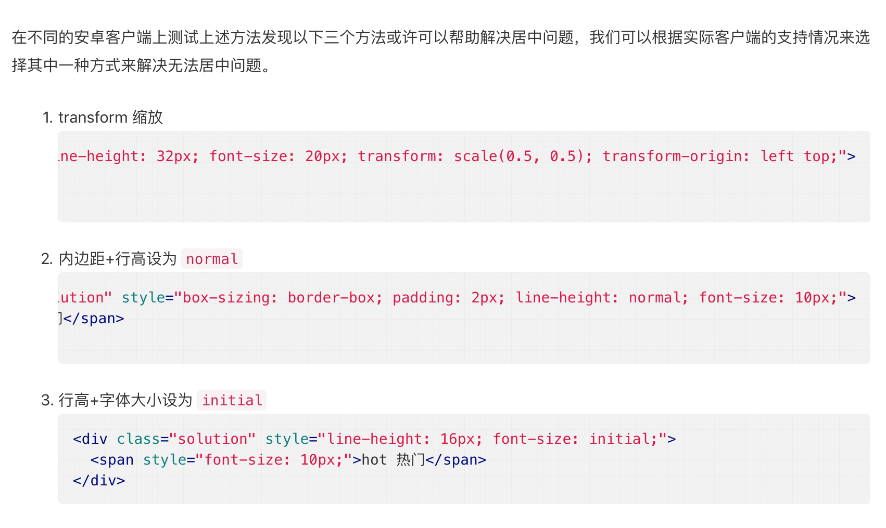

# 安卓垂直居中终极解决方案




```html
<div class="solution" style="height: 32px; line-height: 32px; font-size: 20px; transform: scale(0.5, 0.5); transform-origin: left top;">
  <span>hot 热门</span>
</div>

<div class="solution" style="box-sizing: border-box; padding: 2px; line-height: normal; font-size: 10px;">
  <span>hot 热门</span>
</div>

<div class="solution" style="line-height: 16px; font-size: initial;">
  <span style="font-size: 10px;">hot 热门</span>
</div>
```


> 更新: 2019-03-13 14:04:21  
> 原文: <https://www.yuque.com/u3641/dxlfpu/kwvxfr>