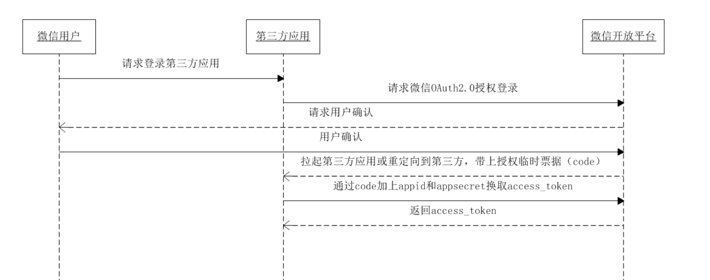

# 微信登录

[微信开发平台文档](https://wohugb.gitbooks.io/wechat/content/qrconnent/README.html)

[https://mp.weixin.qq.com/wiki?t=resource/res_main&id=mp1421140842](https://mp.weixin.qq.com/wiki?t=resource/res_main&id=mp1421140842)

网站应用微信登录是基于OAuth2.0协议标准构建的微信OAuth2.0授权登录系统

## 请求Code

code会被后端捕获到

PC端的URL

https://open.weixin.qq.com/connect/qrconnect?appid=APPID&redirect_uri=REDIRECT_URI&response_type=code&scope=SCOPE&state=STATE#wechat_redirect

移动端的URL

https://open.weixin.qq.com/connect/oauth2/authorize?appid=XX&redirect_uri=XX%3D&response_type=code&scope=snsapi_login&state=#wechat_redirect

## code换取openid

用户允许授权后，将会重定向到redirect_uri的网址上，并且带上code和state参数

若用户禁止授权，则重定向后不会带上code参数，仅会带上state参数

## 后端获取access_token

**通过access_token和openid去获取用户的基本信息**

> 更新: 2019-02-14 14:15:17  
> 原文: <https://www.yuque.com/u3641/dxlfpu/valfqc>