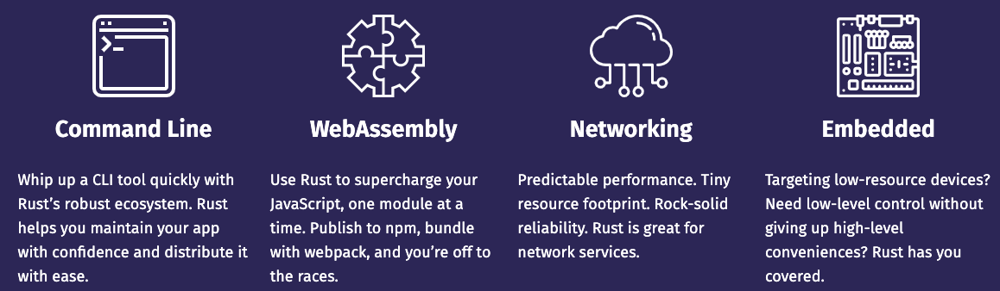

# wasm

WebAssembly is a new type of code that can be run in modern web browsers — it is a low-level assembly-like language with a compact binary format that runs with near-native performance and provides languages such as C/C++, C# and Rust with a compilation target so that they can run on the web. It is also designed to run alongside JavaScript, allowing both to work together.

WebAssembly是一种可以在现代Web浏览器中运行的新型代码-它是一种低级汇编语言，具有紧凑的二进制格式，运行性能接近本机，并为C/C++、C#和Rust等语言提供编译目标，以便它们可以在Web上运行。它还被设计为与JavaScript一起运行，允许两者协同工作。

# rust-wasm
[https://rustwasm.github.io/wasm-bindgen/examples/hello-world.html](https://rustwasm.github.io/wasm-bindgen/examples/hello-world.html)

# wasm-pack
[https://github.com/rustwasm/wasm-pack#-quickstart-guide](https://github.com/rustwasm/wasm-pack#-quickstart-guide)

# Wasm By Example
[https://wasmbyexample.dev/examples/hello-world/hello-world.rust.en-us.html](https://wasmbyexample.dev/examples/hello-world/hello-world.rust.en-us.html)

# rust

> 更新: 2021-05-19 14:28:55  
> 原文: <https://www.yuque.com/u3641/dxlfpu/to1393>