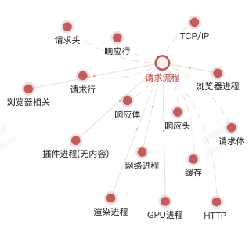

# 前端八股文

原型链继承 

http2 http3 tcp udp 

浏览器event loop node event loop 

http强缓存 协商缓存

cdn原理 

node cluster stream 

多进程通信 

react fiber 时间分片 setState同步 异步 生命周期 

react hooks vue3 vue2区别 依赖收集 

webpack 基本配置 loader plugins 

babel 配置 

web安全 

原型链，**回收，事件循环，继承，编译原理，this，分辨率适配，trace

变量提升，作用域，深浅拷贝

前端安全

手写就多了 手写bind call apply const 防抖 截流 new promise 事件系统 querystring 

http缓存

http各种状态码

> 更新: 2023-07-27 14:12:44  
> 原文: <https://www.yuque.com/u3641/dxlfpu/wmb5bi>