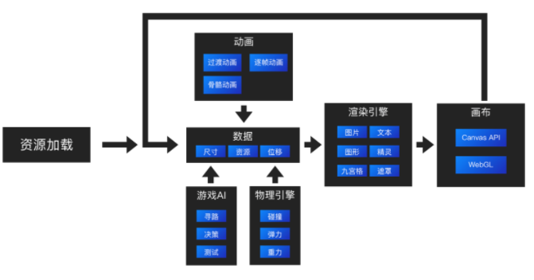
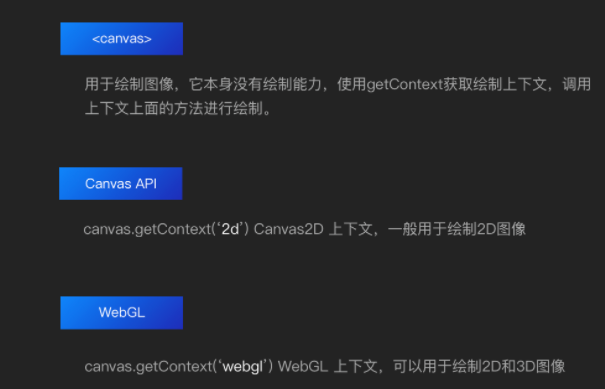

# 2D 游戏化互动入门基础知识

现在越来越多的公司和APP开始使用游戏化的方式去做产品了，所谓游戏化，是指在非游戏环境中将游戏的思维和游戏的机制进行整合运用，以引导用户互动和使用的方法。

[https://mp.weixin.qq.com/s/2xWOjFMQW92_CU88If4q7g](https://mp.weixin.qq.com/s/2xWOjFMQW92_CU88If4q7g)

# 如何运行

# 画布

常用的绘制上下文有Canvas API 和WebGL，一般CanvasAPI来绘制2D图像，WebGL可绘制2D和3D图像，他的性能更高。

#  总结
未来会有越来越多的游戏化产品，开发互动类游戏将成为前端工程师的必备技能

> 更新: 2021-05-15 22:03:45  
> 原文: <https://www.yuque.com/u3641/dxlfpu/ap9y2b>