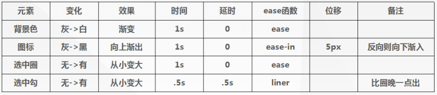
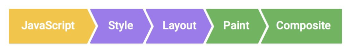
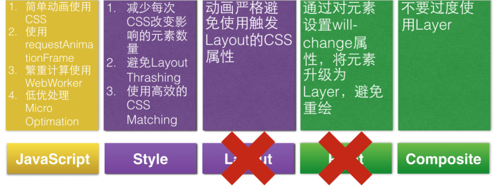

# H5 动画

## 动画的分类


### 按环境来分


 DOM 的动画，还是 CSS3 动画，还是 Canvas 动画，或者 SVG 动画


### 从帧速率区分动画的话


一般来说我们常见的动画都是属于关键帧动画(Keyframe Animation)，而逐帧动画(Frame By Frame)是一帧一帧画


关键帧动画：可以实现常见的动画效果，比如位移、大小、旋转、透明度改变等。


逐帧动画：逐帧动画就是在时间轴的每帧上逐帧绘制不同的内容，使其连续播放而成动画。


#### 关键帧动画


关键帧动画 又称**补间动画**

****

补间动画是动画的基础形式之一，指的是人为设定动画的关键状态，也就是关键帧，而关键帧之间的过渡过程只需要由计算机处理渲染的一种动画形式。


一般有 Transitions 和 Keyframes animation 两种方法实现补间动画。


**Transitions**：用于实现简单的动画，**只有起始两帧过渡**。多用于页面的交互操作，使交互效果更生动活泼。CSS的transition允许CSS的属性值在一定的时间区间内平滑地过渡 


这种效果可以在鼠标单击、获得焦点、被点击或对元素任何改变中触发，并圆滑地以动画效果改变CSS的属性值。


**Keyframes**


> animation 的timing-function设置为ease、linear或cubic-bezier，**<font style="color:#F5222D;">它会在每个关键帧之间插入补间动画，产生具有连贯性的动画</font>**。
>


**常见的实现补帧动画的几种方式**


第一，CSS3 Animation。

通过animation(除steps()以外的时间函数)属性在每个关键帧之间插入补间动画。

第二，CSS3 Transition。

区别于animation，transition只能设定初始和结束时刻的两个关键帧状态。

第三，利用JavaScript实现动画，例如JavaScript动画库或框架，著名的TweenJS，它是CreateJS的其中一个套件。

另外，在Flash业界久负盛名的GreenSock推出的GSAP(GreenSock Animation Platform)也新引入了对Javascript动画的支持。

第四，SVG 动画。

基于移动端对SVG技术的友好的支持性，利用SVG技术实现动画也是一种可行的方案


## <font style="background-color:transparent;">前端动画实现步骤</font>


> 事先做好规划，码的时候注意十二法则，谨记避免导致layout/paint的属性，搞定！
>


1. 与设计师分析动画





2. 「迪士尼九老」总结的十二黄金动画法则（以下简称“十二法则”
3. [https://www.smashingmagazine.com/2011/09/the-guide-to-css-animation-principles-and-examples/#more-105335](https://www.smashingmagazine.com/2011/09/the-guide-to-css-animation-principles-and-examples/#more-105335)
4. [H5动画60FPS](https://weibo.com/p/1001603865643593165786)


## 
## 动画性能


一般情况下，首屏加载的时间应该小于1s，而响应用户行为的时间应该小于100ms，动画应该达到60fps


**关键渲染路径**


> 动画性能高，从直观体验上是动画没有抖动和卡顿，从数字上是渲染达到了60fps。60pfs就是每秒60帧，所以每帧的时间只有1000ms / 60 = 16.67ms。但是实际上，浏览器在每一帧还要做一些额外的事情，所以如果要达成60fps，我们需要保证每一帧的时间在10ms到12ms。
>


页面渲染的一般过程为JS / CSS > 计算样式 > 布局 > 绘制 > 渲染层合并。





其中，Layout(重排)和Paint(重绘)是整个环节中最为耗时的两环，会影响这个环节的见 [https://csstriggers.com/](https://csstriggers.com/)





+ translate属性值来替换top/left/right/bottom的切换，
+ scale属性值替换width/height，opacity属性替换display/visibility等等
+ 触发动画的开始不要用diaplay:none属性值，因为它会引起Layout、Paint环节


## 3D 动画
**webgl**


WebGL是一种3D绘图标准，这种绘图技术标准允许把JavaScript和OpenGL ES 2.0结合在一起

WebGL可以为HTML5 Canvas提供硬件3D渲染能力


**three.js**


three.js: Javascript 3D Engine for canvas, svg, and WebGL


A framework build on top of WebGL


WebGL的库


## CSS Transition 动画


Transitions enable you to define the transition between two states of an element. Different states may be defined using pseudo-classes like** :hover or :active or dynamically set using JavaScript.**

****

过渡使您可以定义元素的两种状态之间的过渡。可以使用伪类（如：hover或：active）定义不同的状态，或使用JavaScript动态设置。


```plain
input[type=text] {
  width: 100px;
  transition: width .35s ease-in-out;
}

input[type=text]:focus {
  width: 250px;
}
```


**Transition 的局限性**


> transition的优点在于简单易用，但是它有几个很大的局限。
>
> （1）transition需要事件触发，所以没法在网页加载时自动发生。
>
> （2）transition是一次性的，不能重复发生，除非一再触发。
>
> （3）transition只能定义开始状态和结束状态，不能定义中间状态，也就是说只有两个状态。
>
> （4）一条transition规则，只能定义一个属性的变化，不能涉及多个属性。
>


## Canvas 动画


> 优点：
>
> 1) 画2D图形时，页面渲染性能比较高
>
> 2) 页面渲染性能受图形复杂度影响小
>
> 3) 渲染性能只受图形的分辨率的影响
>
> 4) 画出来的图形可以直接保存为 .png 或者 .jpg的图形
>
> 5) 最适合于画光栅图像（如游戏和不规则几何图形等），编辑图片还有其他基于像素的图形操作。
>
> 
>
> 缺点：
>
> 1) 整个就是一张图，无论你往上画什么东西——没有DOM 结点可供操作
>
> 2) 没有实现动画的API，**你必须依靠定时器和其他事件来更新Canvas**
>
> 3) 对文本的渲染支持是比较差
>
> 4) 对要求有高可访问性（盲文、声音朗读等）页面，比较困难
>
> 5) 对交互要求高的（比如TIBCO的很多产品）的界面，不建议使用Canvas
>
> 
>

## SVG 动画


Svg (可缩放向量图形)是一种用于绘图的 XML 格式。 您可以像DOM考虑 SVG ——有带有父元素、子元素和属性的元素，并且您可以响应相同的鼠标 / 触摸事件。


好像都用来做loading


```html
<div class="animate-svg">
    <svg id="svgAnimation" ns="http://www.w3.org/2000/svg" version="1.1" width="200" height="200">
        <g transform="translate(100,100)">
            <g>

                <rect width="200" height="200" rx="100" ry="100" fill="red" transform="translate(-100,-100)"></rect>
                <text x="-60" y="-0" font-size="20" fill="white" >SVG Animation</text>
                <!-- Add ease-in-out and infinite iterations to this animation and the code -->
                <animateTransform attributeName="transform" attributeType="xml" type="rotate" from="0" to="360" dur="3s" repeatCount="indefinite">SVG Animation</animateTransform>
            </g>
        </g>
    </svg>
</div>


```


> 优点：
>
> 1) 矢量图形，不受像素影响——SVG的这个特性使得它在不同的平台或者媒体下表现良好，无论屏幕分辨率如何
>
> 2) SVG对动画的支持较好，其DOM结构可以被其特定语法或者Javascript控制，从而轻松的实现动画
>
> 3) Javascript可以完全控制SVG Dom 元素
>
> 4) SVG的结构是XML，其可访问性（盲文、声音朗读等）、可操作性、可编程性、可被CSS样式化完胜Canvas。另外，其支持 ARIA 属性，使其如虎添翼。
>
> 缺点：
>
> 1) DOM比正常的图形慢，而且如果其结点多而杂，就更慢。
>
> 2) SVG 画点报表什么的，还行；在网页游戏前，就束手无策了；当然可以结合 Canvas + SVG实现。
>
> 3) 不能动态的修改动画内容
>
> 4) 不能与HTML内容集成
>
> 5) 整个SVG作为一个动画
>
> 6) 浏览器兼容性问题，IE8-以及Android 2.3默认浏览器是不支持SVG
>
> 
>

## JS 实现动画


requestAnimationFrame


**D3.js 数据可视化框架**


D3.js: D3 is a data visualisation library. It makes it easy to generate and modify graphics **based on data.** This is nothing about 3D though.


数据驱动 For data driven 2D graphics, use D3.


**JS 游戏引擎**


CreateJS为CreateJS库，可以说是一款为HTML5游戏开发的引擎。目前被Adobe整合到Animate CC中，作为导出canvas动画的基础javascript库。


> 更新: 2023-07-21 15:21:04  
> 原文: <https://www.yuque.com/u3641/dxlfpu/qu1isf>